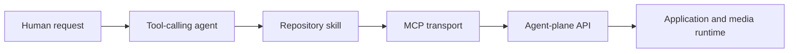

# Agent plane, MCP, and skill integration

This document defines the ownership boundary between Restream's agent plane,
MCP transport, and repository skill. Exact routes, schemas, and tool payloads
belong to their contract owners.

## Contents

- [Recommended layering](#recommended-layering)
- [Browser boundary](#browser-boundary)
- [Ownership split](#ownership-split)
- [Why agents use the agent plane](#why-agents-use-the-agent-plane)
- [Contract owners](#contract-owners)
- [Safe workflow](#safe-workflow)
- [Shared Rust implementation](#shared-rust-implementation)

## Recommended layering

The wrapper stays thin so safety and product behavior are enforced once, inside
Restream.

## Browser boundary

The dashboard is not an agent client. Its ordinary operator workflows use the
authenticated control-plane API. The diagnostics “Ask AI” action is a manual
handoff to an external chat, not an embedded tool-calling runtime.

Do not couple dashboard reads or mutations to the agent routes. A future
approval inbox or embedded agent needs a separately designed authenticated
workflow and an explicit human approval experience.

## Ownership split

| Layer | Owns | Must not own |
|---|---|---|
| Agent plane | redaction, validation, planning, approval state, apply, verification | transport-specific MCP behavior |
| MCP transport | authentication handoff, tool exposure, request/response transport | business validation or alternate approval semantics |
| Repository skill | investigation and mutation sequence, stop conditions, human interaction | raw control-plane mutation shortcuts |
| Dashboard | direct human operator workflows | hidden agent execution |

This split keeps product policy in one place and prevents an MCP wrapper or
prompt from redefining success.

## Why agents use the agent plane

The control plane exposes object-oriented pipeline, output, setting, alert, and
diagnostic operations. The agent plane exposes task-oriented, redacted,
approval-aware workflows.

External agents should use the agent plane for investigation and mutation
planning. They must not bypass it with raw output or pipeline mutation routes
when an approval-gated agent operation is required.

## Contract owners

- [API reference](api-reference.md) owns the public HTTP route and response
  contracts.
- [MCP tool contract](agent-guidance/skills/restream-ops-agent/references/tool-contract.md)
  owns the exact tool-to-route map, JSON request examples, supported change
  kinds, and interpretation rules.
- [Restream ops agent skill](agent-guidance/skills/restream-ops-agent/SKILL.md)
  owns the executable agent sequence and approval stop conditions.
- [MCP Rust architecture](mcp-rust-architecture.md) owns shared implementation,
  feature, backend, and deployment-mode design.

Do not repeat the tool catalog or payload examples here. That previously made a
single contract change require edits in three documents.

## Safe workflow

A mutation workflow has five conceptual phases:

1. discover capabilities and gather redacted context;
2. investigate or plan without mutating;
3. create an auditable operation;
4. stop for explicit human approval when required;
5. apply and verify through the operation boundary.

Validation failure, disabled execution, missing approval, or failed
verification is a stop condition. The exact calls and fields are intentionally
left to the tool contract and skill.

## Shared Rust implementation

Embedded, sidecar, and central-gateway modes should reuse shared Rust handlers
and backend traits. MCP remains a transport adapter rather than a second
implementation of planning or execution policy.

See [MCP Rust architecture](mcp-rust-architecture.md) for the module layout,
feature boundaries, deployment tradeoffs, authentication model, and migration
path.
