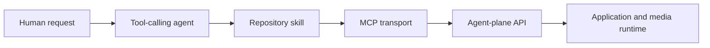
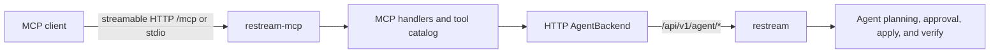

# Agent plane, MCP, and skill integration

This document defines the ownership boundary between Restream's agent plane,
MCP transport, and repository skill. Exact routes, schemas, and tool payloads
belong to their contract owners.

## Contents

- [Recommended layering](#recommended-layering)
- [Browser boundary](#browser-boundary)
- [Ownership split](#ownership-split)
- [Why agents use the agent plane](#why-agents-use-the-agent-plane)
- [Contract owners](#contract-owners)
- [Safe workflow](#safe-workflow)
- [Shared Rust implementation](#shared-rust-implementation)
- [MCP server architecture](#mcp-server-architecture)

## Recommended layering


```mermaid
flowchart LR
    Human["Human request"] --> Agent["Tool-calling agent"]
    Agent --> Skill["Repository skill"]
    Skill --> Mcp["MCP transport"]
    Mcp --> Api["Agent-plane API"]
    Api --> Core["Application and media runtime"]
```

The wrapper stays thin so safety and product behavior are enforced once, inside
Restream.

## Browser boundary

The dashboard is not an agent client. Its ordinary operator workflows use the
authenticated control-plane API. The diagnostics “Ask AI” action is a manual
handoff to an external chat, not an embedded tool-calling runtime.

Do not couple dashboard reads or mutations to the agent routes. A future
approval inbox or embedded agent needs a separately designed authenticated
workflow and an explicit human approval experience.

## Ownership split

| Layer | Owns | Must not own |
|---|---|---|
| Agent plane | redaction, validation, planning, approval state, apply, verification | transport-specific MCP behavior |
| MCP transport | authentication handoff, tool exposure, request/response transport | business validation or alternate approval semantics |
| Repository skill | investigation and mutation sequence, stop conditions, human interaction | raw control-plane mutation shortcuts |
| Dashboard | direct human operator workflows | hidden agent execution |

This split keeps product policy in one place and prevents an MCP wrapper or
prompt from redefining success.

## Why agents use the agent plane

The control plane exposes object-oriented pipeline, output, setting, alert, and
diagnostic operations. The agent plane exposes task-oriented, redacted,
approval-aware workflows.

External agents should use the agent plane for investigation and mutation
planning. They must not bypass it with raw output or pipeline mutation routes
when an approval-gated agent operation is required.

## Contract owners

- [API reference](api-reference.md) owns the public HTTP route and response
  contracts.
- [MCP tool contract](agent-guidance/skills/restream-ops-agent/references/tool-contract.md)
  owns the exact tool-to-route map, JSON request examples, supported change
  kinds, and interpretation rules.
- [Restream ops agent skill](agent-guidance/skills/restream-ops-agent/SKILL.md)
  owns the executable agent sequence and approval stop conditions.
- [MCP Rust architecture](#mcp-server-architecture) owns shared implementation,
  feature, backend, and deployment-mode design.

Do not repeat the tool catalog or payload examples here. That previously made a
single contract change require edits in three documents.

## Safe workflow

A mutation workflow has five conceptual phases:

1. discover capabilities and gather redacted context;
2. investigate or plan without mutating;
3. create an auditable operation;
4. stop for explicit human approval when required;
5. apply and verify through the operation boundary.

Validation failure, disabled execution, missing approval, or failed
verification is a stop condition. The exact calls and fields are intentionally
left to the tool contract and skill.

## Shared Rust implementation

The current `restream-mcp` sidecar uses the shared Rust backend trait and calls
the product-native HTTP surface. MCP remains a transport adapter rather than a
second implementation of planning or execution policy. The HTTP-backed sidecar
is the only MCP backend and deployment mode; there is no in-process MCP
backend.

See [MCP architecture](#mcp-server-architecture) for current module ownership,
feature boundaries (including what `mcp-embedded` means as a compile combo),
and authentication.

## MCP server architecture

Restream provides a Rust `restream-mcp` sidecar that exposes the agent-plane
workflow over MCP. It calls the product-native `/api/v1/agent/*` HTTP surface;
it does not bypass approval or mutate raw control-plane routes.

### Current shape


```mermaid
flowchart LR
    Client["MCP client"] -->|"streamable HTTP /mcp or stdio"| Sidecar["restream-mcp"]
    Sidecar --> Catalog["MCP handlers and tool catalog"]
    Catalog --> Backend["HTTP AgentBackend"]
    Backend -->|"/api/v1/agent/*"| Server["restream"]
    Server --> Core["Agent planning, approval, apply, and verify"]
```

The sidecar supports streamable HTTP and stdio transports. The default HTTP
bind is loopback. Tool handlers depend on the shared `AgentBackend` trait, and
the current runnable binary selects `HttpAgentBackend`.

### Tool contract

The catalog covers capabilities and context reads, investigation and planning,
validation and graph preview, and the approval-gated operation lifecycle. Tool
names and JSON schemas are defined once in `src/agent_mcp/tools.rs`; clients can
inspect the compiled catalog instead of relying on a duplicated list:

```sh
./restream-mcp --print-tools
```

MCP transport code validates and dispatches requests. Agent-plane code remains
the authority for redaction, plan validation, approval, apply, and verification
semantics. Operational guidance is in
[Agent-plane integration](agent-plane-integration.md).

### Build and run

Build the server with the sidecar's required features:

```sh
cargo build \
  --bin restream-mcp \
  --features mcp-server,mcp-http-backend
```

With `restream` listening on its default HTTP address, start streamable HTTP:

```sh
RESTREAM_AGENT_SESSION_COOKIE='session=<value>' \
  target/debug/restream-mcp --bind 127.0.0.1:4040
```

The MCP endpoint is `/mcp`. For a client that launches its server over stdio:

```sh
RESTREAM_AGENT_SESSION_COOKIE='session=<value>' \
  target/debug/restream-mcp --stdio
```

`RESTREAM_AGENT_BASE_URL` changes the target server from
`http://127.0.0.1:3030`.

### Authentication and compatibility

The HTTP backend can forward one of these credentials:

- `RESTREAM_AGENT_SESSION_COOKIE` for the server's session cookie;
- `RESTREAM_AGENT_BEARER_TOKEN` for deployments that terminate bearer auth at
  a compatible boundary.

If both are present, the session cookie is selected. Empty values mean no
credential. Transport deployment must protect these values and use TLS when the
server is remote.

Before serving, the sidecar checks the target build identity and capabilities.
`RESTREAM_MCP_VERSION_CHECK` accepts `strict` (the default), `warn`, or `off`.
Use `off` only for deliberate compatibility testing.

For streamable HTTP, `RESTREAM_MCP_ALLOWED_ORIGINS` is a comma-separated origin
allowlist. An empty list does not grant a wildcard browser origin.

### Feature boundaries

Cargo features keep the optional surface explicit:

| Feature | Adds |
|---|---|
| `agent-plane` | Agent read/planning API |
| `agent-execution` | Approval-gated operation execution |
| `mcp-core` | Shared MCP-facing backend and type contract |
| `mcp-server` | MCP transport/server implementation |
| `mcp-http-backend` | HTTP adapter to `/api/v1/agent/*` |
| `mcp-embedded` | Compile combo of `mcp-core` + `agent-plane` (no in-process backend) |

The `restream-mcp` binary requires the server and HTTP-backend feature set to
run. The exact dependency edges and binary requirements are owned by
`Cargo.toml`.

### Embedded mode

There is no in-process MCP backend. The `mcp-embedded` feature only compiles
`mcp-core` together with `agent-plane`; it does not mount an MCP transport in
the main `restream` binary. Use the HTTP-backed `restream-mcp` sidecar.

### Source ownership

| Path | Responsibility |
|---|---|
| `src/agent_core/` | Shared backend contract, request types, and errors |
| `src/agent_backends/http.rs` | Current HTTP-backed execution adapter |
| `src/agent_mcp/` | Tool catalog, dispatch, and transports |
| `src/bin/restream-mcp.rs` | CLI, environment, compatibility check, backend selection |
| `src/agent_plane.rs`, `src/agent_execution.rs` | Product-native agent behavior |
| `Cargo.toml` | Feature graph and binary requirements |
