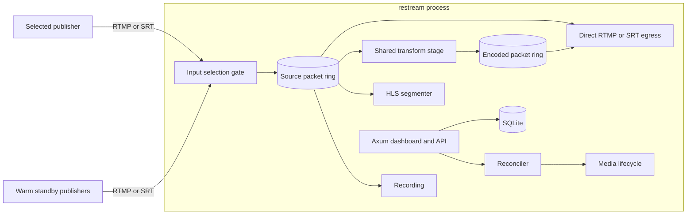
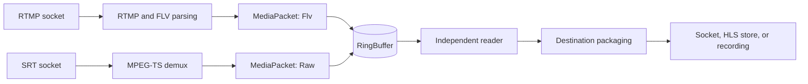

# Architecture

Restream is a Rust application that owns the control plane and production media
path. FFmpeg is used at explicit codec and container boundaries. MediaMTX is an
optional interoperability peer in the live test harness, not a runtime
dependency.

## Contents

- [System shape](#system-shape)
- [Layer ownership](#layer-ownership)
- [Runtime ownership](#runtime-ownership)
- [Input selection](#input-selection)
- [Packet and container boundaries](#packet-and-container-boundaries)
- [Shared processing stages](#shared-processing-stages)
- [Lifecycle and recovery](#lifecycle-and-recovery)
- [State and authentication](#state-and-authentication)
- [Key source areas](#key-source-areas)

## System shape

The API persists desired configuration in SQLite. The reconciler compares that
configuration with the engine's active runtime state and starts, stops, or
restarts media work. Protocol handlers exchange `MediaPacket` values through
bounded fan-out structures instead of routing packet traffic through the
database or API layer.

## Layer ownership

These boundaries are the refactoring guide. Move behavior toward its owner
before adding another abstraction.

| Layer | Owns | Does not own |
|---|---|---|
| `domain` | Stable IDs, validation, typed configuration, shared vocabulary | SQL, HTTP response shapes, sockets, runtime registries |
| `application` | Workflows spanning persistence and runtime, capability ports | Raw SQL, packet processing, HTTP transport details |
| `db` | Schema-aware reads and writes, row mapping | Runtime policy and cross-layer orchestration |
| `media` | Protocols, packet transforms, hot-path storage, media lifecycle | API JSON and meta-table policy |
| `api` | Authentication, request validation, HTTP/SSE response shaping | Persistence policy and media internals |
| `infrastructure` | Concrete adapters and process-level wiring | Domain policy |
| `lib` | Application bootstrap and top-level task composition | Reusable workflows that belong in an owner layer |

The table is the intended ownership. Two production **workflow** paths still
call `crate::db::*` with a pool instead of going through application ports:
log persistence in `src/logging.rs`, and bootstrap reconcile/egress job plus
desired-state writes under `src/infrastructure/bootstrap/`. Those are the
bypasses. SQLite adapters calling `db::*` is the intended shape, not a
breach — including `infrastructure/sqlite_ports.rs`,
`pipeline_input_store.rs`, and `recording_metadata.rs`.

The current layering sequence and stop rules live in
[Layering roadmap](layering-roadmap.md) and the
[layering audit skill](agent-guidance/skills/layering-audit/SKILL.md).

## Runtime ownership

Tokio owns Axum, reconciliation, application/database policy, authentication,
media orchestration, native mux/demux work, and asynchronous child-process
supervision. Dedicated processes or guarded OS threads own blocking FFmpeg
work. Compio/io_uring owns the production SRT and RTMP/RTMPS transport paths.

- RTMP ingress uses one fixed Compio/io_uring owner thread and runtime for the
  listener and accepted connections. That owner runs the RTMP handshake,
  `ServerSession`, chunk parsing, AMF command handling, media extraction,
  protocol responses, TCP statistics, and teardown. Tokio actors handle auth
  and pipeline/ring work through bounded typed messages; there is no Tokio
  duplex byte bridge or borrowed FD crossing.
- The RTMP ingress byte semaphore bounds permit-backed queued/processing media
  commands to 64 MiB. It does not bound parser working sets: a blocked permit
  wait can coexist with a completed RTMP message and the next parser assembly,
  each up to the 24-bit RTMP limit (16,777,215 bytes), plus a 4 KiB socket
  read, a separate 4 KiB parser staging buffer, and event metadata. Those two
  payloads alone approach 16 GiB at the default 512-connection cap and 512 GiB
  at the configured maximum of 16,384; parser/session and other transport
  allocations add more.
- RTMP/RTMPS egress retains the fixed egress fabric. Each shard owns one
  Compio/io_uring runtime, its protocol engines, and the shared Compio TCP
  streams. Established sockets use one-shot bounded RX/TX completions and a
  bounded generation-tagged event queue; only pending connects use `PollFd`,
  with rotating bounded scans. Production runtime construction fails explicitly
  if io_uring is unavailable.
- SRT egress runs on fixed Compio shard threads with at most one `srt-rs`
  Compio `Owner` per address family and a shared caller UDP socket per Owner.
  SRT ingress runs on one dedicated Compio/io_uring owner thread and one
  `Owner::listen_with_resolver`; Tokio addresses sessions only by
  `LogicalPeerId` through bounded commands and events. Ingress observes the
  managed-RX capability but does not install that substrate: pinned srt-rs
  treats transient managed-ring `ENOBUFS` as a terminal RX-stream failure, so
  ingress remains on raw readiness until that failure is retryable. Egress
  retains its independently qualified managed RX path.
- The former direct RTMP io_uring/epoll production path is removed; remaining
  generic dataplane cleanup is tracked under WI7.
- In-process FFmpeg codec work runs on guarded OS threads; recording uses a
  feeder task and writer thread. Default transcoder and file-ingest paths use
  managed FFmpeg child processes with asynchronous pipe I/O.

The transport ownership invariant is that each production SRT/RTMP/RTMPS
connection keeps its socket, protocol and handshake state, timers, receive and
pending-transmit buffers, I/O submissions/completions, fairness accounting,
telemetry, and teardown on one Compio shard. Tokio may exchange bounded typed
control/lifecycle messages, snapshots, and decoded/shared media buffers; live
network byte streams, Tokio duplex streams, borrowed transport FDs, and Tokio
network wrappers must not cross the boundary. RTMP ingress keeps auth and
pipeline/ring work in Tokio but parses RTMP on the socket-owning Compio shard.
RTMPS retains the same owner through Rustls handoff and kTLS; unsupported
behavior remains fail-closed.

Fixed shard ownership, explicit per-visit and completion budgets, bounded
queues/buffers, and generation-safe lifecycle handling are required. Persistent
one-shot receive/write workers are the current RTMP egress baseline; provided
buffer rings and multishot I/O remain optional mechanisms. HLS PUT and FFmpeg
pipe I/O remain Tokio paths unless later capacity evidence justifies a separate
experiment. Codec work never moves to the I/O reactors. WI5B source convergence
is in local verification; real-media, fault, hosted, and container acceptance
remain open.

Thread and process entry points tied to media lifecycle catch panics or child
failures, surface status, and cancel their stage rather than terminating the
server. External FFmpeg children also have admission controls; the canonical
limits and environment parsing are in `src/config.rs`.

The Tokio runtime is built in `src/main.rs`. Its resolved sizing uses the
effective CPU limit and may be overridden by the documented runtime variables.
Restream does not pin individual thread families; coarse CPU and NUMA placement
is a deployment concern.

The important boundary is ownership, not a copied thread-count formula. Exact
counts vary with active publishers, outputs, recordings, stage sharing, codec
capabilities, and host CPU limits; live runtime state and operator-facing
telemetry are the appropriate source for a running process.

Detailed WI5B execution order and acceptance gates live in the
[SRT / Compio roadmap](srt-compio-roadmap.md).

Media and memory ownership below describe the current source topology; WI5B's
real-media, fault, hosted, and container qualification remains open.

[Media pipeline § Thread and memory ownership, ingest to egress](media-pipeline.md#thread-and-memory-ownership-ingest-to-egress)
applies this policy to RTMP and SRT specifically: which hop runs on a Tokio
worker versus a dedicated OS thread, and which structure owns memory at each
hop, from entry socket to exit socket.

## Input selection

Each pipeline owns up to four independently authenticated input sessions. Every
input has one opaque stream key and can connect through RTMP or SRT. Connected
standbys still perform socket receive, protocol parsing, demux/probe, metadata
collection, and on-demand input-scoped HLS preview generation. Each RTMP/SRT
standby retains only its newest complete compressed GOP, bounded by bytes and
packet count. Nothing reaches the shared source ring, outputs, or transforms
until selection, so downstream media work remains single-source.

Promotion is serialized per pipeline. The current gate rejects new packets and
drains its existing packet lease before the target gate is armed. The promoted
network input replays its retained GOP from the cached keyframe on the next
packet arrival. If it has no complete cached GOP, promotion falls back to its
next video keyframe. The replay receives one timestamp offset so its first DTS
follows the prior writer's last DTS while preserving every packet's composition
offset. This keeps the shared ring single-writer and prevents timestamp
regression across repeated handoffs.

## Packet and container boundaries

`MediaPacket` carries media type, track identity, PTS, DTS, keyframe state,
payload format, and reference-counted bytes. Producers set its
`PayloadFormat` explicitly:

| Producer | Format | Payload |
|---|---|---|
| RTMP ingest | `Flv` | FLV-framed audio or video payload |
| MPEG-TS demux | `Raw` | Elementary audio or Annex B video payload |
| Transcoder output | `Raw` | Elementary payload emitted by the selected backend |

Consumers branch on the format rather than guessing from bytes. MPEG-TS
packaging removes FLV headers when needed; direct raw-to-RTMP wrapping is not a
generic fallback.

Each pipeline ring remains single-producer, multi-consumer: multiple connected
inputs are reduced to one forwarding writer before packets reach the
`RingBuffer`. Independent readers prevent one destination from consuming
another destination's packets. A lagging reader can recover at a keyframe after
overflow. This structure is bounded; capacity and overflow behavior are owned
by `src/media/ring_buffer.rs` and `src/config.rs`.

SRT fan-out packages a shared MPEG-TS stream into `TsChunkRing` shards and
keeps per-destination socket state at the edge. Async-to-blocking boundaries
use bounded `MemoryQueue` instances. These structures make backpressure and
shutdown explicit without adding an async channel send to every packet hop.

Timestamp rules are protocol-specific:

- media PTS/DTS remain distinct from wall-clock and application time;
- RTMP video timestamps are DTS and the signed FLV composition offset derives
  PTS;
- MPEG-TS muxing maintains monotonic DTS and container time bases;
- a transcoder creates a new packet timeline, so source-packet identity does
  not continue through that boundary.

Detailed protocol behavior belongs in [Media pipeline](media-pipeline.md).

## Shared processing stages

Outputs with the same typed stage identity share expensive work. A stage owns
its output ring and lifecycle token; destinations own their protocol connection
and sender state.

The current stage families include video presets, HEVC-to-H.264 conversion,
track selection, and audio remap/downmix. HLS preview reuses those shared
media stages (the HEVC→H.264 codec edge for HEVC ingest, source otherwise)
instead of a dedicated preview transcoder. Lightweight track selection is
native packet routing. Codec-heavy video and complex audio work use the
configured FFmpeg backend. Backend-selection flags are scoped by stage family
so enabling one in-process path does not silently switch another.

Stage identity is owned by `src/domain/stage.rs`; dependency resolution lives
with the engine stage modules. Do not reproduce their string grammar in another
layer.

## Lifecycle and recovery

The reconciler is the bridge between desired configuration and active runtime
state. It starts missing work, stops work that is no longer desired, and
applies bounded retry/backoff policy to failed outputs. Each long-lived media
operation has a cancellation boundary and publishes operator-visible status.

Failure isolation follows these rules:

- malformed media or a destination failure must not crash the engine;
- a child process, blocking sender, or codec thread reports failure to its
  owning stage;
- teardown cancels dependents before removing shared state;
- file-ingest children are tracked and reaped;
- HLS state is in memory unless a design change explicitly introduces durable
  storage. MPEG-TS `HlsStore` evicts at `max_segments` (default 20) and drops
  matching variant-cache entries; fMP4 preview retains
  `max_segments + 6` grace segments and advertises only `max_segments`.
  Retained **segment count** is bounded. Per-segment memory still depends on
  encoded bitrate and keyframe cadence: the MPEG-TS accumulator is initialized
  at `segment_capacity` and may grow until a later keyframe splits the
  segment; there is no hard byte ceiling on this path.

Concurrency proof expectations and the stage coverage map live in
[Concurrency proofing](concurrency-proofing.md) and
[Stage boundary proof map](stage-boundary-proof-map.md).

## State and authentication

SQLite stores pipelines, outputs, settings, recordings, sessions, and other
control-plane state. It does not carry live media packets. The dashboard and
API use cookie-backed sessions. The initial administrator password is supplied
at startup or generated into a permission-restricted file beside the database;
only its scrypt hash is stored in SQLite.

The HTTP listener is loopback-only by default. Deployments that expose it on
another interface must provide the surrounding TLS and network boundary.
Configuration details are in [Configuration](configuration.md).

## Key source areas

Line counts and symbol inventories are deliberately omitted. The source audit
owns volatile inventory; these paths identify stable owners.

| Source area | Responsibility |
|---|---|
| `src/main.rs`, `src/lib.rs`, `src/infrastructure/` | Process bootstrap, runtime construction, service wiring |
| `src/api/` | Router, authentication, REST/SSE handlers, embedded assets |
| `src/application/` | Control-plane workflows and service ports |
| `src/domain/` | Stable IDs, output specs, settings, validation vocabulary |
| `src/db/` | SQLite schema and repositories |
| `src/runtime/`, `src/api_runtime_views/` | Runtime models and operator-facing snapshots |
| `src/media/engine.rs`, `src/media/engine_*` | Media lifecycle, reconciliation-facing state, snapshots |
| `src/media/ring_buffer.rs`, `src/media/ts_chunk_ring.rs`, `src/media/avio.rs` | Bounded packet and byte transport |
| `src/media/rtmp.rs`, `src/media/srt*.rs`, `src/media/mpegts.rs` | Protocol and container adapters |
| `src/media/egress/` | Egress fabric: shard runtime/scheduler, protocol-neutral leaf lifecycle, RTMP/RTMPS/SRT/sink/pipeline backends. The only egress path; see [egress architecture](egress-architecture.md) |
| `src/media/hls/`, `src/media/recording/` | HLS and recording lifecycle |
| `src/media/transcoder.rs`, `src/media/external_transcoder.rs` | In-process and child-process transform backends |
| `src/agent_core/`, `src/agent_backends/`, `src/agent_mcp/` | Agent contracts, backends, and MCP transport |
