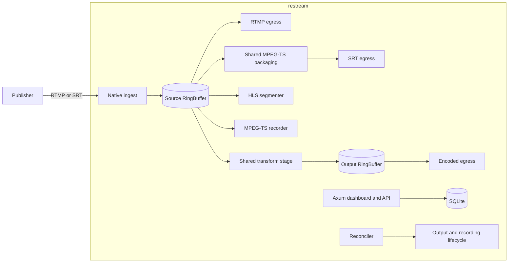
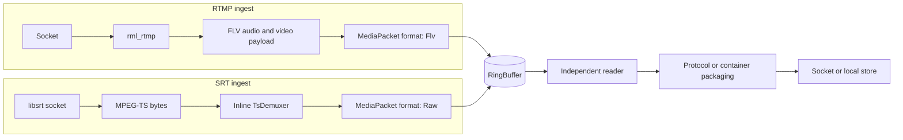
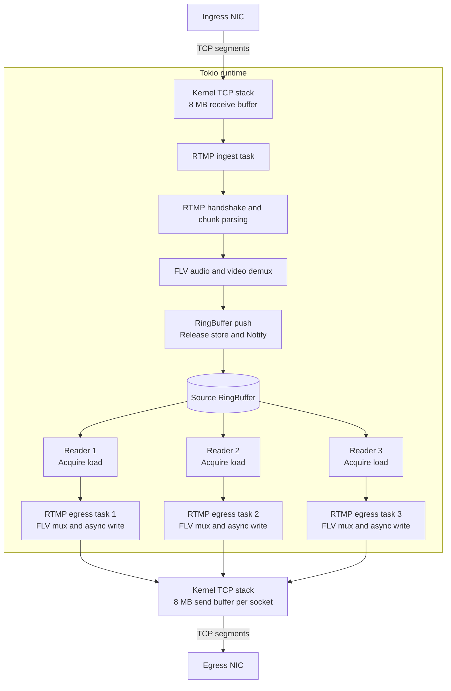
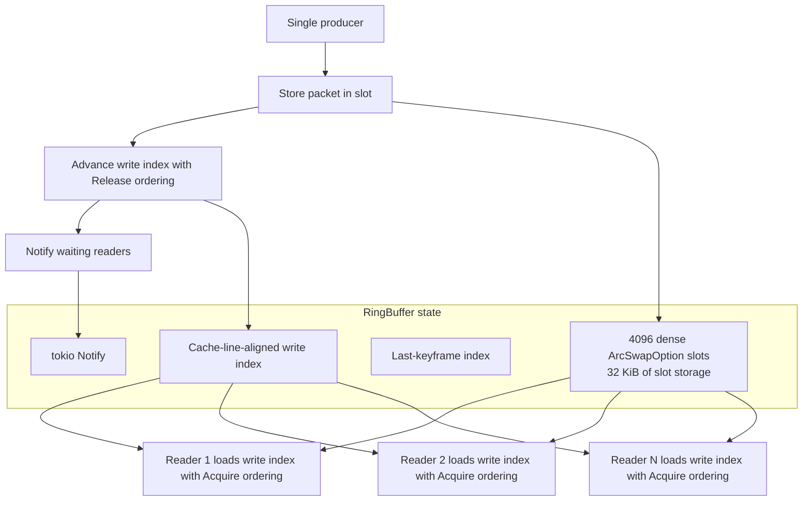
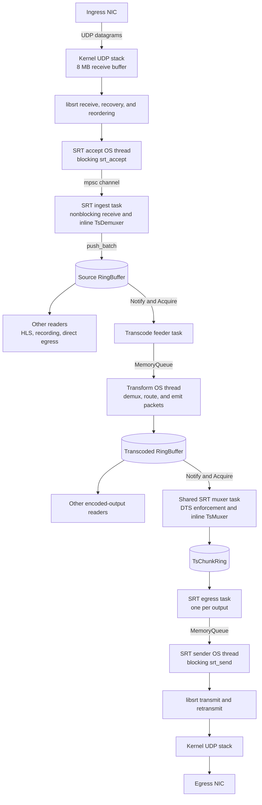
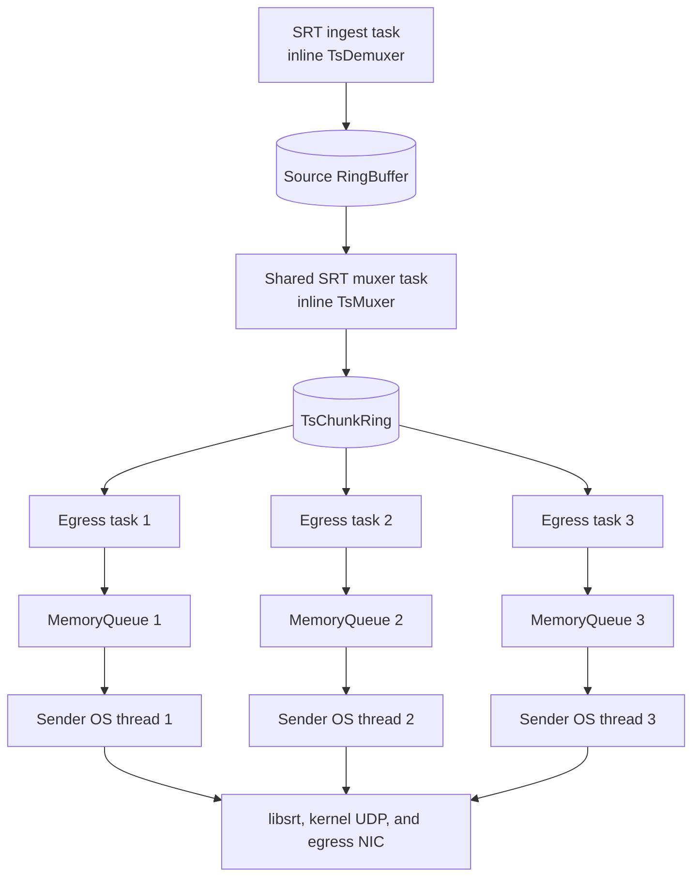
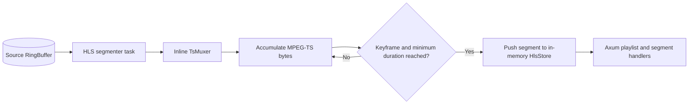
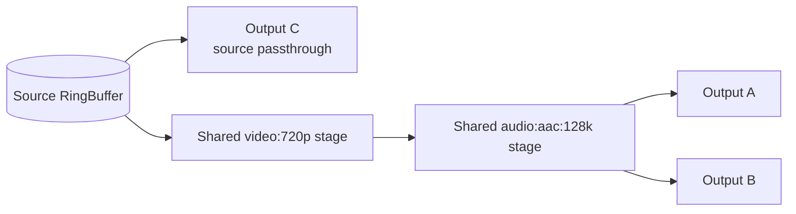

# Architecture

Restream is a Rust application that owns the control plane and the production
media path. The previous Node.js/MediaMTX runtime is archived under `old/`.
MediaMTX may be used as an independent test sink, but it is not a production
dependency.

## Contents

- [Layer Ownership](#layer-ownership)
- [System Shape](#system-shape)
- [Concurrency](#concurrency)
- [Thread Inventory](#thread-inventory)
- [Core affinity](#core-affinity)
- [Packet Flow](#packet-flow)
- [Ring Buffer](#ring-buffer)
- [Packet Walk: RTMP ingest → RTMP egress](#packet-walk-rtmp-ingest-rtmp-egress)
- [Packet Walk: SRT ingest → transcoded SRT egress](#packet-walk-srt-ingest-transcoded-srt-egress)
- [Packet Walk: SRT ingest → SRT egress (no transcoding)](#packet-walk-srt-ingest-srt-egress-no-transcoding)
- [Packet Walk: HLS segmenter](#packet-walk-hls-segmenter)
- [Packet Walk: TS recording](#packet-walk-ts-recording)
- [Synchronization at Each Boundary](#synchronization-at-each-boundary)
- [Memory Ordering (ring buffer hot path)](#memory-ordering-ring-buffer-hot-path)
- [Shared Processing Stages](#shared-processing-stages)
- [HLS and Recording](#hls-and-recording)
- [File Ingest](#file-ingest)
- [State and Authentication](#state-and-authentication)
- [libsrt Internal Threads](#libsrt-internal-threads)
- [Design Rationale: Why OS Threads for FFmpeg](#design-rationale-why-os-threads-for-ffmpeg)
- [Legacy MediaMTX Migration](#legacy-mediamtx-migration)
- [Key source areas](#key-source-areas)

## Layer Ownership

These boundaries are intentional. When refactoring, prefer moving code toward
the owner layer instead of introducing a new abstraction first.

### `domain`

Owns:

- typed configuration, validation, and parsing rules
- stable vocabulary shared across API, application, and media
- enums/newtypes that replace stringly-typed contracts

Should not own:

- SQL
- HTTP request/response shaping
- runtime registries, sockets, or hot-path packet behavior

### `application`

Owns:

- orchestration across persistence, runtime, and edge concerns
- persistence policy for config stored in meta or related tables
- capability traits/ports used to decouple orchestration from storage
- shared workflows reused by more than one API/runtime entry point

Should not own:

- raw SQL text
- packet-level media behavior
- HTTP transport details
- large runtime state machines

### `db`

Owns:

- raw SQL
- schema-aware reads and writes
- row/DTO persistence mechanics

Should not own:

- orchestration across multiple workflows
- runtime policy
- HTTP semantics

### `media`

Owns:

- runtime engine state
- protocol implementations
- hot-path packet transforms and caches
- process/thread lifecycle directly tied to media flow

Should not own:

- API-shaped JSON
- meta-table serialization policy
- duplicated control-plane orchestration
- broad cross-source settings assembly

### `api`

Owns:

- auth gates
- request validation and field-length checks
- HTTP status codes and response shaping
- edge/view serialization

Should not own:

- duplicated orchestration already shared elsewhere
- persistence policy
- runtime-internal view assembly when the same data can come from application

### `lib`

Owns:

- process bootstrap
- top-level wiring of services, runtime tasks, and reconcilers
- spawning loops that connect already-owned modules

Should not own:

- reusable orchestration logic that can live in `application`
- API-facing serialization
- domain validation rules

## System Shape



## Concurrency

Tokio tasks handle:

- Axum HTTP
- RTMP ingest and egress
- SRT connection coordination and ingest (inline native MPEG-TS demux)
- SRT egress feed and mux (inline TsMuxer)
- HLS segmenting and store (inline native MPEG-TS mux)
- Output reconciliation and egress lifecycle
- External transcoder: stdin feeder + stdout TsDemuxer task + stderr logger task
- Audio-routing stages (`atrack:`, `remap:`): pure packet-filter tokio tasks

Dedicated OS threads (`std::thread::spawn`) handle blocking FFmpeg or blocking
libsrt calls:

- SRT accept loop (blocks on `srt_accept()`)
- SRT egress sender (blocks on `srt_send()`)
- Internal transcoder video stage (`RESTREAM_INTERNAL_VIDEO_PRESETS=1`): libavcodec decode+encode via MemoryQueue
- `hevc_to_h264` stage: libavcodec H.265→H.264 in-process, one OS thread per unique RTMP encoding with H.265 ingest (keyed `hevc_to_h264:from:<upstream>`)
- MPEG-TS recording (raw TS write via MemoryQueue)

The **external transcoder** (default) runs `ffmpeg` as a child subprocess — it does
**not** spawn an OS thread inside the parent. Per stage it uses three tokio tasks
(stdin feeder, stdout TsDemuxer, stderr logger) and one `Command::spawn` child.

All `std::thread::spawn` entry points are wrapped in `catch_unwind(AssertUnwindSafe(…))`
so FFmpeg or libsrt panics do not crash the process. SRT accept/sender threads log
the panic and stop; transcoder threads cancel their stage token so the reconciler
can restart the stage on the next tick.

## Thread Inventory

### Fixed threads (always running)

| Thread | Type | Spawned at | Purpose |
|---|---|---|---|
| Tokio runtime workers | OS threads | `src/main.rs` runtime builder | Async task scheduling, epoll I/O polling |
| SRT accept loop | `std::thread` | `srt.rs` `SrtServer::run` | Blocks on `srt_accept()`, sends sockets via bounded `mpsc::channel(1024)` |
| SRT socket monitor | tokio task | `srt.rs` `SrtServer::run` | Polls `/proc/net/udp` every 1s for buffer occupancy |
| Reconciler | tokio task | `lib.rs` `run_app` | 1-second default tick: reconciles output desired vs active state; logs DB errors to stderr instead of silently skipping |
| RTMP listener | tokio task | `lib.rs` `run_app` | Accepts TCP connections on configurable port, default 1935 |
| Web server (Axum) | tokio task | `lib.rs` `run_app` | REST API + SSE health on configurable HTTP port, default 3030 |

Tokio worker count = `num_cpus` (tokio default, not configurable).

### Per-connection / per-output threads and tasks

| Thread / task | Type | Count | Lifetime |
|---|---|---|---|
| RTMP ingest handler | tokio task | 1 per RTMP publisher | TCP connection lifetime |
| RTMP egress handler | tokio task | 1 per RTMP output | Output lifetime |
| SRT ingest handler | tokio task | 1 per SRT publisher | SRT session; inline TsDemuxer |
| SRT shared egress muxer | tokio task | 1 per unique `(pipeline, preset)` | Shared `TsMuxer` task that feeds the SPMC `TsChunkRing` |
| SRT egress connection feeder | tokio task | 1 per SRT output | Drains `TsChunkRing` and writes to the connection's `MemoryQueue` |
| SRT egress sender | `std::thread` | 1 per SRT output, capped at 512 combined (play + egress) by `srt_sender_semaphore` | Blocks on `srt_send()`; connection is rejected gracefully when cap is reached |
| HLS segmenter | tokio task | 1 per active HLS pipeline | Inline TsMuxer + in-memory segment store |
| Ext transcoder stdin feeder | tokio task | 1 per `(pipeline, video_preset)` | source_ring → TsMuxer → FFmpeg stdin |
| Ext transcoder stdout reader | tokio task | 1 per `(pipeline, video_preset)` | FFmpeg stdout → TsDemuxer → output_ring |
| Ext transcoder stderr logger | tokio task | 1 per `(pipeline, video_preset)` | Drains and logs FFmpeg stderr |
| Ext FFmpeg subprocess | child process | 1 per `(pipeline, video_preset)` | Lives while stage is active |
| Int transcoder OS thread | `std::thread` | 1 per `(pipeline, video_preset)` when `RESTREAM_INTERNAL_VIDEO_PRESETS=1` | libavcodec decode+encode via MemoryQueue |
| `hevc_to_h264` OS thread | `std::thread` | 1 per unique RTMP encoding with H.265 ingest | libavcodec H.265→H.264 in-process; keyed `hevc_to_h264:from:<upstream>` |
| `hevc_to_h264` feeder task | tokio task | 1 per unique RTMP encoding with H.265 ingest | upstream ring (source or preset output) → TsMuxer → MemoryQueue |
| Audio-routing stage | tokio task | 1 per `(pipeline, audio_key)` | Pure SelectTracks / Remap filter; no OS thread |
| Recording feeder | tokio task | 1 per active recording | source_ring → MemoryQueue |
| Recording writer | `std::thread` | 1 per active recording | MemoryQueue → raw MPEG-TS file write |

### OS thread count formula

```
total_os_threads =
    num_cpus                                    # tokio workers (fixed)
  + 1                                           # SRT accept loop (fixed)
  + min(N_srt_play + N_srt_egress, 512) × 1    # sender per SRT play subscriber or egress output
                                                #   capped at 512 by srt_sender_semaphore
  + N_hevc_to_h264_pipelines × 1               # libavcodec H.265→H.264 stage
  + N_int_video_stages × 1                     # libavcodec encode (internal backend only)
  + N_recordings × 1                           # TS writer per active recording
```

The following do **not** add OS threads:
- Tokio tasks (RTMP ingest/egress, SRT ingest/egress feed, HLS, recording feeder)
- External transcoder subprocess (child process, not a thread in the parent)
- Audio-routing stages (`atrack:`, `remap:`) — pure tokio task packet filters

### Example: 1 SRT ingest (H.264), 3 SRT egress, 720p transcode (ext), no recording

```
num_cpus (e.g. 8)    tokio workers
+ 1                  SRT accept loop
+ 3                  3 × SRT egress sender
─────
12 OS threads        (ext FFmpeg subprocess is a child process, not counted here)
```

### Example: 1 SRT ingest (H.265), 3 RTMP egress (source), 720p transcode, recording active

```
num_cpus (e.g. 8)    tokio workers
+ 1                  SRT accept loop
+ 1                  hevc_to_h264:from:source OS thread  (RTMP-src passthrough)
+ 1                  recording TS writer
─────
11 OS threads        + 1 ext FFmpeg child process (video:720p)
```

### Example: 1 RTMP ingest, 3 RTMP egress, no transcoding

```
num_cpus (e.g. 8)    tokio workers
+ 1                  SRT accept loop (always runs)
─────
9 OS threads total    (everything else is async tasks)
```

## Core affinity

No CPU pinning is configured. All threads use the kernel's default scheduler.
There is currently no active `core_affinity` wiring.

## Packet Flow



`MediaPacket` carries media type, track index, PTS, DTS, keyframe state,
payload format tag, and a reference-counted payload.

### Payload format tagging

`MediaPacket.format` is a `PayloadFormat` enum (`Flv` or `Raw`) set by the
producer and checked by each consumer:

| Producer | Format | Payload content |
|---|---|---|
| RTMP ingest | `Flv` | FLV-wrapped: 5-byte video header, 2-byte audio header |
| SRT ingest TsDemuxer | `Raw` | Annex B (video), raw AAC (audio) |
| Transcoder stage | `Raw` | Annex B / raw AAC from FFmpeg demux |
| Rust MPEG-TS demuxer | `Raw` | Annex B / raw AAC extracted from PES |

Consumers use `format` to decide whether to strip FLV headers:

| Consumer | `Flv` action | `Raw` action |
|---|---|---|
| RTMP egress | Publish payload directly | Would need FLV re-wrap (not yet implemented) |
| SRT egress TsMuxer | Strip 5/2 byte FLV header, skip sequence headers | Pass through |
| HLS segmenter TsMuxer | Strip 5/2 byte FLV header, skip sequence headers | Pass through |
| Transcoder feeder | Strip FLV headers before muxing to input MPEG-TS | Pass through |
| Recording feeder | Passes raw bytes to FFmpeg MemoryQueue | Passes raw bytes |

## Ring Buffer

Each pipeline uses a 4096-slot single-producer/multi-consumer buffer.
`ArcSwapOption` slots permit lock-free reader loads, and payloads are shared
through `Arc`/`Bytes`. Slots are densely packed; only producer-owned indexes
are cache-line aligned.

Single-producer is an architectural assumption, not currently enforced. A
second independent publisher for the same pipeline can write concurrently and
invalidate it. A proper SRT bonded publisher is different: libsrt presents the
bond as one accepted group ID and one application receive path.

When a reader falls behind by at least the full capacity, it fast-forwards to
the latest known keyframe. Health, graph, and diagnostics expose per-reader lag,
overflow counts, burst-size stats, and unread packet age so operators can spot
slow consumers before they overflow.

The 4096-slot value is sized as a working target for high-rate streams (~24s at
4K60, ~48s at 1080p30). Actual depth depends on packetization, frame rate,
audio-track count, and encoder behavior.

## Packet Walk: RTMP ingest → RTMP egress

Zero thread hops. The entire path runs as Tokio tasks on the async runtime;
the lock-free ring is the only application-level synchronization boundary.



### RingBuffer internals



## Packet Walk: SRT ingest → transcoded SRT egress

The full transform path crosses the SRT accept channel, two lock-free rings,
and two `MemoryQueue` boundaries. The application owns one transform thread
and one blocking SRT sender thread for each output.



## Packet Walk: SRT ingest → SRT egress (no transcoding)

When encoding is `source` (passthrough), no transcoder threads are spawned.
The egress reads directly from the source RingBuffer.



## Packet Walk: HLS segmenter



## Packet Walk: TS recording


## Synchronization at Each Boundary

| Boundary | Mechanism | Blocking? |
|---|---|---|
| SRT accept → tokio handler | `mpsc::channel(1024)` (bounded) | No (async recv) |
| Ingest handler → source RingBuffer | `push_batch()` (`ArcSwap` + `Release`) | No (lock-free) |
| Source ring → transcode feeder | `tokio::sync::Notify` + Acquire | No (async wait) |
| Feeder → transcoder | `MemoryQueue` (Mutex + Condvar) | Yes (Condvar wait) |
| Transcoder → transcoded ring | `ArcSwap` + Release | No (lock-free, direct push) |
| Transcoded ring → egress handler | `tokio::sync::Notify` + Acquire | No (async wait) |
| SRT egress task → SRT sender | `MemoryQueue` (Mutex + Condvar) | Yes (Condvar wait) |

## Memory Ordering (ring buffer hot path)

```rust
// Producer (ingest thread)
slots[idx].data.store(Some(Arc::new(packet)));   // ArcSwap store
write_idx.store(idx + 1, Ordering::Release);     // Release fence
notify.notify_waiters();                         // wake readers

// Consumer (egress task)
let w = write_idx.load(Ordering::Acquire);       // Acquire fence
let pkt = slots[idx].data.load_full();           // ArcSwap load
```

Release on the producer ensures all stores (slot data, keyframe index) are
visible before the write index increment. Acquire on the consumer establishes
a happens-before edge. Each reader has an independent `read_idx` — no
contention between consumers.

## Shared Processing Stages

Typed output configs are lowered into two stage identities:

1. video preset, shared across outputs using the same transform;
2. audio routing, keyed by both routing mode and upstream video stage.

Example:



The stage cache prevents one encoder per destination. The current transcoder
creates output encoder parameters but then stream-copies compressed input
packets; it does not run a decode/filter/encode loop. Resolution, crop/rotate,
and H.265-to-H.264 presets therefore remain non-functional transforms even
though their stages appear in the graph.

Task "active" state is generally cancellation-token presence, not a worker
health signal. A native worker thread can fail while its feeder task/token
remains active.

## HLS and Recording

HLS segments are stored in memory in a twenty-segment sliding window and served by
Axum. The store and playlist behavior are tested. The live feeder uses the
native `TsMuxer` inline in the async task. One shared segmenter serves all
browser previews and HLS-type outputs per pipeline, kept alive by access
heartbeats and persistent output references.

Recordings are written as raw MPEG-TS files under `media/`. Recordings shorter
than five seconds are removed automatically. Recording uses the shared TS packet
feeder and a MemoryQueue-backed writer thread.

After a successful recording stop, the runtime launches a one-off FFmpeg remux
to a sibling `.mp4` for browser-friendly playback. Operators can choose whether
the source `.ts` is retained after a successful remux via the persisted
`recordingSettings.retainSourceTs` setting. Failed remuxes always keep the
source `.ts`.

## File Ingest

Configured file ingest has two backends:

- default: spawn the same embedded `public/bin/ffmpeg` binary used by the
  external transcoder, point it at a media file directly, and read MPEG-TS from
  stdout;
- optional (`RESTREAM_USE_INTERNAL_FILE_INGEST=1`): remux the file to MPEG-TS
  in-process through linked libavformat/libavcodec and feed the same
  `TsDemuxer` path without a subprocess.

Both backends converge on `TsDemuxer`, push `MediaPacket`s into the source
ring, track running state by ingest ID, and stop through the API without any
RTMP loopback hop.

File ingest also exposes a `liveOptimized` mode with configurable
`targetGopSeconds`. That mode always uses the embedded FFmpeg subprocess so it
can re-encode video to H.264, audio to AAC, and force a live-friendly keyframe
cadence when the source file's GOP is too sparse for steady preview and
recording.

## State and Authentication

SQLite stores pipelines, outputs, jobs, logs, file-ingest definitions, metadata,
and sessions. On first startup, the dashboard password is taken from
`RESTREAM_INITIAL_ADMIN_PASSWORD` when set; otherwise a high-entropy initial
password is generated, written to a local owner-only file next to the SQLite
database, and stored as a scrypt hash. Session cookies are `HttpOnly` and
`SameSite=Strict`.

Deletion handlers cancel active output/ingest tasks before removing their
database rows, and file-ingest deletion kills its tracked child. Naturally
exited file-ingest children are reaped by the reconciler and by running-state
checks.

## libsrt Internal Threads

libsrt manages its own thread pool (opaque to the application):

- Sender threads: retransmission, ACKs, bandwidth probing
- Receiver threads: UDP recv, reordering, loss recovery

These are not controlled by restream. The application interacts via
`srt_recv()` / `srt_send()` / `srt_accept()` calls.

## Design Rationale: Why OS Threads for FFmpeg

FFmpeg codec calls (`avcodec_decode_video2`, `avcodec_encode_video2`,
`av_interleaved_write_frame`) block indefinitely. Running them on a tokio
worker would stall all tasks on that thread. Explicit `std::thread::spawn`
keeps the async runtime responsive.

All FFmpeg threads use `catch_unwind(AssertUnwindSafe(…))` so that corrupt
streams or codec bugs log errors without crashing the process. All three SRT
OS threads (accept, play sender, egress sender) carry the same guard.

## Legacy MediaMTX Migration

The previous Node.js backend used MediaMTX for RTMP/SRT transport, path
management, health APIs, Prometheus metrics, and HLS preview. All of those are
now handled natively by the Rust binary. MediaMTX remains useful only as an
isolated interoperability sink in protocol tests.

The old MediaMTX Prometheus/Grafana setup belongs to the archived implementation
under `old/`. The current Rust binary has no `/metrics` text endpoint.

## Key source areas

Line counts are intentionally omitted because the source audit owns that
volatile inventory. These paths are the maintained ownership map:

| Source area | Responsibility |
|---|---|
| `src/lib.rs`, `src/infrastructure/` | App composition, service wiring, and reconciliation |
| `src/api/` | Router, auth, REST/SSE handlers, and embedded assets |
| `src/application/` | Control-plane orchestration and service ports |
| `src/domain/` | Stable IDs, state, output specs, and validation vocabulary |
| `src/db/` | SQLite schema and repositories |
| `src/runtime/`, `src/api_runtime_views/` | Runtime models and operator-facing snapshots |
| `src/diag.rs` | Native diagnostics |
| `src/media/engine.rs`, `src/media/engine_*` | Active media state, lifecycle, and snapshots |
| `src/media/ring_buffer.rs`, `src/media/ts_chunk_ring.rs` | Packet and MPEG-TS fan-out |
| `src/media/mpegts.rs`, `src/media/codec.rs` | Native MPEG-TS and codec transforms |
| `src/media/avio.rs` | In-memory FFmpeg AVIO and queues |
| `src/media/rtmp.rs`, `src/media/srt*.rs` | RTMP and SRT protocol adapters |
| `src/media/hls/`, `src/media/engine_hls.rs` | In-memory HLS stores, segmenters, upload, and lifecycle |
| `src/media/recording/` | Recording lifecycle, writer, and catalog |
| `src/media/transcoder.rs`, `src/media/external_transcoder.rs` | Shared internal and external transcoder stages |
