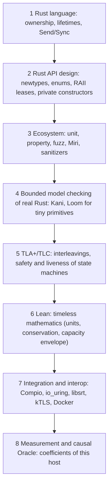

# Assurance roadmap

How Restream and srt-rs should prove what they claim, ordered by cost. This
condenses a design conversation ("Program proofs in Lean", 2026-10) and
checks it against the code as it is today. [Concurrency proofing](concurrency-proofing.md)
remains the operational guide to which gate to run; this page decides what to
build next.

## Contents

- [The rule](#the-rule)
- [The ladder](#the-ladder)
- [Where we are](#where-we-are)
- [Relevant work: Rust and its ecosystem](#relevant-work-rust-and-its-ecosystem)
- [Good-to-have future work](#good-to-have-future-work)

## The rule

> **Every invariant lives at the lowest rung that can enforce it cleanly.**

Prefer, in this order: delete duplicated state; make the invalid state
unrepresentable; make mutation go through a capability (a lease, permit or
handle); check the one primitive that owns the invariant; test only
composition and external behavior. Optimize for proof compression, not for
test deletion: delete a test when the behavior it defends can no longer be
expressed through the production API, never merely because a new abstraction
exists. If hardening an invariant adds more machinery than the tests it
replaces, do not do it.

## The ladder

Read top to bottom from cheapest to widest scope. A higher rung is not a
better one: each answers a different question. Rust and API
design own **structure** (who owns what), TLA+ owns **time** (which orderings
are legal), Lean owns **mathematics** (what follows from the equations), and
measurement owns **physics** (what this host can sustain). Proofs never yield
a host coefficient such as packets per second; measurements never yield a
universal invariant.

## Where we are

Checked against `master` (Restream) and `main` (srt-rs), October 2026.

| Rung | Restream | srt-rs |
|---|---|---|
| 1 Language | Strong: Compio Owners are `!Send` and thread-homed; one Owner per address family, not per output. Unsafe is confined to FFmpeg/libc/socket boundaries. | Strong: sans-I/O single-owner protocol core; `srt-lifecycle` forbids `unsafe`; strict unsafe lints. |
| 2 API design | Good, with duplicated state the types do not prevent (listed below). | Strong: logical peer/caller ids, transactional first attach, bounded caller pool, generational dense arena that owns readiness. |
| 3 Ecosystem | Many property tests and live fault cases; cargo-fuzz smoke over six media/RTMP parsers; **no Miri or sanitizer job in CI**. | Mature: proptests with checked-in seeds, Miri, ASan, structured cargo-fuzz targets, libsrt interop. |
| 4 Model checking | Seven Loom models in the mandatory concurrency gate. **No Kani.** | One Loom model (reuseport layout barrier, run by `cargo xtask ci`). **No Kani.** |
| 5–6 TLA+, Lean | None. | None. |

Rungs 1–3 are close to their useful limit. The real gaps are rung-2
duplicated state in Restream and Kani at rung 4 in both repositories.

## Relevant work: Rust and its ecosystem

Each item names the code it changes and the tests it lets us delete. Hot-path
items need before/after benchmark or codegen evidence.

### Rung 2: delete duplicated state

1. **`EgressManager` keeps one map, not two.** `desired` and `desired_specs`
   (`src/media/egress/manager.rs`) must agree on keys and generations; fold
   the spec into `DesiredOutput`. Disagreement then has no representation.
2. **`ReadyQueue` owns membership.** `ScheduleState::enqueued`
   (`src/media/egress/scheduler.rs`) mirrors queue membership, and backends
   repeat the check/set/push sequence inline. Make the queue the only
   authority (dense bitset for membership; `pop` returns a non-`Copy` item
   that `requeue` consumes). Deletes `enqueued`, `can_enqueue`, the
   caller-discipline sequences and the discipline proptest; keep one check of
   the queue itself. Hot path: benchmark first. srt-rs's dense arena
   (`ready_queued`, generational `PeerSlotId`) is the pattern to copy.
3. **HLS persistent consumers are a lease.** `add_persistent`/
   `remove_persistent` on an `AtomicU64` (`src/media/engine_hls.rs`) allow an
   unmatched remove that wraps the counter (a test documents it). Return a
   non-`Clone` `PersistentLease` that decrements on `Drop`; delete the
   remove API and the wrap test; keep "lease held ⇒ not idle" and
   "lease dropped ⇒ may go idle".
4. **No shadow command depth.** `command_depths`
   (`src/media/egress/manager.rs`) shadows the bounded shard channels and
   must be reset to the real lengths. Let the channel own capacity
   (`try_send`), or a `CommandPermit` where a send needs a reservation first.
5. **`WorkBudget` debits itself.** Its fields are public counters checked by
   each engine (`src/media/egress/policy.rs`). Make it an active resource with
   private remaining units/bytes and `claim`/`take_*` operations, ideally
   reached only through a visit context that performs the I/O. Most
   per-backend "does not exceed N" tests collapse into one primitive test.
   Deadlines stay a runtime check.
6. **One generation resolver.** Stale-completion checks are written per
   handler (DNS, connect, timers, unregister, retry). Route every
   asynchronous mutation through `resolve_current(id) -> Option<&mut T>` on a
   generational arena; keep one check of the arena and one wiring test per
   subsystem.

Keep as they are: `LeafLifecycle` (one enum, one transition table; typestate
would add wrapping for little gain), and every test of external behavior
(RTMP serialization, libsrt interop, slow-peer isolation, Compio wakeups,
kTLS handoff, capacity).

### Rung 3: narrow memory-safety jobs for Restream

Add a small Miri target for pure, ownership-sensitive Rust that needs no
FFmpeg or kernel, and an AddressSanitizer job over selected native/FFI-heavy
integration tests. Do not copy srt-rs's whole matrix: Miri cannot execute
FFmpeg or io_uring paths. The parser fuzz targets (enhanced-RTMP HEVC,
AVCC/ASC, RTMP server responses) exist; see [testing](testing.md#parser-fuzz-targets).

### Rung 4: Kani on a handful of primitives

Five to ten harnesses, each over a small bounded state and a production
function, not a framework:

| Repository | Primitive | Property for every bounded sequence |
|---|---|---|
| srt-rs | `DenseSlotArena` | a stale handle never resolves; live ≤ capacity |
| srt-rs | `DueIndex` / `DenseDueIndex` | entries and due results stay consistent through replace/remove |
| srt-rs | admission accounting, `CallerPool` | totals never exceed limits; queued + in-flight + free = capacity |
| srt-rs | sequence/window arithmetic | wrap and frontier operations stay in valid regions |
| Restream | `ReadyQueue` (after item 2) | membership ⇔ queued; each key at most once |
| Restream | generational arena (after item 6) | generation mismatch ⇒ no mutable access |

Loom stays narrow: only cross-thread primitives that remain after the
fixed-owner design (wakes, snapshot swaps, shutdown signals, the reuseport
layout barrier). Needing Loom across the dataplane means the ownership model
was violated.

### Practice

- A counterexample from any checker becomes a deterministic Rust regression
  test with the same step sequence.
- Commits that change an invariant state which rung enforces it and name the
  test or harness that proves it (mutation-check new guards).

## Good-to-have future work

Not scheduled. Each becomes worth doing at the roadmap point named.

### TLA+ (TLC first; Apalache only if TLC state spaces hurt)

Small specifications with 2–3 actors, kept beside the code
(`spec/tla/`), checked by TLC in CI:

- **`GenerationOwnership`** (now-ish): no event produced for generation *g*
  mutates state of *g′ ≠ g*, across create/remove/reuse and timer, TX, RX,
  connect and shutdown completions.
- **`OwnerScheduler`**: per-visit work ≤ budget; TX-slot conservation
  (free + reserved + queued + in flight + completing = K); liveness: a
  continuously ready caller is eventually serviced under fairness.
- **`Reconciler`**: a result for an older revision never installs; deleting
  and recreating cannot attach an old completion; eventually runtime =
  reconcile(desired) once desired stops changing.
- **kTLS handoff** (only if its lifecycle grows): application data is sent
  only in plaintext mode or after kTLS is installed, never both.
- **`Rescale`** (only once the Oracle may move live state): exactly one owner
  per leaf, no rescale during another, stale migration completions ignored.

Use a refinement mapping (concrete slot/generation/ready model → abstract
caller states) so models stay small. TLAPS stays out unless an unbounded
proof becomes necessary.

### Lean (when capacity work makes the model gate admission)

A compact `Capacity` package: units (bits/s, bytes/s, packets/s,
cycles/packet, core-equivalents) and their conversions (payload bitrate vs
SRT pacing rate, logical connections vs physical legs); conservation;
monotonicity of demand Σλᵢcᵢ in each rate; the envelope lemma
(max utilization < U_safe ⇒ every resource < U_safe); admission. Lean proves
the equation machinery; coefficients come from measurement.

### Oracle provenance

Label every claim the system reports by how it is known: `PROVED`,
`MODEL-CHECKED`, `IMPLEMENTATION-CHECKED`, `OBSERVED`, `MEASURED`,
`INFERRED`, `ASSUMED`. A theorem has no confidence score; a capacity
estimate does. Optimizations then carry a falsifiable prediction (which
limiting term moves, by how much) checked by a controlled benchmark.

### Languages to watch, not adopt

- **Bend 2**: one definition that is both executable and the subject of a
  checked law. Worth one side experiment on a pure kernel (receiver
  reservation conservation or the admission envelope) compared against
  Rust + proptest, Rust + Kani and Lean + Rust. Not for the dataplane: one
  effect event loop, no 64-bit integers, and a source proof is not a verified
  compiler.
- **Vx**: borrow the idea, not the language. A typed machine graph (CPU, NUMA
  memory, NIC queues, io_uring shards, accelerators; edges with bandwidth,
  latency and cost) is a good schema for the Oracle, with capacities measured
  rather than taken from specifications. Vx itself targets tensor placement
  and is at v0.0.2.

Not planned: Verus, Prusti, Creusot, Coq or Isabelle; formal models of Linux,
Compio, TLS or the whole SRT protocol; a proof of the full Rust ↔ TLA+
correspondence.
