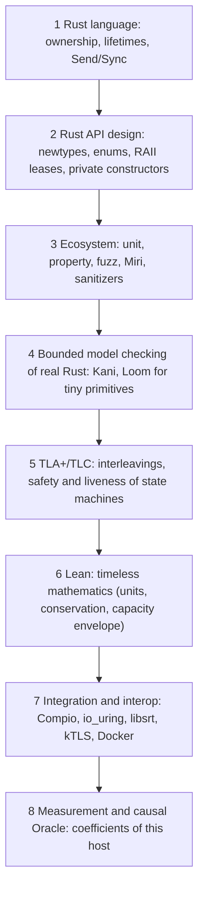

# Assurance roadmap

How Restream and srt-rs should prove what they claim, ordered by cost. This
condenses a design conversation ("Program proofs in Lean", 2026-10) and
checks it against the code as it is today. [Concurrency proofing](concurrency-proofing.md)
remains the operational guide to which gate to run; this page decides what to
build next.

## Contents

- [The rule](#the-rule)
- [The ladder](#the-ladder)
- [Where we are](#where-we-are)
- [Relevant work: Rust and its ecosystem](#relevant-work-rust-and-its-ecosystem)
- [Good-to-have future work](#good-to-have-future-work)

## The rule

> **Every invariant lives at the lowest rung that can enforce it cleanly.**

Prefer, in this order: delete duplicated state; make the invalid state
unrepresentable; make mutation go through a capability (a lease, permit or
handle); check the one primitive that owns the invariant; test only
composition and external behavior. Optimize for proof compression, not for
test deletion: delete a test when the behavior it defends can no longer be
expressed through the production API, never merely because a new abstraction
exists. If hardening an invariant adds more machinery than the tests it
replaces, do not do it.

Rust is affine, not linear: a lease or permit gives at-most-once ownership,
but `mem::forget` or an abort skips its `Drop`. Exact resource accounting must
therefore tolerate a leaked token (a bounded leak, never a double release).

## The ladder

Read top to bottom from cheapest to widest scope. A higher rung is not a
better one: each answers a different question. Rust and API
design own **structure** (who owns what), TLA+ owns **time** (which orderings
are legal), Lean owns **mathematics** (what follows from the equations), and
measurement owns **physics** (what this host can sustain). Proofs never yield
a host coefficient such as packets per second; measurements never yield a
universal invariant.

Safe Rust is strong at spatial questions (who owns this, how long it lives,
who may mutate it) and weak at temporal ones (should this event still be
accepted, will this caller be serviced, does shutdown terminate). That
boundary is where to climb. A shared-nothing design (one owner per
connection, no connection mutex) is itself a verification technique: it
removes whole bug families before any checker runs.

## Where we are

Checked against `master` (Restream) and `main` (srt-rs), October 2026, and
re-checked against the full conversation after the isolation work (open PRs
named where they apply).

| Rung | Restream | srt-rs |
|---|---|---|
| 1 Language | Strong: Compio Owners are `!Send` and thread-homed; one Owner per address family, not per output. Unsafe is confined to FFmpeg/libc/socket boundaries. Builds refuse `panic = "abort"` (fault domains need unwinding, #240). Workspace lints deny `unsafe_op_in_unsafe_fn`, `unused_must_use` and `clippy::undocumented_unsafe_blocks`; FFI-free modules `forbid(unsafe_code)`. | Strong: sans-I/O single-owner protocol core; `srt-lifecycle` forbids `unsafe`; strict unsafe lints. |
| 2 API design | Good, with duplicated state the types do not prevent (listed below). Per-entity panic boundaries and per-client admission bounds (#237, #239; [isolation audit](isolation-audit.md)); std locks only through poison-tolerant `crate::sync`, enforced by `clippy.toml` (#240). | Strong: logical peer/caller ids, transactional first attach, bounded caller pool, generational dense arena that owns readiness. |
| 3 Ecosystem | Many property tests and live fault cases; cargo-fuzz smoke over seven media/RTMP/TS parsers; narrow Miri and ASan CI jobs ([testing](testing.md#miri-and-addresssanitizer)). | Mature: proptests with checked-in seeds, Miri, ASan, structured cargo-fuzz targets, libsrt interop. |
| 4 Model checking | Seven Loom models in the mandatory concurrency gate. **No Kani.** | One Loom model (reuseport layout barrier, run by `cargo xtask ci`). **No Kani.** |
| 5–6 TLA+, Lean | None. | None. |

Rungs 1–3 are close to their useful limit. The real gaps are rung-2
duplicated state in Restream and Kani at rung 4 in both repositories.

## Relevant work: Rust and its ecosystem

Each item names the code it changes and the tests it lets us delete. Hot-path
items need before/after benchmark or codegen evidence.

### Rung 1: adopt srt-rs's workspace lints (done)

Restream's `[lints]` sets only `unexpected_cfgs`. Adopt what srt-rs already
enforces: `unsafe_op_in_unsafe_fn = "deny"`, `clippy::undocumented_unsafe_blocks
= "deny"` (every `unsafe` carries its `SAFETY:` argument), `unused_must_use =
"deny"`, and `#![forbid(unsafe_code)]` in modules with no FFI or syscalls
(the parsers, the scheduler, the reconciler). Fix the existing sites in the
same change; no allow-list.

Done: `[lints]` in `Cargo.toml`; every one of the 91 existing `unsafe` sites
(lib, tests, `test_harness`) states its `SAFETY:` argument;
`#[forbid(unsafe_code)]` sits on the `mod` declarations of `codec`, `mpegts`
(with `mpegts_probe`), `hls::fmp4`, `hls::upload_policy`, `rtmp::{flv,
ingest_media, timestamps}`, `egress::scheduler` and both `reconcile`
modules. The audit removed one test that mutated the process environment
while sibling tests ran; its assertion moved under `ENV_LOCK`.

### Rung 2: the strong Rust forms

Use these before any checker, wherever the weak form exists today:

| Invariant | Weak form | Strong form |
|---|---|---|
| never zero | `usize` + tests | `NonZeroUsize` / `NonZeroU32` |
| exactly one lifecycle state | several booleans | one `enum` + one transition function |
| one owner of a resource | id + discipline | owned non-`Clone` capability |
| acquire and release paired | `add()` … `remove()` | RAII lease (`Drop` releases) |
| stale object never mutated | index + generation checks at each site | opaque generational handle resolved by the arena |
| queue never over capacity | `VecDeque` + caller `len` checks | bounded container with no unchecked insert |
| queued at most once | queue + external flag | queue owns membership |
| invalid config never runs | public fields + validation convention | private fields + validated constructor |
| units never mix | several `u64`s | newtypes (`Bytes`, `Packets`, `Generation`, `ShardId`) |
| untrusted bytes never panic | indexing + tests | slice patterns, `get`, checked arithmetic, module-level `deny` lints ([isolation audit](isolation-audit.md) F6) |

### Rung 2: delete duplicated state

1. **`EgressManager` keeps one map, not two** (done). `desired` and `desired_specs`
   (`src/media/egress/manager.rs`) must agree on keys and generations; fold
   the spec into `DesiredOutput`. Disagreement then has no representation.
2. **`ReadyQueue` owns membership.** `ScheduleState::enqueued`
   (`src/media/egress/scheduler.rs`) mirrors queue membership, and backends
   repeat the check/set/push sequence inline. Make the queue the only
   authority (dense bitset for membership; `pop` returns a non-`Copy` item
   that `requeue` consumes). Deletes `enqueued`, `can_enqueue`, the
   caller-discipline sequences and the discipline proptest; keep one check of
   the queue itself. Hot path: benchmark first. srt-rs's dense arena
   (`ready_queued`, generational `PeerSlotId`) is the pattern to copy.
3. **HLS persistent consumers are a lease** (done: `PersistentLease`). `add_persistent`/
   `remove_persistent` on an `AtomicU64` (`src/media/engine_hls.rs`) allow an
   unmatched remove that wraps the counter (a test documents it). Return a
   non-`Clone` `PersistentLease` that decrements on `Drop`; delete the
   remove API and the wrap test; keep "lease held ⇒ not idle" and
   "lease dropped ⇒ may go idle".
4. **No shadow command depth** (done: `CommandSink`). `command_depths`
   (`src/media/egress/manager.rs`) shadowed the bounded shard channels and
   had to be reset to the real lengths. The manager now asks the channel
   (`CommandSink::free_slots`, flume capacity minus length) before it sends;
   the shadow, its reset/complete calls and the test-only `apply_command`
   are gone.
5. **`WorkBudget` debits itself** (done). Its fields were public counters checked by
   each engine (`src/media/egress/policy.rs`). Make it an active resource with
   private remaining units/bytes and `claim`/`take_*` operations, ideally
   reached only through a visit context that performs the I/O. Most
   per-backend "does not exceed N" tests collapse into one primitive test.
   Deadlines stay a runtime check.

   Done: the limits and the spent units/bytes are private; engines call
   `debit_bytes`/`debit_unit` and ask `is_exhausted()`/`remaining_bytes()`,
   and report progress from `spent_*()`. The RTMP and SRT engines lost
   their parallel `total_*` counters. Feed reads keep sizing from the
   visit limit (`max_bytes()`), not the remainder, as before. The
   per-engine budget tests stay: they check where each engine consults
   the budget (an outsized unit stops mid-flush), not the arithmetic.
6. **One generation resolver.** Stale-completion checks are written per
   handler (DNS, connect, timers, unregister, retry). Route every
   asynchronous mutation through `resolve_current(id) -> Option<&mut T>` on a
   generational arena; keep one check of the arena and one wiring test per
   subsystem.

   Done for slot-addressed state: `LeafArena` (`src/media/egress/leaf_arena.rs`)
   owns every shard's leaves (RTMP, SRT, sink, pipeline), and a `LeafKey`
   carries the slot's epoch, bumped on removal. Readiness events, I/O
   completions and queued entries for a removed leaf stop resolving, even
   when the slot, the fd and the spec generation are all reused (the case
   per-handler checks missed). One proptest checks the arena; the RTMP
   test `a_removed_leafs_late_event_does_not_reach_the_slots_next_output`
   checks the wiring. Output-keyed pending connects (DNS, Owner admission)
   keep their spec-generation check: the output id is their identity.

Keep as they are: `LeafLifecycle` (one enum, one transition table; typestate
would add wrapping for little gain), and every test of external behavior
(RTMP serialization, libsrt interop, slow-peer isolation, Compio wakeups,
kTLS handoff, capacity).

### Rung 3: narrow memory-safety jobs for Restream (done)

Add a small Miri target for pure, ownership-sensitive Rust that needs no
FFmpeg or kernel, and an AddressSanitizer job over selected native/FFI-heavy
integration tests. Do not copy srt-rs's whole matrix: Miri cannot execute
FFmpeg or io_uring paths. The parser fuzz targets (enhanced-RTMP HEVC,
AVCC/ASC, RTMP server responses, ingest requests, MPEG-TS demux) exist and a
crash found by them is fixed with a regression test first; see
[testing](testing.md#parser-fuzz-targets). Fuzz belongs at externally supplied
bytes: no theorem prover for parser robustness.

Done: CI `Miri` runs the kTLS control-message parser (project `unsafe`) plus
the leaf arena, scheduler and bit reader; CI `AddressSanitizer` runs the FFI
and syscall tests (avio, transcoders, file ingest, TLS, Compio TCP, external
transcoder, TSC timing, RTMP listener and live sessions, TCP stats, runtime
info) with build-std instrumentation. Both refuse a filter that selects no
test. A deliberate
use-after-free probe was reported as `heap-use-after-free`, so the job is
live. Leak detection is off (FFmpeg's process-lifetime allocations).

### Rung 4: Kani on a handful of primitives

Five to ten harnesses, each over a small bounded state and a production
function, not a framework:

| Repository | Primitive | Property for every bounded sequence |
|---|---|---|
| srt-rs | `DenseSlotArena` | a stale handle never resolves; live ≤ capacity |
| srt-rs | `DueIndex` / `DenseDueIndex` | entries and due results stay consistent through replace/remove |
| srt-rs | admission accounting, `CallerPool` | totals never exceed limits; queued + in-flight + free = capacity |
| srt-rs | sequence/window arithmetic | wrap and frontier operations stay in valid regions |
| srt-rs | TX / permit pool | free + held + in flight = capacity; no stranded slot |
| srt-rs | output-drain budget arithmetic | no underflow or overrun through any bounded sequence |
| srt-rs | packet-size and rate conversions | payload ↔ wire bytes, MAXBW (the 1316/1332 class) |
| Restream | `ReadyQueue` (after item 2) | membership ⇔ queued; each key at most once |
| Restream | generational arena (after item 6) | generation mismatch ⇒ no mutable access |
| Restream | `WorkBudget` (after item 5) | granted work never exceeds the budget |

Loom stays narrow: only cross-thread primitives that remain after the
fixed-owner design (wakes, snapshot swaps, shutdown signals, the reuseport
layout barrier). Needing Loom across the dataplane means the ownership model
was violated.

### Practice

- A counterexample from any checker becomes a deterministic Rust regression
  test with the same step sequence.
- Commits that change an invariant state which rung enforces it and name the
  test or harness that proves it (mutation-check new guards).

## Good-to-have future work

Not scheduled. Each becomes worth doing at the roadmap point named.

### TLA+ (TLC first; Apalache only if TLC state spaces hurt)

Small specifications with 2–3 actors, kept beside the code
(`spec/tla/`), checked by TLC in CI:

- **`GenerationOwnership`** (now-ish): no event produced for generation *g*
  mutates state of *g′ ≠ g*, across create/remove/reuse and timer, TX, RX,
  connect and shutdown completions.
- **`OwnerScheduler`**: per-visit work ≤ budget; TX-slot conservation
  (free + reserved + queued + in flight + completing = K); liveness: a
  continuously ready caller is eventually serviced under fairness.
- **`Reconciler`**: a result for an older revision never installs; deleting
  and recreating cannot attach an old completion; eventually runtime =
  reconcile(desired) once desired stops changing.
- **kTLS handoff** (only if its lifecycle grows): application data is sent
  only in plaintext mode or after kTLS is installed, never both.
- **`Rescale`** (only once the Oracle may move live state): exactly one owner
  per leaf, no rescale during another, stale migration completions ignored.
- **Media ring and cursors** (deferred while ring semantics are stable):
  oldest ≤ head; occupancy ≤ capacity; a cursor never resurrects evicted
  state; a frozen leaf cannot block eviction or another leaf's progress.

Use a refinement mapping (concrete slot/generation/ready model → abstract
caller states) so models stay small. TLAPS stays out unless an unbounded
proof becomes necessary.

Footprint stays tiny: `spec/tla/` beside the code (srt-rs:
`GenerationOwnership`, `OwnerScheduler`; Restream: `Reconciler`, later
`Rescale`) and `spec/lean/Capacity/` (`Units`, `Conservation`, `Envelope`,
`Admission`). No framework, model API or proof runtime.

### Lean (when capacity work makes the model gate admission)

A compact `Capacity` package: units (bits/s, bytes/s, packets/s,
cycles/packet, core-equivalents) and their conversions (payload bitrate vs
SRT pacing rate, logical connections vs physical legs); conservation;
monotonicity of demand Σλᵢcᵢ in each rate; the envelope lemma
(max utilization < U_safe ⇒ every resource < U_safe); admission. Lean proves
the equation machinery; coefficients come from measurement.

Candidates to graduate from tests to theorems (10–20, not more): receiver
occupancy = retained + loss + application reservations ≤ capacity; a stale
completion never mutates a newer generation; one visit never exceeds its
budget; partial send or backpressure never reorders output; ring memory stays
bounded however slowly one destination reads; rebuilding a deadline index
keeps the set of live deadlines; transactional admission rolls back
completely; continuously ready work is serviced under stated fairness.

### Assurance CI tiers (once the formal pieces exist)

| Gate | Contents |
|---|---|
| PR fast | Rust tests, selected Kani harnesses, small TLC configurations, Lean build |
| PR integration | live SRT/RTMP/kTLS end-to-end, libsrt interop, fault cases |
| Nightly | larger TLC models, deeper Kani unwinds, longer fuzz runs |
| Performance qualification | pinned-host workloads, Oracle calibration |
| Release | full host/container/loss/crypto matrix |

### Oracle provenance

Label every claim the system reports by how it is known: `PROVED`,
`MODEL-CHECKED`, `IMPLEMENTATION-CHECKED`, `OBSERVED`, `MEASURED`,
`INFERRED`, `ASSUMED`. A theorem has no confidence score; a capacity
estimate does. Optimizations then carry a falsifiable prediction (which
limiting term moves, by how much) checked by a controlled benchmark.

The Oracle is a causal performance model (identity, conservation, queues,
service rates, deadlines, kernel evidence, time correlation) with a query
interface, not a model guessing from dashboards. Its first production form
only computes: required cores and shards, headroom, hottest shard and the
current bottleneck. It moves live state only after migration is boring and
`Rescale` is model-checked.

### Languages to watch, not adopt

- **Bend 2**: one definition that is both executable and the subject of a
  checked law. Worth one side experiment on a pure kernel (receiver
  reservation conservation or the admission envelope) compared against
  Rust + proptest, Rust + Kani and Lean + Rust. Not for the dataplane: one
  effect event loop, no 64-bit integers, and a source proof is not a verified
  compiler.
- **Vx**: borrow the idea, not the language. A typed machine graph (CPU, NUMA
  memory, NIC queues, io_uring shards, accelerators; edges with bandwidth,
  latency and cost) is a good schema for the Oracle, with capacities measured
  rather than taken from specifications. Vx itself targets tensor placement
  and is at v0.0.2. Worth one side experiment: describe a simplified host
  (2 NUMA nodes, 1 NIC, 4 egress shards, 1 GPU) in its machine algebra and
  see where Restream-specific resources (PPS, SQE/CQE, socket memory,
  deadlines) stop fitting.

Not planned: Verus, Prusti, Creusot, Coq or Isabelle; formal models of Linux,
Compio, TLS or the whole SRT protocol; a proof of the full Rust ↔ TLA+
correspondence.
