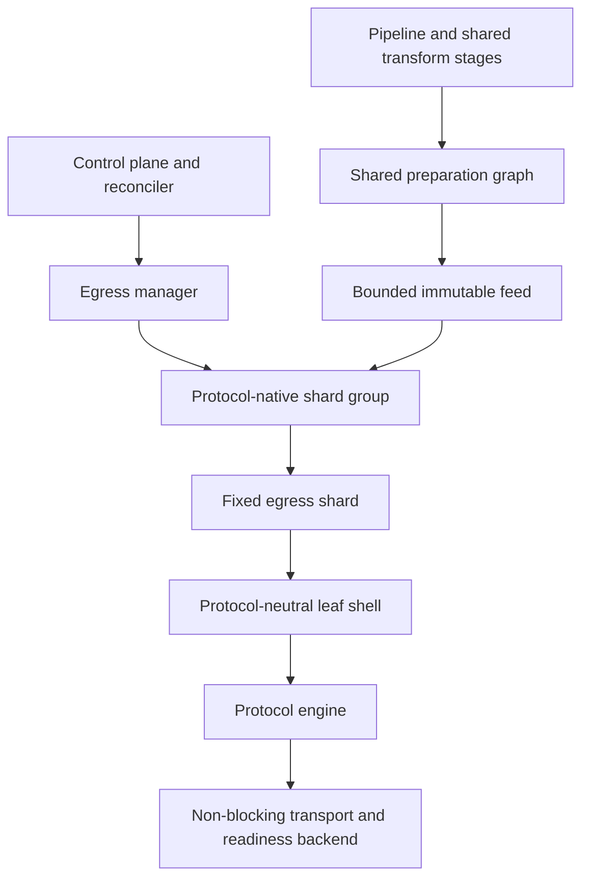
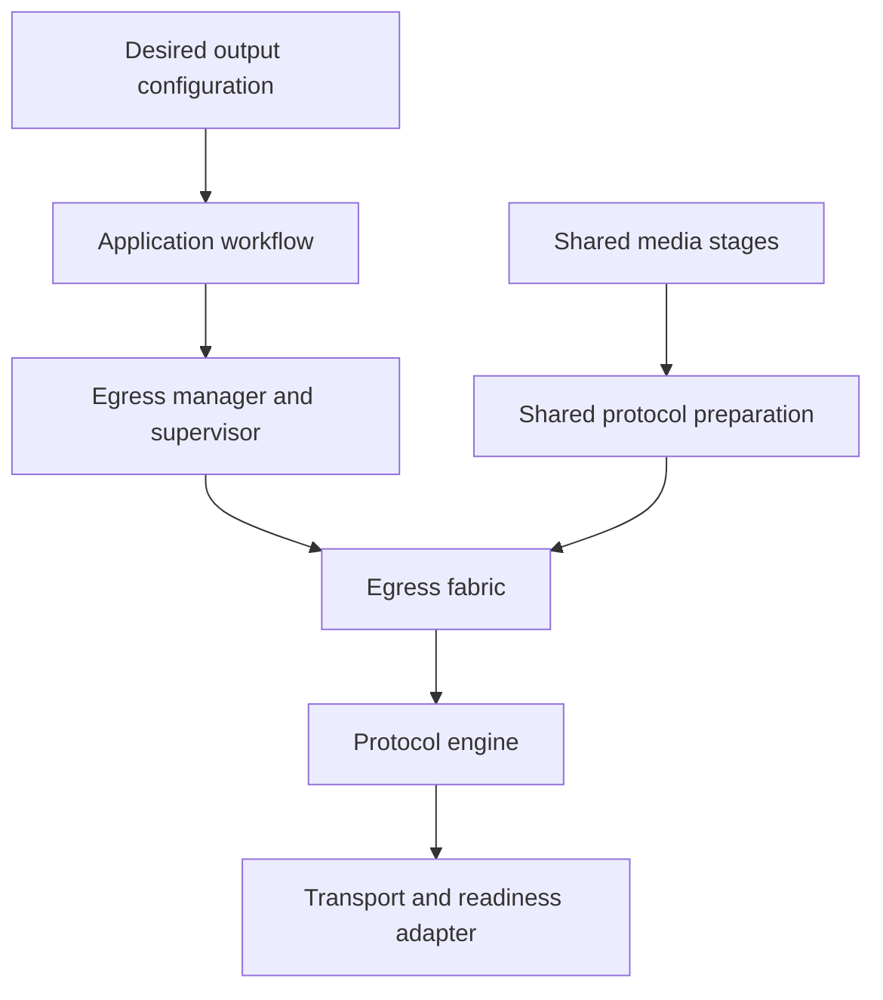
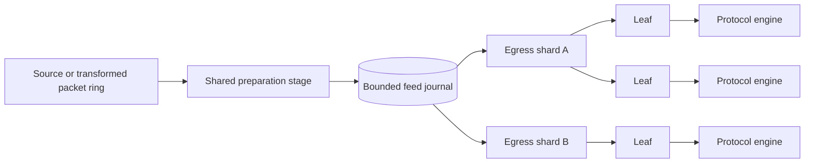
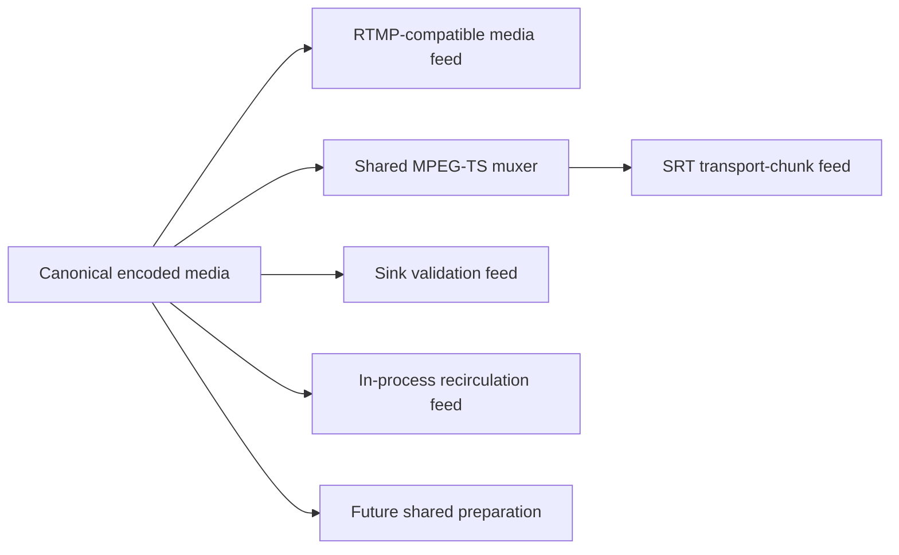
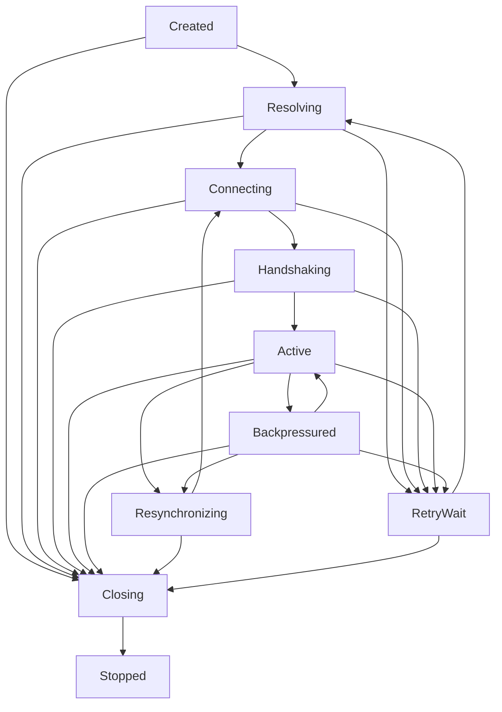

# Egress architecture

This document is the target architecture for Restream's high-fan-out egress
path. It is a proposal until the migration described in
[egress implementation](egress-implementation.md) is complete. Once adopted,
it becomes the normative ownership and concurrency contract for RTMP, RTMPS,
SRT, and future live egress protocols.

The central decision is to use one protocol-neutral egress fabric for
ownership, scheduling, lifecycle, backpressure, retries, observability, and
failure isolation, while retaining protocol-specialized preparation, wire
state, and readiness mechanisms.

## Contents

- [Goals](#goals)
- [Non-goals](#non-goals)
- [Architectural decision](#architectural-decision)
- [Current constraints](#current-constraints)
- [Layer model](#layer-model)
- [Data-path topology](#data-path-topology)
- [Shared preparation graph](#shared-preparation-graph)
- [Feed and journal contract](#feed-and-journal-contract)
- [Egress manager](#egress-manager)
- [Shard ownership](#shard-ownership)
- [Leaf ownership](#leaf-ownership)
- [Protocol engine boundary](#protocol-engine-boundary)
- [Readiness backends](#readiness-backends)
- [Lifecycle](#lifecycle)
- [Scheduling and fairness](#scheduling-and-fairness)
- [Backpressure and slow destinations](#backpressure-and-slow-destinations)
- [Dead destinations and retries](#dead-destinations-and-retries)
- [Failure containment](#failure-containment)
- [Shard assignment and scaling](#shard-assignment-and-scaling)
- [Command and wakeup model](#command-and-wakeup-model)
- [Memory and copying model](#memory-and-copying-model)
- [Observability](#observability)
- [Configuration](#configuration)
- [Correctness invariants](#correctness-invariants)
- [Performance invariants](#performance-invariants)
- [Compatibility and migration](#compatibility-and-migration)
- [Tradeoffs](#tradeoffs)
- [Decision summary](#decision-summary)

## Goals

The architecture must:

- support at least 1,000 active egress leaves without one application thread
  or one independent media backlog per destination;
- keep the application topology the same for RTMP, RTMPS, SRT, and future
  protocols;
- prevent a small number of slow, dead, or malicious destinations from
  materially degrading healthy neighbors on the same shard;
- prevent a failed or overloaded shard from interrupting other shards;
- preserve shared transforms and shared packaging when outputs are compatible;
- keep publication from a pipeline or transform stage non-blocking with respect
  to network egress;
- bound memory by shared-feed retention and small per-leaf state, not by
  destination count multiplied by stall duration;
- preserve protocol correctness, including RTMP session state, TLS state, SRT
  message semantics, timestamps, codec configuration, and synchronization;
- expose enough progress and fairness telemetry to prove isolation under live
  load;
- allow the smallest proven number of egress threads rather than requiring one
  thread per visible CPU.

## Non-goals

This design does not:

- make RTMP and SRT wire operations identical;
- force TCP readiness and SRT epoll into one physical polling API;
- move the API, database, reconciler, ingest, recording, or codec execution onto
  an egress thread-per-core runtime;
- guarantee hard isolation from a native library call that violates its
  non-blocking contract; process isolation would be required for that guarantee;
- introduce dynamic third-party protocol plugins;
- migrate live socket state between shards during normal operation;
- create a universal packet representation for every container and protocol;
- replace the existing shared stage graph or `MediaPacket` contracts.

## Architectural decision

Restream will use a protocol-neutral egress fabric with protocol-specialized
preparation feeds, engines, and readiness backends.



The stable boundary is policy versus mechanism:

| Protocol-neutral fabric owns | Protocol-specific code owns |
|---|---|
| Output assignment and supervision | Handshake bytes and state |
| Leaf lifecycle | Wire serialization |
| Work budgets and fairness | Protocol acknowledgements and control messages |
| Feed cursors and overrun policy | TCP/TLS/SRT readiness mechanics |
| Backpressure and stall policy | Partial-write or message-send semantics |
| Retry delay and admission control | Protocol error classification |
| Shutdown and removal | Socket options and transport setup |
| Progress, lag, and health metrics | Protocol synchronization capabilities |

Protocol implementations must not create their own long-lived application
threads, destination tasks, media queues, retry loops, or lifecycle policy.

## Current constraints

The current codebase already has useful high-fan-out properties that this design
must preserve:

- encoded packets are shared through bounded `RingBuffer` instances;
- expensive transforms are shared by typed stage identity;
- compatible SRT outputs share MPEG-TS preparation through `TsChunkRing`;
- RTMP outputs use asynchronous TCP or TLS I/O and independent protocol state;
- slow ring readers can recover after bounded overflow.

The current implementations also expose the migration targets:

- `src/media/rtmp/egress.rs` owns one Tokio task per RTMP destination and awaits
  complete `write_all` operations;
- `src/media/srt_egress.rs` owns an asynchronous feeder, a `MemoryQueue`, and a
  dedicated blocking sender thread per SRT destination;
- `src/media/engine_registries.rs` caps application SRT sender threads at 512;
- per-destination readers wait on shared ring notifications, which can amplify
  one publication into many runnable consumers;
- SRT bytes cross multiple application-owned buffers before reaching libsrt.

The repository's recorded 1,200-output workload shows that a small Tokio worker
count can outperform a larger worker count. The target is therefore not a
blanket thread-per-core rewrite. It is fixed ownership and bounded scheduling
for the egress hot path.

## Layer model

The target layering is:



### Control plane

The API, database, and reconciler own desired configuration and orchestration.
They issue idempotent add, update, remove, drain, and shutdown commands. They do
not send media or manage socket readiness.

### Shared media and preparation

The media layer owns packet transforms and reusable protocol preparation.
Expensive work is keyed and shared before the destination edge.

### Egress fabric

The fabric owns all protocol-independent behavior required to move prepared
media to independent destinations fairly and safely.

### Protocol engine

An engine owns connection-local protocol state. It advances only when given
readiness, feed data, and a finite work budget.

### Transport adapter

The adapter maps a native readiness mechanism into the fabric's readiness
vocabulary. It does not own retries, backpressure policy, or leaf lifecycle.

## Data-path topology

Every live output follows the same logical path:



There is no protocol-specific bypass around the manager, shard scheduler,
common lifecycle, or backpressure policy.

A shard may use a protocol-native poller. For example, RTMP shards can use OS
TCP readiness while SRT shards use SRT epoll. This is implementation
specialization under the same application topology, not a separate egress
architecture.

## Shared preparation graph

Preparation is separate from destination scheduling because the most valuable
work is often reusable.



A preparation key must include every property that changes reusable output,
including selected tracks, codec state, container settings, and any transport
payload policy that affects bytes. Destinations with different keys must not
share a prepared feed.

RTMP leaves consume encoded audio and video units. Each leaf still owns RTMP
chunking, acknowledgement, connection, and optional TLS state.

SRT leaves consume immutable MPEG-TS messages produced once for compatible
outputs. Each leaf still owns SRT connection, congestion, retransmission, and
encryption state inside libsrt.

Sink leaves consume prepared media and discard it after accounting progress.
They have no transport readiness adapter, but they still run through the same
manager, shard scheduler, lifecycle, feed cursor, limits, status, and
observability paths. Useful cases include capacity and soak tests without
external receivers, validating feed wake/cursor behavior, measuring preparation
cost separately from network cost, deliberate black-hole outputs for staging
pipelines, and operator diagnostics where the question is whether media reaches
egress at all.

Pipeline or recirculation leaves connect one pipeline's prepared output to
another pipeline's input in the same process. They must not serialize through a
network protocol or a byte queue when the source and destination can share
immutable media ownership. The adapter for this backend is a topology bridge:
it translates feed units into the target pipeline's ingress contract and
publishes wakeups, but retry, backpressure, lifecycle, and loop prevention stay
with the common control plane and fabric.

Preparation feeds must not perform destination-specific retries or retain data
for a single slow output.

## Feed and journal contract

The fabric consumes a bounded, sequence-addressed, immutable feed. The stable
contract is behavior, not one universal media enum.

```rust
pub trait EgressFeed {
    type Unit: Clone;

    fn head_sequence(&self) -> u64;
    fn oldest_sequence(&self) -> u64;
    fn read_from(&self, cursor: FeedCursor, budget: ReadBudget) -> FeedRead<Self::Unit>;
    fn latest_sync_point(&self) -> Option<FeedCursor>;
    fn sync_point_at_or_after(&self, sequence: u64) -> Option<FeedCursor>;
}
```

A feed unit must be immutable and cheap to reference, normally through `Bytes`
or `Arc`. A feed is bounded by both bytes and media age where meaningful.

A leaf cursor contains only position and epoch information:

```rust
pub struct FeedCursor {
    pub epoch: u64,
    pub next_sequence: u64,
}
```

Cursors do not pin retained entries. If a cursor falls behind
`oldest_sequence`, the feed reports overrun. The leaf then follows the common
resynchronization policy instead of forcing the feed to grow.

Feed epochs change when a discontinuity invalidates old cursors, such as a
source replacement or preparation-stage restart. An epoch mismatch is handled
as a resynchronization event.

Publication must never wait for a network destination or egress command queue.
The feed itself is the source of truth; notifications are only hints that new
work may exist.

## Egress manager

`EgressManager` is the application-facing capability for live output lifecycle.
It owns:

- shard-group creation and shutdown;
- stable output-to-shard assignment;
- command routing;
- shard health supervision;
- reconnect admission shared across shards;
- output snapshots for API and reconciliation;
- feature-gated coexistence with the legacy egress path during migration.

The manager does not own packet hot loops or connection-local protocol state.

Representative commands are:

```rust
pub enum EgressCommand {
    Add(OutputSpec),
    Update(OutputSpec),
    Remove(OutputId),
    DrainShard(ShardId),
    Shutdown,
}
```

Commands are idempotent by output identity and configuration generation. A
stale update must not resurrect or overwrite a newer output generation.

## Shard ownership

A shard is a long-lived OS thread with exclusive ownership of its mutable hot
state:

```rust
pub struct EgressShard<B: EgressBackend> {
    backend: B,
    leaves: slab::Slab<Leaf<B::Leaf>>,
    ready: std::collections::VecDeque<LeafKey>,
    timers: TimerWheel<LeafKey>,
    commands: BoundedCommandReceiver,
    feeds: FeedSubscriptions,
    metrics: ShardMetrics,
}
```

A shard owns:

- its native poller;
- all leaf protocol and transport state assigned to it;
- its ready queue and scheduling flags;
- connect, handshake, progress, and retry timers;
- local counters and metric aggregation;
- its bounded control inbox;
- feed subscriptions and coalesced wake state.

No hot-path global mutex is required for leaf scheduling or socket state.
Mutable leaf state does not migrate between threads during normal operation.

A shard loop performs bounded work in this order:

1. process a limited batch of high-priority control commands;
2. consume readiness events;
3. process expired timers;
4. schedule leaves whose feeds advanced;
5. service ready leaves under per-leaf and per-loop budgets;
6. publish aggregated metrics when due;
7. block in the native poller until readiness, command wakeup, timer expiry, or
   feed notification.

Control processing itself is budgeted so a large update burst cannot starve
media progress.

## Leaf ownership

Every output has one protocol-neutral leaf shell and one specialized protocol
state value.

```rust
pub struct Leaf<P> {
    pub common: LeafCommon,
    pub protocol: P,
}

pub struct LeafCommon {
    pub output_id: OutputId,
    pub generation: u64,
    pub feed: FeedId,
    pub cursor: FeedCursor,
    pub lifecycle: LeafLifecycle,
    pub pending_bytes: usize,
    pub scheduling: SchedulingState,
    pub deadlines: LeafDeadlines,
    pub retry: RetryState,
    pub progress: ProgressState,
    pub limits: LeafLimits,
}
```

A leaf may retain:

- connection-local protocol and socket state;
- one partially written wire unit, or a small explicitly bounded set required
  by the protocol;
- a feed cursor;
- bounded handshake and control output;
- timers, counters, and health state.

A leaf must not retain an arbitrary media backlog, spawn a private retry task,
or block the shard thread.

## Protocol engine boundary

The protocol boundary is progress-oriented. The engine receives readiness,
access to an appropriate prepared feed, and a finite budget. It returns why it
stopped.

```rust
pub trait ProtocolEngine {
    type Feed: EgressFeed;
    type Transport;

    fn advance(
        &mut self,
        transport: &mut Self::Transport,
        readiness: Readiness,
        feed: &Self::Feed,
        cursor: &mut FeedCursor,
        budget: WorkBudget,
    ) -> EngineProgress;

    fn close(&mut self, transport: &mut Self::Transport, reason: CloseReason);
    fn recovery_capability(&self) -> RecoveryCapability;
}
```

`advance` must:

- never block;
- obey byte, unit, and CPU-time budgets;
- stop immediately when the transport would block;
- preserve any partial wire state required to resume correctly;
- report actual forward progress;
- avoid sleeping, spawning work, or implementing its own retry delay;
- avoid holding a shared feed or registry lock while performing I/O.

Representative results are:

```rust
pub enum EngineProgress {
    Progress { bytes: usize, units: usize, wants: Interest },
    Needs(Interest),
    HandshakeComplete,
    FeedOverrun,
    PeerClosed,
    Failed(ProtocolFailure),
    Yield,
}
```

A static enum or generic backend is preferred over boxed dynamic dispatch in
the per-packet hot loop. Dynamic dispatch may still be used in manager and
factory code where it is not performance-sensitive.

## Readiness backends

The application topology and scheduler are common; native readiness remains
specialized.

### TCP and TLS backend

RTMP and RTMPS use non-blocking TCP readiness. The protocol engine owns RTMP
and TLS state and performs partial reads and writes. It must not call
`write_all` from a shared shard loop.

A pending RTMP write should retain shared payload ownership where possible and
track independent offsets for headers and payloads. A writable visit is bounded
and stops on `WouldBlock`.

RTMPS drives TLS incrementally. Plaintext accepted by TLS and encrypted output
retained by the connection are both included in per-leaf memory limits.

### SRT backend

SRT uses non-blocking socket mode and SRT epoll. Sender synchronization is
disabled for egress sockets so a full sender buffer returns the asynchronous
send condition instead of blocking the shard.

A pending SRT write retains one immutable transport message. On sender-buffer
saturation, the leaf waits for SRT writable readiness. Application-owned
per-destination byte queues and sender threads are removed.

SRT internal sender-buffer limits remain part of the leaf's total buffering
policy; moving buffering into libsrt does not make it free or unbounded.

### Future backends

A future protocol either reuses an existing readiness family or adds a new
backend. It must still use the same manager, shard loop, leaf shell, lifecycle,
backpressure, retry, and observability contracts.

The sink backend is the simplest non-network backend: it is always ready and
exists to exercise the fabric, feed, policy, and observability path without an
external transport. It must not be special-cased around admission, scheduling,
or status publication.

The recirculation backend is a non-network transport adapter between pipelines.
It should be in-process and cheap, preferably sharing immutable feed units or
reference-counted buffers end to end. It must not create a hidden pipeline
engine, private media backlog, or recursive bypass around the application
topology graph.

## Lifecycle

All protocols use one lifecycle:



The fabric owns transitions and deadlines. A protocol engine reports events;
it does not choose an independent lifecycle.

Each output configuration has a monotonically increasing generation. Events,
timers, and readiness records from an old generation are ignored after update
or removal.

## Scheduling and fairness

A leaf becomes runnable only when it can make useful progress:

- its transport has required readiness;
- its handshake or control state has work;
- its feed contains readable units;
- its retry or other lifecycle timer expired;
- a control command changed its state.

Each leaf has a `scheduled` bit. Multiple events coalesce into one ready-queue
entry.

The scheduler uses bounded round robin or deficit round robin. One visit ends
when the first configured budget is exhausted:

- maximum media or protocol units;
- maximum bytes;
- maximum CPU time;
- transport would block;
- no useful work remains.

A leaf that remains runnable is appended to the tail. A blocked leaf is removed
until the needed readiness or timer event occurs. A continuously writable
high-bitrate destination therefore cannot remain at the head of the queue.

The shard also has a loop-wide budget so a readiness storm cannot delay command
processing, timers, and metric publication indefinitely.

## Backpressure and slow destinations

The defining rule is:

> A slow leaf stops being runnable; it does not create more work or more backlog.

When a send would block:

1. retain only the current bounded pending wire state;
2. record the required writable interest;
3. mark the leaf backpressured;
4. remove it from the ready queue;
5. resume only after readiness or a progress deadline.

Every leaf has strict limits covering:

- pending application bytes;
- protocol-internal buffered bytes where observable or configurable;
- lag behind the feed head;
- queued media duration;
- time without successful forward progress;
- handshake control output.

The first exceeded limit triggers recovery. Limits are enforced, not advisory.
A write larger than the remaining budget is split, rejected, or retained as one
explicitly accounted pending unit; it must not silently exceed capacity.

A leaf never prevents feed reclamation. If it falls behind the journal's
oldest sequence or crosses its lag limit, the fabric marks it for
resynchronization.

The default resynchronization policy is reconnect at the latest valid sync
point:

1. stop consuming stale media;
2. close the connection;
3. clear bounded pending wire state;
4. advance the cursor to a safe synchronization point;
5. pass through retry admission if required;
6. reconnect and send protocol initialization and codec configuration;
7. resume media.

A protocol may advertise a proven in-place recovery capability, but the common
policy remains authoritative and reconnect recovery remains the safe default.

## Dead destinations and retries

Socket writability alone is not proof of destination health. A leaf tracks:

- last successful application-byte progress;
- last protocol-level progress;
- connection and handshake deadlines;
- time continuously backpressured;
- feed lag and overrun count;
- peer closure and transport errors.

A leaf that exceeds its no-progress deadline is closed and enters `RetryWait`.
While waiting, it owns no media backlog, no active writable interest, and no
ready-queue entry. It consumes only bounded state and one timer entry.

Retries use capped exponential backoff with jitter. Reconnection work is
protected by:

- a process-wide token bucket;
- a per-shard concurrent connect and handshake limit;
- optional per-host or per-destination-class limits if live evidence requires
  them.

These controls prevent a large dead-destination set from causing DNS, TCP, TLS,
or SRT handshake storms.

## Failure containment

### Same-shard isolation

A normal slow or dead leaf cannot block healthy neighbors because:

- all transport operations are non-blocking;
- work per visit is finite;
- a blocked leaf is not polled again without a useful event;
- private buffering and feed lag are bounded;
- retries are timer-driven and admission-controlled;
- scheduling entries are deduplicated.

The expected cost of a stalled leaf is bounded bookkeeping, not proportional
CPU or memory growth.

### Cross-shard isolation

Each shard owns an independent thread, poller, ready queue, timer structure,
command inbox, and mutable leaf registry. Hot-path operations do not acquire a
process-wide leaf lock.

Shared feeds are immutable and bounded. Cross-shard interaction is limited to
feed sequence observation, coalesced wakeups, configuration snapshots, and
periodic metrics publication.

### Shard failure

A supervisor monitors shard heartbeat and loop progress. If a shard panics or
stops responding:

1. mark only that shard unhealthy;
2. stop routing commands to the failed instance;
3. start a replacement shard;
4. recreate desired leaves from control-plane configuration;
5. reconnect affected outputs from a valid sync point.

Other shards continue. Live socket state is not migrated after failure.
Reconnection is the recovery boundary.

A non-blocking contract violation inside native code can still stall its owning
shard. Multiple shards limit the blast radius, and driver-call duration metrics
make such violations visible. If a native dependency is proven capable of
unbounded hangs, process isolation must be evaluated separately.

## Shard assignment and scaling

Outputs are assigned stably using weighted rendezvous hashing or another stable
hash with load weighting. Assignment inputs may include:

- estimated bitrate and packet rate;
- plain RTMP versus RTMPS;
- SRT encryption and latency settings;
- current leaf count and observed shard service delay;
- current connect and handshake load.

Outputs from one pipeline should be distributed across shards rather than
co-located by pipeline identity. Each shard subscribes to the necessary shared
feed.

Live connections are not migrated solely to rebalance load. Reassignment occurs
on output creation, reconnect, explicit shard drain, or a configuration change
that already requires reconnect.

Shard count is independent of Tokio worker count. Production begins with a
small fixed count and is selected by measurement. One shard is supported for
proof and constrained deployments, but multiple shards are the normal failure
containment boundary.

The goal is not one shard per visible core. The goal is the smallest shard count
that meets throughput, tail-latency, reconnect-storm, and isolation targets with
headroom.

## Command and wakeup model

Control commands and media notifications have different semantics.

High-priority bounded commands include add, update, remove, drain, and shutdown.
A control-plane sender must not block indefinitely; overload is surfaced as an
operator-visible error and reconciliation retries the desired state.

Media notifications are coalesced hints. Each feed and shard pair has a
`wake_pending` flag. Publication schedules at most one outstanding wake until
the shard observes the newest sequence and clears the flag.

```rust
if !subscription.wake_pending.swap(true, Ordering::AcqRel) {
    subscription.wake_shard();
}
```

The feed remains authoritative if a notification is lost or coalesced. The
shard compares head sequences whenever it wakes.

Control commands must not share a queue whose capacity can be consumed by one
notification per media packet.

## Memory and copying model

The target memory complexity is:

```text
O(shared retained feeds + leaves + bounded pending wire units)
```

It must not become:

```text
O(leaves × retained media window)
```

The fabric therefore uses:

- immutable `Bytes` or `Arc` feed units;
- sequence cursors rather than copied per-leaf media queues;
- one current pending wire unit or a small protocol-required bound;
- shared MPEG-TS chunks for compatible SRT outputs;
- reusable connection-local protocol buffers only when ownership remains clear;
- local metric counters flushed periodically instead of shared atomics on every
  packet where practical.

RTMP wire headers and session state remain destination-specific. The design
must not introduce another payload copy merely to coalesce writes; prior
repository measurements found that strategy regressive.

SRT leaves must not copy shared TS data into a byte-oriented `MemoryQueue` and
then into a sender buffer. They retain immutable transport-message references
until accepted by libsrt.

## Observability

Metrics must make fairness and isolation falsifiable.

### Per shard

- active leaves by lifecycle and protocol;
- ready-queue depth and high-water mark;
- control-command queue depth;
- useful and empty feed wakes;
- loop iterations and loop latency percentiles;
- scheduler service delay percentiles;
- bytes and units processed per loop;
- connect and handshake concurrency;
- timer count and retry rate;
- driver-call duration and budget violations;
- heartbeat age;
- CPU time where available.

### Per leaf

- lifecycle and assigned shard;
- connected duration;
- last byte and protocol progress age;
- feed lag in units, bytes where estimable, and media time;
- pending application bytes;
- partial-write and would-block counts;
- writable-wake-to-progress latency;
- retry attempt and next retry time;
- resynchronization and overrun counts;
- close or failure reason;
- bytes and media units sent.

### Per feed

- head and oldest sequence;
- retained bytes and media duration;
- publication rate;
- subscriber shard count;
- coalesced wake count;
- overrun count;
- latest synchronization-point age.

Metrics publication must be aggregated and rate-limited so observability does
not recreate per-packet cross-thread contention.

## Configuration

Configuration should expose policy without exposing internal implementation
accidents.

Recommended settings include:

- `RESTREAM_EGRESS_FABRIC` feature or rollout mode;
- `RESTREAM_EGRESS_SHARDS`;
- per-leaf maximum pending application bytes;
- maximum feed lag duration;
- no-progress timeout;
- connect and handshake timeouts;
- retry minimum, maximum, multiplier, and jitter;
- process and per-shard connect concurrency;
- per-visit byte, unit, and CPU-time budgets;
- shard loop budget;
- shared feed byte and duration retention;
- protocol-specific native buffer ceilings.

Defaults must derive from measured workload and effective resources. Invalid
zero, overflow, or contradictory values fail validation at startup.

Operational configuration should describe outcomes such as lag, progress, and
concurrency limits. Internal queue and thread counts should not become durable
public API unless operators need them.

## Correctness invariants

The implementation must continuously preserve these properties:

1. One output generation owns at most one active leaf.
2. Removed or superseded generations cannot be revived by stale events.
3. Media publication never waits for a destination or egress command queue.
4. A leaf cursor cannot retain feed entries beyond configured feed bounds.
5. Every application and native buffer has an explicit finite limit.
6. No protocol engine call blocks or performs unbounded work.
7. No leaf is present more than once in a shard ready queue.
8. A would-block result removes the leaf from active scheduling until a useful
   event occurs.
9. Service budgets apply equally to every protocol.
10. Retry waiting consumes no active media backlog or send-loop CPU.
11. A feed epoch change invalidates stale cursors deterministically.
12. Recovery resumes only at a protocol-valid synchronization point.
13. A leaf failure cannot mutate another leaf's protocol state.
14. A shard failure does not terminate or corrupt another shard.
15. Shutdown closes transport state and releases feed subscriptions exactly
    once.

## Performance invariants

Performance acceptance is based on behavior under load, not socket count alone:

- application egress thread count is fixed as leaf count increases;
- memory remains bounded during indefinite destination stalls;
- healthy same-shard leaves retain bounded service latency when a small number
  of neighbors are blocked;
- cross-shard service latency does not materially change when another shard has
  dead destinations or reconnect churn;
- retry-waiting leaves do not consume continuous CPU;
- one feed publication creates at most one outstanding wake per interested
  shard, not one runnable task per destination;
- bytes copied per destination are limited to unavoidable protocol and native
  transport work;
- scheduler overhead remains below measured protocol serialization and send
  work at target scale;
- scaling shard count is monotonic only until the workload is satisfied;
  additional shards are rejected if they increase CPU without improving tail
  behavior.

The implementation plan defines the concrete workload and thresholds used to
prove these invariants.

## Compatibility and migration

The new fabric is introduced behind a rollout selector. Legacy and fabric
outputs may coexist during migration, but one output must have exactly one
owner.

The control plane, persisted output configuration, API contracts, stage keys,
and canonical `MediaPacket` behavior remain stable. Migration changes runtime
ownership and scheduling, not user-visible output identity.

SRT should migrate first because the existing per-leaf sender thread and byte
queue are the largest structural limit. RTMP migrates after the common fabric
is proven with a fake engine and live SRT load.

The legacy path is removed only after:

- both RTMP and SRT use the common lifecycle and policy;
- live parity and rollback gates pass;
- all legacy thread and queue ownership is absent from production egress;
- operational dashboards expose fabric metrics;
- the 1,000-plus-leaf isolation workload passes repeatedly.

## Tradeoffs

### Benefits

- one lifecycle and failure policy for all protocols;
- fixed application thread count;
- bounded memory under slow consumers;
- fewer wakeups and less per-leaf queueing;
- protocol parity in metrics and operational behavior;
- clear ownership and test seams;
- easier addition of future protocols;
- explicit shard-level failure domains.

### Costs

- substantial rewrite of connection ownership;
- more explicit partial-I/O and readiness state;
- two native poller implementations under one fabric;
- careful feed synchronization and overrun recovery;
- new scheduler and timer correctness obligations;
- a temporary dual-path migration period;
- possible loss of simplicity compared with one independent async task per
  RTMP destination at small scale.

### Risks

- over-generalizing before two protocols prove the boundary;
- hiding protocol semantics behind a vague universal transport trait;
- moving reusable preparation back into per-leaf engines;
- replacing application queues with unbounded native transport buffers;
- treating average throughput as proof while tail fairness regresses;
- adding shards or CPU affinity without measured benefit.

The implementation must prefer narrow abstractions proven by RTMP and SRT over
an extensible framework designed for hypothetical protocols.

## Decision summary

Restream's target egress architecture is:

- shared, keyed preparation before the destination edge;
- immutable bounded feeds with non-pinning sequence cursors;
- a protocol-neutral manager, supervisor, lifecycle, scheduler, backpressure
  policy, retry policy, and metrics model;
- a small fixed set of egress shards with exclusive mutable ownership;
- protocol-specialized engines and native readiness backends;
- non-blocking, budgeted progress for every leaf;
- no application thread, independent media queue, or retry task per output;
- reconnect-at-sync-point as the default recovery boundary;
- measurement-driven shard count rather than universal thread-per-core sizing.

This is the durable layering boundary: common policy and ownership above,
protocol mechanism below.
