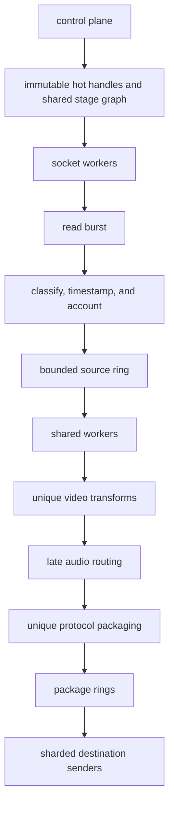
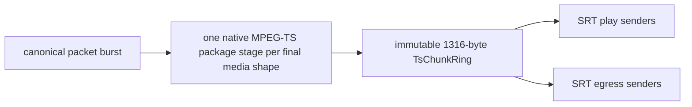

# High-Performance Media Data Path

This document turns the media data-path audit into an incremental implementation
and measurement plan. The application should retain Tokio and the operating
system's TCP/SRT stacks while applying proven high-performance packet-processing
principles inside ingest, fan-out, packaging, and sender stages.

The governing rule is:

> Change the unit of work from one packet, one lookup, and one wakeup to a
> bounded burst owned by a stable worker.

No change should be accepted because it merely resembles a fast networking
framework. Every step must preserve protocol correctness and demonstrate an
improvement in production-shaped measurements.

## Contents

- [Evidence and current measurements](#evidence-and-current-measurements)
- [Rust Zero-Cost Abstraction Patterns](#rust-zero-cost-abstraction-patterns)
- [Obtaining the current baseline](#obtaining-the-current-baseline)
- [Target Shape](#target-shape)
- [Optimization Areas](#optimization-areas)
- [Native MPEG-TS Opportunities](#native-mpeg-ts-opportunities)
- [Opportunities From Other Recent Media Changes](#opportunities-from-other-recent-media-changes)
- [Benchmark source of truth](#benchmark-source-of-truth)
- [Required Follow-Up Measurements](#required-follow-up-measurements)
- [Incremental Plan](#incremental-plan)
- [Correctness Gates](#correctness-gates)

## Evidence and current measurements

Dated progress logs, allocation audits, and benchmark numbers live in
[high-performance evidence](evidence/high-performance-audits-2026-06-23-to-2026-07-03.md).
Use [the quality baseline ledger](agent-guidance/quality/baselines.md) for
recorded measurements and rerun the relevant Criterion suite before changing a
hot path.

## Rust Zero-Cost Abstraction Patterns

These are the idioms that actually matter in this codebase, with the rule and the
anti-pattern side-by-side. Future code in `src/media/` must follow them.

### Rule 1 — Hoist burst-drain Vecs before the loop

A `Vec::with_capacity(N)` inside a `tokio::select!` arm allocates on every
burst cycle (~every 8 ms at 30 fps video). Hoist it before the `loop {}` and
call `.clear()` at the start of the arm.

```rust
// WRONG — new allocation per burst
loop {
    tokio::select! {
        _ = reader.wait_for_data() => {
            let mut packets = Vec::with_capacity(32); // ← alloc here
            reader.pull_burst(&mut packets, 32)?;
        }
    }
}

// CORRECT — one allocation, retained across bursts
let mut packets = Vec::with_capacity(32);
loop {
    tokio::select! {
        _ = reader.wait_for_data() => {
            packets.clear();                          // ← just zeroes len
            reader.pull_burst(&mut packets, 32)?;
        }
    }
}
```

The same rule applies to `ts_batch`, `video_conv_buf`, `audio_conv_buf`, and
every other scratch buffer used in a packet loop. A buffer declared outside the
loop retains its heap capacity indefinitely; a buffer declared inside re-triggers
the allocator on every burst.

**Measured (bench-dev, x86-64 Zen, `burst_drain_alloc` group, 32-packet burst):**

| Variant | Time per burst | Throughput |
|---|---|---|
| `Vec::with_capacity(32)` inside arm (old) | ~2.79 µs | ~11.5 Melem/s |
| Hoisted + `.clear()` (new) | ~2.54 µs | ~12.6 Melem/s |
| **Improvement** | **~9% faster, ~250 ns/burst** | |

**Files where this is done correctly**: `hls.rs`, `srt.rs` (play sender),
`recording.rs`.

### Rule 2 — Use `_into` codec variants with per-consumer scratch buffers

Every payload conversion function has a `_into` variant that writes into a
caller-provided `Vec<u8>` instead of returning a freshly allocated `Vec`:

| Allocating (avoid on hot path) | Zero-allocation (use this) |
|---|---|
| `video_for_ts(payload, fmt, ...)` → `Cow<[u8]>` | `video_for_ts_into(payload, fmt, ..., buf)` → `&[u8]` |
| `audio_for_ts(payload, fmt, ...)` → `Cow<[u8]>` | `audio_for_ts_into(payload, fmt, ..., buf)` → `&[u8]` |
| `avcc_to_annexb(data, nls)` → `Vec<u8>` | `avcc_to_annexb_into(data, nls, out)` |
| `annexb_to_avcc(data)` → `Vec<u8>` | `annexb_to_avcc_into(data, out)` |
| `video_for_rtmp(payload, kf)` → `Vec<u8>` | `video_for_rtmp_into(payload, kf, out)` |
| `audio_for_rtmp(payload)` → `Vec<u8>` | `audio_for_rtmp_into(payload, out)` |

Hold one `video_conv_buf` and one `audio_conv_buf` per consumer task, declared
before the loop. The `_into` variant clears the buffer and writes into it; on
the `Raw` passthrough path it returns the original slice directly (zero-copy).

### Rule 3 — `drain_into` over `drain` to retain `TsDemuxer` output capacity

`TsDemuxer::drain()` uses `std::mem::take`, which strips the internal output
`Vec`'s capacity on every call. `drain_into(&mut caller_vec)` uses
`Vec::append`, which transfers elements while leaving both vectors' allocations
intact.

```rust
// WRONG
let pkts = demuxer.drain();   // demuxer's Vec → capacity 0 next call

// CORRECT
demuxer.drain_into(&mut pkts); // demuxer keeps its allocation
```

`drain_into` is already the production API on all hot paths (SRT ingest,
external transcoder). Never introduce a call to `drain()` in a packet loop.

### Rule 4 — `Cow<'a, [u8]>` for conditional-allocation paths

Use `Cow<'a, [u8]>` when a function sometimes borrows and sometimes converts.
`Cow::Borrowed(slice)` is a zero-cost borrow; `Cow::Owned(vec)` signals an
allocation happened. This makes the fast path (Raw passthrough) pay nothing.

`video_for_ts` / `audio_for_ts` in `codec.rs` demonstrate this: the
`PayloadFormat::Raw + ADTS present` path returns `Cow::Borrowed` without
touching any allocator.

### Rule 5 — `OnceLock` for lazily-computed statics

One-time setup that would otherwise run per-packet (table generation, pattern
compilation, path resolution) belongs in a `static OnceLock<T>`. After the
first call the read path is a single atomic load.

Examples in this codebase:
- CRC-32/MPEG-2 lookup table — computed once, O(1) thereafter (`mpegts.rs`)
- `memchr::memmem::Finder` — needle pre-compiled once (`codec.rs`)
- `FFMPEG_BIN_PATH` — resolved once at startup (`ffmpeg_extract.rs`)

### Rule 6 — `Bytes::from_owner` for FFmpeg zero-copy publishing

`OwnedFfmpegPacket(ffmpeg_next::Packet)` wraps an `AVBufferRef`-backed FFmpeg
packet and implements `AsRef<[u8]>`. `Bytes::from_owner(OwnedFfmpegPacket(pkt))`
creates a `Bytes` that holds the FFmpeg refcount — no `memcpy` into a new
buffer. Drop of the last `Bytes` clone calls `av_packet_unref`.

Do not replace this with `Bytes::copy_from_slice(pkt.data())` unless the FFmpeg
buffer cannot be shared (e.g. the encoder reuses it immediately).

### Rule 7 — `#[repr(align(64))]` for writer-owned atomics

Producer-owned counters (`write_idx`, `last_keyframe_idx`) are wrapped in
`AlignedAtomicUsize { #[repr(align(64))] }` so each lands on its own cache
line. This eliminates false sharing between:
- the producer writing `write_idx`
- readers loading `write_idx`
- readers loading `last_keyframe_idx` on overflow recovery

Do not store writer-hot atomics alongside reader-hot or control-plane data in
the same struct without explicit alignment padding.

### Rule 8 — `#[inline]` on per-packet helpers

Functions called on every packet in a hot loop must carry `#[inline]` so they
are inlined in non-LTO builds (tests, benches with `bench-dev` profile). In
release with `lto = "fat"` the compiler inlines regardless, but explicit hints
improve profiler output and benchmark accuracy.

Apply `#[inline]` to: `video_for_ts_into`, `audio_for_ts_into`,
`avcc_to_annexb_into`, `annexb_to_avcc_into`, `video_for_rtmp_into`,
`find_ts_sync`, `h264_is_keyframe`, `h265_is_keyframe`, and any new function
that is called once per TS packet or media packet.

### Quick checklist for new hot-path code

- [ ] Batch `Vec`s declared **before** the `loop {}`
- [ ] `_into` codec variant used (not the `Cow`-returning version)
- [ ] No `drain()` — use `drain_into` or `Vec::append`
- [ ] No `Vec::with_capacity` or `String::from` inside packet loops
- [ ] Scratch buffers cleared with `.clear()`, not replaced
- [ ] New per-packet helper carries `#[inline]`
- [ ] No `Arc::clone` or `Bytes::clone` inside packet loops (use `Arc` handles cached before the loop)
## Obtaining the current baseline

Do not copy a current file map, allocation count, or throughput number into this
guide. Before hot-path work:

1. identify the production path from `src/media/` and the relevant suite in
   `Cargo.toml` / `benches/`;
2. record a before baseline with the repository benchmark workflow;
3. make the scoped change without weakening protocol correctness;
4. record the after result and place durable numbers in the dated quality
   baseline ledger with commit, host, and replay command.

The invariant is stable even when implementation details move: the control
plane may own strings, maps, configuration, and diagnostics, while packet loops
should operate on cached handles, bounded buffers, compact metadata, and
reference-counted payloads.

## Target Shape



The control plane owns strings, hash maps, configuration, lifecycle, and
diagnostic objects. The data plane should operate on direct handles, integer
stage identifiers, bounded rings, compact metadata, and immutable payload
references.
## Optimization Areas

### Direct hot handles

Resolve a pipeline during authentication and retain its data-path state:

```rust
struct PipelineHotHandle {
    ring: Arc<RingBuffer>,
    bytes_received: Arc<AtomicU64>,
    keyframes: Arc<KeyframeTracker>,
    stream: Arc<StreamDescriptor>,
}
```

Apply the same pattern to outputs. Hash maps remain appropriate for setup,
health snapshots, and teardown. If a future worker handles unrelated pipelines
in one iteration, bulk lookup can then be evaluated; for the current
connection-owned flow, no lookup is better than a batched lookup.

### Bounded burst APIs

Introduce and benchmark:

```text
RingBuffer::push_batch()
Reader::pull_burst()
ChunkQueue::enqueue_batch()
ChunkQueue::dequeue_batch()
```

Initial packet counts:

```text
1, 4, 8, 16, 32, 64
```

Use both a count and a latency threshold. Start by testing a maximum of 32
packets with a 50–200 microsecond flush timer. Keyframes and queue pressure may
force earlier publication.

Batching should amortize:

- index acquisition and publication;
- queue synchronization;
- wakeups;
- timestamp and track classification;
- counter updates;
- package-stage calls.

### Run-to-completion for cheap work

An ingest worker should process a received burst locally:


Queue boundaries remain useful around expensive, shareable, or blocking work:
decode, encode, filtering, muxing, recording, and network backpressure. Cheap
packet-local operations should not each become a separate task or channel.

### Compact ring storage

Measure densely packed slots against the existing cache-line-per-slot layout.
Readers do not modify the slots, so aligning every slot does not prevent useful
reader false sharing.

A candidate layout is:

```rust
struct Slot {
    sequence: AtomicUsize,
    packet: ArcSwapOption<MediaPacket>,
}
```

Keep producer index, keyframe index, and notification state on separate cache
lines. The sequence protects readers from accepting a packet belonging to a
later wraparound generation.

### Bounded chunk queues

Replace the byte queue with an SPSC-oriented queue of immutable or pooled
chunks:

```rust
struct ChunkQueue {
    chunks: BoundedRing<Bytes>,
    read_offset: usize,
}
```

FFmpeg input callbacks consume across chunk boundaries. Output callbacks copy
their ephemeral buffer into pooled `BytesMut`, freeze it, and enqueue one
chunk. Expose capacity, occupancy, high-water mark, full events, and closure.

### Shared protocol packaging

Packaging should scale with unique media shape, not destination count:


Package identity must include upstream stage identity, codec shape, selected
tracks, timestamp policy, and mux options. RTMP should likewise investigate
sharing media-message bodies while retaining per-connection chunk-stream state.

### Stable workers and local pools

Long-lived workers should own:

- reusable packet-batch storage;
- local payload-buffer caches;
- counters periodically published to diagnostics;
- assigned pipelines or package stages.

Return buffers in batches. Derive size classes from recorded traffic rather
than guessing permanently. Pin only expensive demux, encode, mux, and fan-out
workers where measurements demonstrate a benefit; do not pin every socket task.

### Batch-oriented memory layout

Keep ergonomic packet objects at boundaries. Inside hot loops test an
array-of-structs-of-arrays representation:

```rust
struct PacketBatch<const N: usize> {
    pts: [i64; N],
    dts: [i64; N],
    tracks: [u16; N],
    flags: [u8; N],
    payloads: [Bytes; N],
    len: usize,
}
```

This can improve timestamp rescaling, track selection, keyframe classification,
and package planning. A sender-worker layout containing arrays of session
handles, reader indexes, pending byte counts, queue depths, and connection
states may produce a larger gain.

### Prefetch and vectorized search

Prefetch only inside real burst loops after compacting the layout. Candidate
data includes upcoming slots, payload headers, stream-map entries, and sharded
sender state. Test distances of one to four iterations and retain prefetch only
when cycles or cache stalls improve.

Use portable vectorized search at protocol edges:

- MPEG-TS sync and alignment;
- H.264/H.265 start-code scans;
- AAC ADTS sync;
- fixed-header classification.

Use a wide candidate scan followed by scalar protocol verification. Do not
replace ordinary memory copies or codec operations without production-shaped
evidence.
## Native MPEG-TS Opportunities

The new `mpegts.rs` path removes the FFmpeg demux thread and byte queue from SRT
ingest, then publishes completed packets with `push_batch()`. That is a strong
architectural improvement, but it also moves MPEG-TS parsing and muxing into the
application's hottest loops. Optimize it in the following order.

### P0: Retain output and accumulator capacity

`TsDemuxer::drain()` currently uses `std::mem::take(&mut self.output)`. The
demuxer therefore loses the preallocated output vector every time SRT drains
packets. Add an API such as:

```rust
fn drain_into(&mut self, output: &mut Vec<MediaPacket>)
```

Use `Vec::append` so the demuxer's vector retains its allocation and the SRT
loop reuses a caller-owned packet batch.

PES payload storage similarly loses its 16 KiB capacity after
`std::mem::take()`. Benchmark size-classed payload pools or a `BytesMut`
ownership-transfer design. `Bytes::from(Vec<u8>)` is already zero-copy, so the
remaining target is allocation reuse rather than another payload copy.

### P0: Constant-time PID dispatch

Every 188-byte TS packet currently searches `streams` with
`iter().position(...)`. Replace this with a PID-index table:

```text
pid_to_stream[8192] -> stream index or sentinel
```

An `i16` table occupies 16 KiB and removes a branchy linear scan from every TS
packet. Populate it when the PMT is parsed. Keep PAT and PMT PID checks before
the table lookup.

### P0: ~~Avoid constructing and copying a contiguous PES packet in the muxer~~ Done

PES header is now built on a `[u8; 19]` stack array. TS packets are written
directly into `self.output` via `resize` + slice mutation—no intermediate
`Vec<u8>` PES allocation, no full payload copy, no per-packet `[u8; 188]` temp
array. A `copy_pes_slices` helper walks the two logical slices (header +
original payload) without ever building a contiguous PES buffer.

**Result:** 6.7 MB fixture mux time dropped from ~880 µs to ~490 µs (45% faster,
throughput 6.8 → 12.3 GiB/s).

### P1: Native batch APIs

Add:

```text
TsDemuxer::feed_batch(chunks)
TsDemuxer::drain_into(packet_batch)
TsMuxer::mux_batch(media_packets)
```

The SRT receive loop should retain a reusable `Vec<MediaPacket>`, drain into it,
and call `RingBuffer::push_batch()` without allocating a new vector on every
receive. A mux batch can resolve stream mappings once, reserve aggregate output
capacity, and emit 1316-byte-aligned groups of seven TS packets for the sender.

### P1: Resynchronization and framing — complete

The demuxer uses `find_ts_sync()` with the runtime-dispatched `memchr`
implementation, then verifies `+188` and `+376` stride candidates scalarly. The
normal aligned path tests the expected sync byte directly and skips the scanner
entirely.

Measured on a 64 KiB corrupted prefix followed by aligned TS packets:

| Variant | Time | Throughput |
|---|---|---|
| Portable `memchr` sync scan | 631 ns | 96.8 GiB/s |
| Removed hand-written vector scanner | 907 ns | 67.3 GiB/s |
| Scalar sync scan (`iter().position()`) | 16.4 µs | 3.7 GiB/s |
| Full demuxer resync (vector search + stride verify + parse) | 1.31 µs | 46.6 GiB/s |

`memchr` is about 30% faster than the removed custom scanner and roughly 26×
faster than scalar search in this case. It also removes local unsafe
architecture-specific code while preserving runtime dispatch. The full
demuxer still performs scalar cadence verification before accepting a
candidate.

### P1: Annex-B start-code scanning — Complete

Vectorized Annex B NAL unit start-code scanning has been implemented directly in [src/media/codec.rs](file:///home/krsna1729/code/github/live-miracles/restream/src/media/codec.rs) using `memchr::memmem::Finder::new(&[0, 0, 1])` to locate start-code sequences at runtime.

#### Micro-Benchmark Comparison (8192-byte buffer):
- **memchr (AVX2/SSE2/scalar dispatch)**: **118.73 GiB/s**
- **wide (compile-time dispatch, 256-bit)**: **40.25 GiB/s**
- **pulp (runtime-dispatched SIMD abstraction)**: **4.14 GiB/s**

`memchr` provides the highest performance while automatically supporting multiple SIMD register widths on the target machine without custom target-feature configuration flags.

The vectorized scanner (`find_annexb_start_codes`) consumes arbitrary numbers of leading zeros backwards from the `00 00 01` signature to correctly match both 3-byte and 4-byte start codes. It is now called by:
1. `split_annexb_nalus` in `codec.rs` (used in conversions/sequence header synthesis).
2. `for_each_nal_raw` in `mpegts.rs` (used in MPEG-TS demux and keyframe detection).

### P2: ~~Stream lookup in the muxer~~ — not beneficial

Benchmarked a cached `video_stream_idx` + `audio_idx_by_track` lookup table
against the existing linear `.position()` search. With typical stream counts
(1 video + 1–16 audio), the linear scan is already branch-predicted and L1-hot.
The table lookup added indirection overhead and measured ~10% *slower*. Keeping
the simple linear search.

Note this rejected experiment is a different technique from the
`mux_packet_by_stream_idx` bypass added 2026-07-03 (see Progress Log and the
Hot-Path Layout Follow-Up Audit above). That change does not add any new
lookup structure inside `TsMuxer` — it eliminates a *second, redundant* linear
scan by reusing the `stream_idx` the caller (`TsPacketFeeder`) already computed
for `DtsEnforcer::enforce`. The linear scan itself is unchanged and still runs
exactly once per packet; only the duplicate second occurrence of it is gone.

### P2: Timestamp and CRC helpers

Timestamp conversion currently uses floating point for the exact `90 kHz ->
milliseconds` conversion. Benchmark an integer implementation with explicit
negative-timestamp semantics.

PAT/PMT CRC uses a bit-at-a-time scalar loop. Tables or hardware acceleration
are possible, but PAT/PMT are emitted roughly every 500 ms and the sections are
small, so CRC work is not a significant SIMD target unless profiling proves
otherwise.

### Correctness and benchmark requirements

Before replacing the FFmpeg path or adopting the native muxer broadly, add:

- recorded H.264/H.265 plus multi-track AAC demux traces;
- aligned, split-packet, corrupted-prefix, and continuity-gap inputs;
- demux bytes/s, TS packets/s, media packets/s, allocations, and copied bytes;
- mux tests at small audio packets, ordinary P-frames, and 200–500 KiB I-frames;
- native demux versus FFmpeg demux throughput and output equivalence;
- scalar versus vectorized resync (done: `memchr` is roughly 26× faster on the 64 KiB prefix) and Annex-B scanning;
- packet-at-a-time versus batch demux/mux;
- output validation with `ffprobe` and the existing protocol probes.

Also remove the duplicate `try_build_probe(stream_idx, &payload)` invocation in
`flush_pes()`; it is mostly masked by the probe cache but is unnecessary work
and obscures the intended one-shot probe path.
## Opportunities From Other Recent Media Changes

### SRT native ingest

Moving SRT ingest from an FFmpeg thread plus `MemoryQueue` to `TsDemuxer`
removes a thread boundary and at least two byte-queue copies. Preserve that
advantage by avoiding new allocation and registry costs:

- ~~cache the ingest byte counter in the SRT connection handle instead of calling
  `update_ingest_bytes()` through an async map lookup for every receive~~ — done;
- ~~drain demux output into a reusable packet vector instead of returning a new
  vector from `TsDemuxer::drain()`~~ — done (`drain_into` adopted);
- ~~keep `push_batch()` at the demux-to-ring boundary~~ — done;
- ~~batch publish ingest packets to the ring buffer in the SRT ingest loop~~ — done;
- benchmark 1316-byte single-link receives separately from larger group-message
  receives;
- record allocations, copied bytes, TS packets/s, and media packets/s against
  the removed FFmpeg path.

### Egress and Transcoder loop burst consumption — Complete

All consumer loops have been migrated to burst consumption APIs and zero-allocation
codec helpers:
- **RTMP play/egress** (`rtmp.rs`): `pull_burst` 32; `video_for_rtmp_into` / `audio_for_rtmp_into` with per-egress scratch buffers.
- **SRT egress / play subscriber** (`srt.rs`): consume pre-muxed 1316-byte TS chunks in bursts from `TsChunkRing` directly, bypassing per-connection conversions and redundant `TsMuxer` instances.
- **HLS segmenter** (`hls.rs`): `pull_burst` 32; `video_for_ts_into` / `audio_for_ts_into` with scratch buffers.
- **Recording** (`recording.rs`): `pull_burst` 32; `video_for_ts_into` / `audio_for_ts_into` with scratch buffers.
- **Transcoder worker** (`transcoder.rs`): `pull_burst` 32.

All paths reuse the packet buffer vector and codec scratch buffers across loops.

### Transcoder output

The transcoder output demuxer copies every FFmpeg packet with
`Bytes::copy_from_slice()` and publishes one ring packet at a time. Opportunities:

- collect demuxed packets into a small vector and publish with `push_batch()`;
- investigate transferring or reference-counting FFmpeg `AVBufferRef` ownership
  before adding a custom payload pool;
- preserve stream identity and timestamps in the batch rather than emitting
  anonymous byte chunks;
- benchmark allocation count and copied bytes per output media packet.

### Native packaging and shared stages — Complete

Both HLS and SRT now utilize shared native packaging stages:
- **HLS:** Uses one shared native `TsMuxer` segmenter per source pipeline. Browser preview requests keep it alive through access heartbeats, persistent HLS outputs hold a reference, and the reconciler removes idle segmenters after 60 seconds.
- **SRT Egress and Play:** Share a single native `TsMuxer` task per pipeline+preset which feeds a shared `TsChunkRing` (SPMC lock-free package ring). Individual client loops consume pre-muxed 1316-byte packets directly from `TsChunkReader` and write to their bounded `MemoryQueue` buffers. This satisfies the high-performance shape:



This design has been validated against `ffprobe` correctness checks, multi-track AAC, PCR/PTS/DTS monotone ordering, PAT/PMT cadence, and our end-to-end correctness protocol gates.

The HLS cost benchmark currently reports:

| Profile | Mux cost for 1 s content | Full 6 s segment | Ten-segment window |
|---|---:|---:|---:|
| 720p30 H.264, 3 Mbps | ~27 µs | ~0.23 ms | ~23 MiB |
| 1080p30 H.264, 5 Mbps | ~46 µs | ~0.41 ms | ~37 MiB |
| 1080p60 H.264, 8 Mbps | ~71 µs | ~0.66 ms | ~62 MiB |
| 4K30 HEVC, 15 Mbps | ~147 µs | ~2.75 ms | ~111 MiB |

These synthetic measurements isolate packaging and retained segment storage;
they do not include ring waits, socket delivery, browser behavior, or
production payload distributions.

### Thread and scheduler model

Recent transport and bonding work adds more long-lived socket and helper tasks.
Track:

- OS threads and Tokio tasks per pipeline and per destination;
- context switches and CPU migrations;
- whether package work scales with unique media shapes or output count;
- affinity experiments only for long-lived demux, mux, and encode workers;
- one slow destination versus the other readers in the same package fan-out.
## Benchmark source of truth

Benchmark targets are declared in `Cargo.toml` and implemented under
`benches/`. Do not maintain a second list of benchmark groups here. Use the
suite closest to the changed production path, run it before and after the
change, and record durable results in
[the quality baseline ledger](agent-guidance/quality/baselines.md).

## Required Follow-Up Measurements

These need production seams or primitives that do not yet exist:

1. Sleeping-reader notifications: wakeups and p99 delivery latency.
2. Shared package stage versus one muxer per output.
3. Recorded RTMP and SRT packet-trace replay.
4. Worker-local pools versus allocator-backed copies.
5. Compact versus aligned slots under concurrent readers.
6. Sharded sender worker versus one task per destination.
7. Batch metadata timestamp and track-routing loops.
8. Prefetch-distance sweep on the winning compact layout.
9. Single-socket and multi-socket locality tests.

For release-mode harnesses collect:

```text
cycles and instructions
branches and branch misses
L1 and last-level cache misses
context switches and CPU migrations
allocations and allocated bytes
reference clone/drop rate
queue occupancy and high-water marks
wakeups
threads and Tokio tasks
RSS before, during, and after teardown
p50, p95, and p99 packet latency
```

Use realistic pre-demuxed traces in both realtime and saturation modes.
## Incremental Plan

### Step 0: Baselines and instrumentation

- Keep baseline benchmark names immutable.
- Add allocation and queue high-water instrumentation.
- Record CPU topology, compiler flags, FFmpeg version, and kernel.
- Save Criterion baselines before production changes.

### Step 1: Direct hot handles

- Resolve rings and counters once at authentication.
- Remove packet-rate engine-map access.
- Batch counter publication if direct atomics remain contended.

### Step 2: Burst ring APIs

- Add `push_batch()` and `pull_burst()`.
- Publish the write index once per burst.
- Coalesce notifications.
- Preserve overflow and keyframe recovery.

### Step 3: Compact ring layout

- Add generation validation.
- Pack read-mostly slots.
- Isolate only contended mutable indexes.

### Step 4: Bounded chunk queues

- Add chunk-based FFmpeg input/output queues.
- Instrument backpressure and occupancy.
- Compare ordinary and pooled chunks.

### Step 5: Shared package stages

- Establish a canonical packet contract.
- Cache package stages by upstream identity and final media shape.
- Fan immutable package chunks to destinations.

### Step 6: Worker sharding and pools

- Assign package and sender work to stable workers.
- Add local pools and batched counter publication.
- Test optional affinity and locality.

### Step 7: Layout, prefetch, and SIMD refinement

- Introduce `PacketBatch` only for demonstrated hot loops.
- Sweep prefetch distance.
- Integrate scanners only where they replace measured scalar work.
## Correctness Gates

Every step must retain:

- existing unit and integration tests;
- RTMP and SRT protocol probes;
- packet and byte counts;
- PTS/DTS ordering and B-frame behavior;
- keyframe startup and overflow recovery;
- audio-track identity;
- HLS playlist and segment ordering;
- recording validity;
- bounded queue behavior and clean teardown.

Throughput produced by invalid media is not an optimization result.
