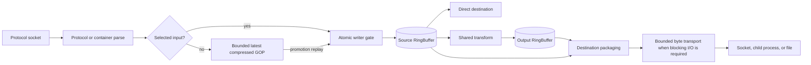

# High-performance data path

This document records the stable performance contract for packet and byte
movement. Current measurements belong in the
[quality baseline ledger](agent-guidance/quality/baselines.md); benchmark code
and production source own executable detail.

## Contents

- [Data-path shape](#data-path-shape)
- [Hot-path contracts](#hot-path-contracts)
- [Bounded transport](#bounded-transport)
- [Sharing and isolation](#sharing-and-isolation)
- [Native and child-process boundaries](#native-and-child-process-boundaries)
- [Measurement workflow](#measurement-workflow)
- [Change review](#change-review)

## Data-path shape

Encoded payloads move as reference-counted bytes. Packet rings provide
single-producer, multi-consumer fan-out, while `TsChunkRing` shares packaged
MPEG-TS chunks across SRT destinations. `MemoryQueue` bridges async producers
to blocking native or file I/O without an unbounded channel.

## Hot-path contracts

Packet loops must avoid work whose cost grows invisibly with packet rate:

- no per-packet logging, serialization, or metrics-label construction;
- no avoidable payload copy or fresh allocation when ownership can move;
- no shared global lock or async channel send in the normal ring path;
- no blocking syscall on a Tokio worker;
- no diagnostic reader that changes production fan-out behavior;
- no loss of PTS/DTS or payload-format distinctions for convenience.

Reusable buffers are allocated outside loops and cleared for reuse. Prefer
`Bytes`/`BytesMut` ownership transfer and burst APIs where the consumer already
supports batches. Optimizations must preserve protocol correctness and bounded
shutdown behavior.

## Bounded transport

The application bounds packet rings, MPEG-TS chunk rings, standby GOP caches,
async/native queues, socket admission, sender admission, and child-process
admission. Configurable defaults and environment parsing live in
`src/config.rs`; fixed structural limits live with their owning module. Each
structure owns its overflow or backpressure policy.

Different structures deliberately react differently under pressure:

- a lagging packet-ring reader may recover at a recent keyframe;
- a connected RTMP/SRT standby retains one compressed GOP and invalidates it
  entirely when its byte or packet bound is crossed;
- an MPEG-TS chunk reader detects overwrite and advances according to its
  container boundary;
- a `MemoryQueue` blocks or wakes its producer/consumer through its explicit
  cancellation contract;
- connection and child-process semaphores reject or defer new work instead of
  allowing unbounded resource growth.

Do not copy capacities or derived seconds-of-buffer estimates into planning
documents. They change with configuration and packetization; runtime telemetry
is the correct evidence for a specific deployment.

## Sharing and isolation

Expensive work is shared by typed stage identity. Destination-specific state
stays outside the shared stage:

| Shared | Per destination |
|---|---|
| Video/audio transform output ring | Protocol connection and retry state |
| SRT MPEG-TS packaging shard | Per-destination socket queue |
| Source packet ring | Independent reader position and lag counters |
| HLS pipeline store | Request authorization and response transfer |

Under the egress fabric default (`RESTREAM_EGRESS_FABRIC=all`; see
`docs/egress-implementation.md`), RTMP/RTMPS and SRT egress additionally
share a small, CPU-derived pool of shard OS threads across many
destinations, each multiplexed through native non-blocking readiness
polling rather than one blocking sender thread per destination — the
legacy per-output blocking sender only exists under
`RESTREAM_EGRESS_FABRIC=off`.

Sharing must not couple destination failure domains. A stalled or failed
destination can lose its own buffered data or restart without stopping the
publisher or another destination.

Multi-input standby caching is intentionally outside shared transforms. It adds
socket/demux work plus reference-counted compressed payload retention, but no
standby decode, encode, transform ring, output packaging, or continuously
generated HLS. With four configured inputs, the default worst case is three
standby cache bounds in addition to the selected pipeline.

## Native and child-process boundaries

Tokio owns sockets and inline native mux/demux work. Calls that may block are
isolated on guarded OS threads. The default codec-heavy transform path launches
an FFmpeg child and handles its pipes asynchronously; selected stage families
can use in-process FFmpeg when their feature/configuration path is enabled.

The external boundary has a process-start cost and pipe traffic, but isolates
codec failure and avoids blocking the async scheduler. The in-process boundary
removes process and pipe overhead, but requires explicit panic containment,
cancellation, and native-thread accounting. Backend changes therefore require
both correctness proof and representative measurement.

## Measurement workflow

The benchmark targets declared in `Cargo.toml` and implemented under `benches/`
are the executable inventory. Live protocol modes are owned by the harness.
For a hot-path change:

1. Select the benchmark or live mode that exercises the changed owner.
2. Record a clean baseline with the same build profile, fixture, and host
   constraints intended for the comparison.
3. Make one bounded change.
4. Run the focused correctness gate before trusting a speed result.
5. Repeat the same measurement and record variance, throughput, latency, and
   resource effects relevant to the hypothesis.
6. Update the baseline ledger only when the result is repeatable and useful as
   a future comparison point.

Use `scripts/build/resource-limit.sh` for Cargo work and
`scripts/build/bench-harness.sh` when a measurement mode requires the canonical
`target/bench/` binaries. Do not infer production capacity from loopback
throughput alone.

## Change review

A performance change is ready only when it answers all of these questions:

- Which production owner and workload does the measurement represent?
- Did protocol and lifecycle proof remain at least as strong?
- Is any added allocation, lock, copy, task hop, thread, process, or syscall
  visible in the design?
- Are memory and queue effects bounded under slow-consumer conditions?
- Does the result distinguish a directional signal from a proven deployment
  recommendation?

Architecture ownership is summarized in [Architecture](architecture.md), and
test/gate selection is maintained in [Testing](testing.md).
