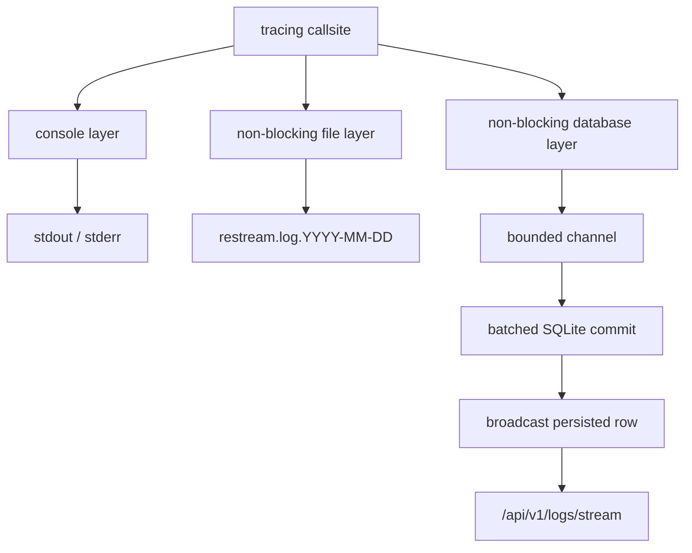

# Logging

Restream uses `tracing` for process logs and lifecycle events. A callsite emits
one structured event; the logging subsystem writes it to the console, an
optional daily JSON file, and SQLite-backed history. Persisted rows are then
broadcast to authenticated SSE clients.

This guide owns the runtime design, level policy, and callsite rules. The
[API reference](api-reference.md#process-logs) owns request and response
details, while [configuration](configuration.md) owns environment variables
and defaults.

## Contents

- [Data flow](#data-flow)
- [Level policy](#level-policy)
- [Sinks and persistence](#sinks-and-persistence)
- [Pipeline and output context](#pipeline-and-output-context)
- [Query and live-tail API](#query-and-live-tail-api)
- [Callsite rules](#callsite-rules)
- [Implementation map](#implementation-map)
- [Invariants](#invariants)

## Data flow



There are three subscriber layers. SSE is not a fourth tracing layer: the
background database task broadcasts rows only after their transaction commits,
so reconnect cursors always refer to durable positive IDs.

`Cargo.toml` enables `tracing`'s `max_level_debug` feature, so `trace!`
callsites are compiled out. `RUST_LOG`, defaulting to `info`, filters the
console and file layers. SQLite history independently retains all compiled
`error`, `warn`, and `info` events.

## Level policy

| Level | Use it for |
|---|---|
| `error` | A system fault stopped a task or delivery path and requires operator attention: database failure, panic, unrecoverable allocation/setup failure, or a crashed media worker. |
| `warn` | A recoverable or client-caused condition: rejected authentication, malformed input, destination refusal followed by retry, transient network failure, or enforced resource limit. |
| `info` | An operator-visible lifecycle transition: server readiness, ingest connect/disconnect, output start/stop/retry, recording transition, or codec discovery. |
| `debug` | Investigation detail about internal mechanisms, reconciliation, registry changes, or setup that would obscure normal lifecycle events. |

Two questions usually settle the level:

1. Did the system lose the ability to deliver this task or stream? Use
   `error`; otherwise prefer `warn` for a condition it can reject or recover.
2. Would an operator need the event to reconstruct the lifecycle? Use `info`;
   otherwise use `debug`.

Do not promote destination failures to `error` merely because they are
important to one output. If the reconciler will retry a remote refusal, it is a
recoverable `warn`; emit `error` when the local delivery task itself cannot
continue safely.

## Sinks and persistence

### Console

`error` and `warn` go to stderr. `info` and `debug` go to stdout. Both use the
standard text formatter with module targets; ANSI color follows the configured
`no_color` setting.

### Daily file

The file layer writes JSON through `tracing_appender::non_blocking`. It rolls
daily under `RESTREAM_LOG_DIR` using names such as
`restream.log.2026-07-14`. The default directory is `.restream/logs/`; an empty
value disables this sink. `LoggingHandles` retains the writer guard for the
process lifetime so buffered events flush during shutdown.

`RESTREAM_LOG_RETENTION_DAYS` applies to SQLite history cleanup, not deletion
of rolled files. File retention belongs to the host or container log policy.

### SQLite history and SSE handoff

The database layer accepts `error`, `warn`, and `info` events. Its callsite path
uses `try_send` into a bounded channel with capacity 4096 and never waits for
SQLite. If the channel is full, the event is dropped rather than applying
backpressure to application work.

The background task collects at most 64 rows or waits 100 ms, then commits the
batch to `app_logs`. Only committed rows are broadcast. The broadcast channel
holds 256 rows; a lagged SSE receiver is closed so the client can reconnect and
backfill from its last durable event ID.

SQLite history retains `RESTREAM_LOG_RETENTION_DAYS` days, defaulting to seven.
The reconciler performs cleanup periodically.

## Pipeline and output context

Long-lived work should carry `pipeline_id` and, when applicable, `output_id`.
Callsites may provide those fields directly or inherit them from an enclosing
span. For spawned async work, instrument the future so the context crosses the
task boundary:

```rust
let span = tracing::info_span!(
    "egress",
    pipeline_id = %pipeline_id,
    output_id = %output_id,
);

tokio::spawn(run_output().instrument(span));
```

Lifecycle events also provide stable `event_class` and `event_type` fields.
The dashboard uses those fields to group history without parsing human-readable
messages.

## Query and live-tail API

Both endpoints require an authenticated session:

- `GET /api/v1/logs` returns persisted rows and supports level, time, target,
  scope, pipeline, output, event-class, message-prefix, cursor, ordering, and
  limit filters.
- `GET /api/v1/logs/stream` returns `event: log` SSE frames, supports the core
  scope filters, and sends a heartbeat every 20 seconds.

The stream resumes from the `Last-Event-ID` header or `last_event_id` query
parameter. Backfill reads SQLite in ascending ID order before switching to the
live broadcast. If the receiver falls behind, the server closes the stream;
browser reconnection resumes from the last delivered durable ID.

See the [process-log API reference](api-reference.md#process-logs) for the
complete filter and response contract.

## Callsite rules

- Use structured fields instead of embedding identifiers in message text.
- Keep messages stable and human-readable; use `event_type` for machine-facing
  lifecycle classification.
- Do not add `[module]` prefixes. The tracing target already identifies the
  source module.
- Never log inside packet-level push, pull, read, mux, demux, or send loops.
- Control operations such as stage creation, reader registration, resize, or
  teardown may log at `debug` or `info` according to operator value.
- Passing tests should not emit expected warnings, panic text, or media-tool
  chatter. Suppress expected noise at the test helper.
- Keep point-in-time callsite inventories in dated evidence, not this guide.

For a level audit, enumerate current callsites from `src/`, apply the policy
above, fix mismatches with scoped tests, and update this document only when the
policy or an invariant changes.

## Implementation map

| Concern | Source of truth |
|---|---|
| Subscriber layers, span inheritance, batching, post-commit broadcast | `src/logging.rs` |
| Shared log DTOs and filters | `src/logging/types.rs` |
| SQLite schema | `src/db/schema.rs` |
| Persistence and filtering queries | `src/db/log_repo.rs` |
| HTTP query and SSE behavior | `src/api/logs.rs` |
| Route registration | `src/api/router.rs` |
| Runtime defaults | `src/config.rs` and [configuration](configuration.md) |

## Invariants

- No `println!` or `eprintln!` in `src/`; crate lints enforce this.
- No logging in packet-level loops in `ring_buffer.rs` or `avio.rs`.
- Subscriber callsites never block on SQLite or SSE consumers.
- SSE publishes only rows that committed successfully and therefore have a
  stable database ID.
- The file writer guard outlives all application tasks that may emit logs.
- Async work that needs pipeline/output inheritance uses `.instrument(span)`;
  a temporary `span.enter()` guard must not be held across task boundaries.
