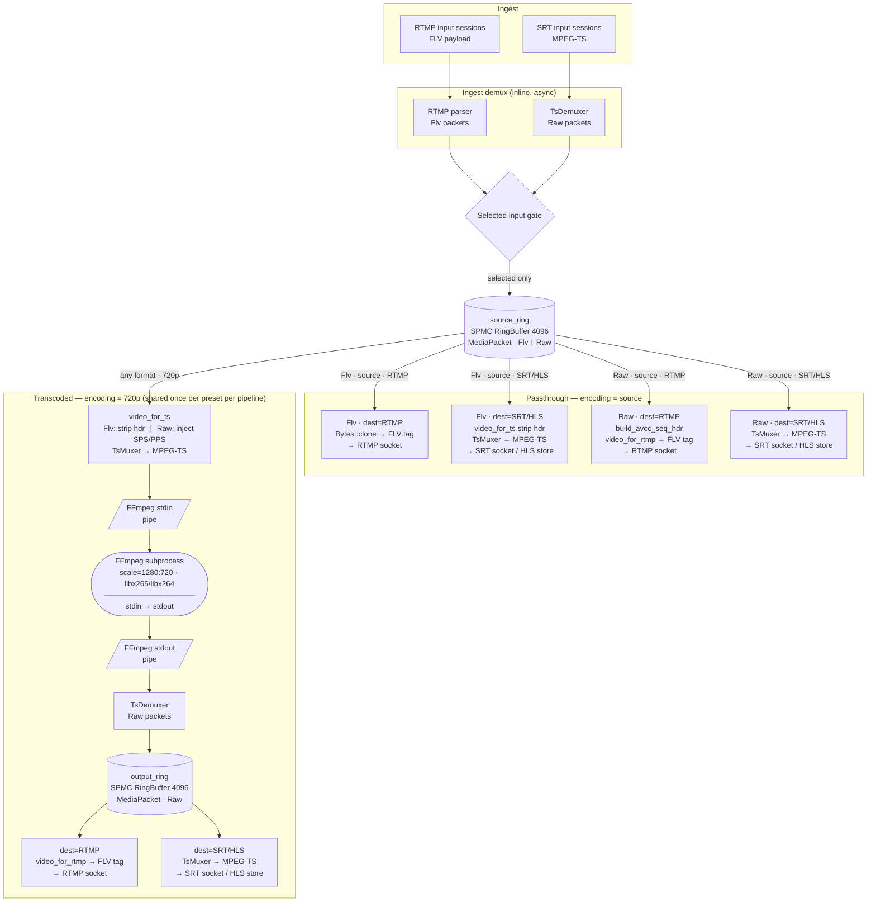
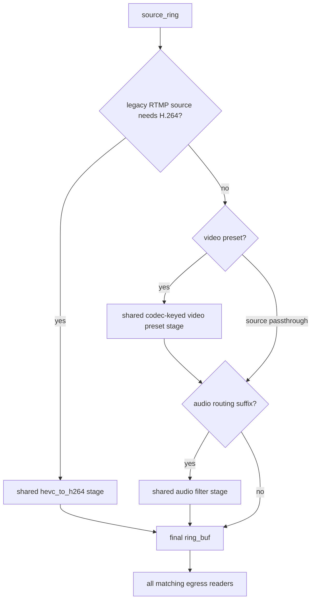
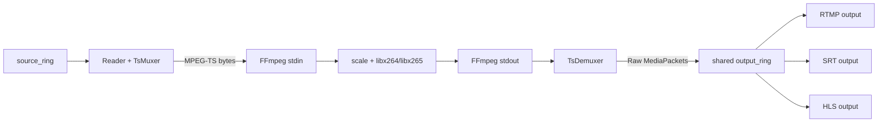
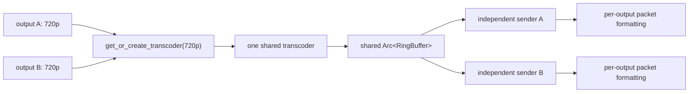

# Media Pipeline

This document covers the ingest-to-egress media pipeline: current shape,
protocol/codec boundaries, stage sharing, buffer sizing, and correctness
requirements.

For the performance optimization plan and benchmark results, see
[High-Performance Data Path](high-performance-data-path.md).

## Contents

- [Current shape](#current-shape)
- [Multi-input selection](#multi-input-selection)
- [Transcoder stages](#transcoder-stages)
- [Protocol and codec boundaries](#protocol-and-codec-boundaries)
- [Resolution presets](#resolution-presets)
- [H.265 egress policy](#h265-egress-policy)
- [Current protocol matrix](#current-protocol-matrix)
- [Minimum work per consumer](#minimum-work-per-consumer)
- [Harness coverage](#harness-coverage)
- [What is shared when outputs use the same video and audio config](#what-is-shared-when-outputs-use-the-same-video-and-audio-config)
- [Audio stage cache](#audio-stage-cache)
- [Buffer sizing for 4K 60fps](#buffer-sizing-for-4k-60fps)
- [Thread and memory ownership, ingest to egress](#thread-and-memory-ownership-ingest-to-egress)
- [SRT bonding](#srt-bonding)
- [SRT ingress owner](#srt-ingress-owner)
- [Protocol correctness requirements](#protocol-correctness-requirements)

## Current shape



## Multi-input selection

A pipeline supports one primary and up to three backup input records. Each
record has a separate stream key and independent RTMP/SRT session. Unselected
connected sessions stay warm through socket receive, parsing, demux/probe,
metadata, transport metrics, and on-demand input-scoped HLS preview generation.
RTMP and SRT standbys keep the latest complete compressed GOP in a
protocol-task-local `StandbyGopCache`. The default per-input limits are 16 MiB
of payload and 2,048 packets. Crossing either limit invalidates the whole GOP;
non-keyframe packets are then discarded until the next keyframe starts a new
cache. The cache has no shared lock, async channel, decoder, or transform.

Explicit promotion demotes and drains the old gate, then arms the target gate.
On the target's next packet, a complete cached GOP activates the gate and is
drained exactly once from its retained video keyframe. Without a complete cache,
the target waits for its next live video keyframe. `InputTimestampMapper`
applies one offset to the replay so its first DTS follows the prior writer's
last DTS, with PTS/DTS composition offsets preserved across the whole GOP and
on later re-promotions. The gate stores forwarding state and in-flight lease
count in one atomic word; loom covers no overlapping writers and one activation
for a replay-ready boundary.

This is connected standby, not bonded ingest. Each publisher remains an
independent source and the operator chooses one. SRT bonding is one caller group
represented by a single logical publisher. File inputs retain the next-live-keyframe promotion path;
the compressed-GOP cache applies to continuously connected RTMP/SRT publishers.

## Transcoder stages

Every non-passthrough encoding creates a **shared stage**: one process per
`(pipeline_id, preset, output_codec)` tuple regardless of how many outputs use
that resolved video shape.

### Stage graph



The `hevc_to_h264` stage converts H.265 ingest to H.264 at source resolution
for consumers that cannot carry HEVC: legacy RTMP egress and HLS preview.
Both share `hevc_to_h264:from:source` so audio and video stay on one ring.
Preset outputs resolve the codec first: legacy RTMP `codec:auto` creates an
H.264 preset stage (for example `video:720p:codec:h264`), while Enhanced RTMP
and SRT can create or share an H.265 preset stage (for example
`video:720p:codec:hevc`).

### Passthrough rule

`source` encodings **never** enter any transcoder stage. The egress reads
directly from `source_ring`. This is enforced in the reconciler (`src/lib.rs`)
before any `get_or_create_transcoder` call. `custom` output encodings are
rejected during output create/update because custom FFmpeg arguments are stored
for future implementation but not applied by the runtime.

### Stage-key naming

| Stage | Key format | Example |
|---|---|---|
| Video preset | `video:<preset>:codec:<codec>` | `video:720p:codec:h264`, `video:720p:codec:hevc` |
| H.265→H.264 | `hevc_to_h264:from:<upstream_key>` | `hevc_to_h264:from:source` |
| Audio filter | `audio:<op>:from:<video_key>` | `audio:atrack:0:from:video:720p:codec:h264` |

The `upstream_key` in the `hevc_to_h264` key encodes what ring feeds the
converter. Legacy RTMP source outputs and HEVC HLS preview both use `source`.

The video-preset key is shared across all compound encodings with the same
resolved video part (for example `720p+atrack:0` and `720p+remap:0:1` can both
use `video:720p:codec:h264`). The audio key embeds the upstream video key to
prevent cross-contamination between presets and output codecs.

### External transcoder (default)



One `ffmpeg` subprocess per `(pipeline, preset)`. FFmpeg reads MPEG-TS from
stdin and writes transcoded MPEG-TS to `pipe:1` (stdout). A Tokio task reads
stdout, runs it through `TsDemuxer`, and pushes the resulting `MediaPacket`s
into `output_ring`.

This is the **default** backend. It is robust because FFmpeg errors are
isolated to the subprocess and logged to stderr; a crash restarts cleanly on
the next reconciler cycle.

### Internal transcoder (opt-in)

Set `RESTREAM_INTERNAL_VIDEO_PRESETS=1` to use the in-process libavcodec path
(`src/media/transcoder.rs`) for video-preset stages. HEVC-to-H.264 bridge
stages and complex audio stages have separate rollout flags:
`RESTREAM_INTERNAL_HEVC_TO_H264` and `RESTREAM_INTERNAL_AUDIO_COMPLEX`.
`RESTREAM_INTERNAL_HLS_PREVIEW` still exists as a backend-family toggle for
`StageKind::Preview`, but HLS preview now reuses the shared HEVC→H.264 codec
edge (or source) instead of creating that kind. The data flow is identical —
the same `source_ring → output_ring` contract holds — but uses
`MemoryQueue`/`avio` callbacks instead of a subprocess pipe.

Current behavior: for `video:*` presets, the internal path uses
`run_ffmpeg_transcode_with_scale` and performs decode→scale→encode in-process
(`libx264` for H.264 input, `libx265` for H.265 input), while audio streams are
passed through. Source passthrough still bypasses the video transcoder.

The external FFmpeg subprocess backend remains the default. Backend selection
is explicit per stage family; there is no global switch that silently changes
every transform path.

### Muxing stages summary

| Stage | Role |
|---|---|
| SRT Ingest | `TsDemuxer` — demux MPEG-TS into `MediaPacket`s (inline async) |
| External transcoder | subprocess FFmpeg stdin→stdout; `TsMuxer` writes stdin, `TsDemuxer` reads stdout |
| Internal transcoder | in-process FFmpeg via `MemoryQueue`+`avio`; `TsMuxer` feeds input, output packets pushed directly to ring |
| SRT Egress | Shared `TsMuxer` task per unique `(pipeline, preset)` feeding a shared `TsChunkRing` (SPMC lock-free package ring) |
| HLS | `TsMuxer` remux to MPEG-TS, then segment in memory (inline async) |
| Recording | Raw MPEG-TS write to `.ts` file via `MemoryQueue` (OS thread) |


## Protocol and codec boundaries

| Area | Current state |
|---|---|
| RTMP H.264/AAC | Native ingest/play/egress; video uses DTS and carries FLV composition offset. B-frame round-trip still an E2E gate |
| SRT H.264/AAC | Native ingest/read/egress with MPEG-TS demux/remux |
| SRT H.265 | Codec mapping implemented; full E2E matrix remains a gate |
| RTMP H.265 | Enhanced RTMP ingest (H.265 arriving over RTMP) is not implemented. RTMP *egress* with H.265 source works: `hevc_to_h264` stage does full libavcodec decode→encode |
| Multi-track audio | SRT ingest preserves audio track indices plus MPEG-TS PID/language metadata where present |
| Audio remap/downmix | Channel-level DSP routes use an external FFmpeg audio stage (`pan` for remap, stereo resample for downmix); `atrack` remains packet-only |
| HLS pull routes/store | Implemented and tested; live segment generation uses native TsMuxer |
| HLS upload | Implemented; HTTP/HTTPS output URLs PUT new segments plus playlist to the target |
| RTMPS output | `rtmps://` uses the RTMP Compio shard path; Rustls completes TLS and hands record I/O to Linux kTLS. TLS 1.3 tickets are discarded after handoff (no session resumption); KeyUpdate closes the output. Unsupported suites or handoff errors fail without userspace-TLS fallback |
| Custom output encoding | Not applied; `custom` is rejected by output create/update instead of being exposed as a passthrough runtime option |

## Resolution presets

The external transcoder stage applies `scale=WxH` and re-encodes preserving the
input codec: `libx265 -preset veryfast` for H.265 input, `libx264 -preset
veryfast` for H.264 input. The internal video-preset backend (when enabled
with `RESTREAM_INTERNAL_VIDEO_PRESETS=1`) uses the same preset table via
`run_ffmpeg_transcode_with_scale`.

| Preset | Resolution | Scale filter |
|---|---|---|
| `source` | passthrough | none — never enters transcoder |
| `480p` | 854×480 | `scale=854:480` |
| `720p` | 1280×720 | `scale=1280:720` |
| `1080p` | 1920×1080 | `scale=1920:1080` |


## H.265 egress policy

Standard RTMP (non-Enhanced) does not carry H.265. The reconciler enforces:

| Egress protocol | H.265 input | Behavior |
|---|---|---|
| Legacy RTMP | H.265 source | `hevc_to_h264:from:source` stage inserted; full libavcodec H.265→H.264 — **working** |
| Legacy RTMP | H.265 + video preset | typed `codec:auto` resolves to H.264, so the preset stage is keyed as `video:<preset>:codec:h264` and no HEVC bridge is needed |
| Enhanced RTMP | H.265 source/preset | HEVC is packetized as Enhanced FLV `hvc1`; encoded presets are keyed as `video:<preset>:codec:hevc` |
| SRT | H.265 source | Passthrough (MPEG-TS carries HEVC natively) — **working** |
| SRT | H.265 + video preset | `video:<preset>:codec:hevc` with libx265; same ring can be shared with Enhanced RTMP — **working** |
| HLS preview | H.265 source | Reuses shared `hevc_to_h264:from:source` (same ring as legacy RTMP) at source resolution, then serves H.264+AAC fMP4 — **current path** |

Output configuration is symmetric at the model boundary: video mode, video
codec, audio routing, and protocol mode are typed fields. Protocol capability
validation remains asymmetric: legacy RTMP and HLS resolve `codec:auto` to
H.264, Enhanced RTMP and SRT can preserve H.265, and explicit unsupported
codec/protocol combinations are rejected before persistence.

## Current protocol matrix

| Ingest | RTMP egress | SRT egress | HLS preview | Recording |
|---|---|---|---|---|
| RTMP H.264 | Basic interop; B-frame timestamp gate | Implemented; full matrix gate | fMP4 HLS preview with alternate-audio renditions | Input-scoped mixed gate validates final MP4 |
| RTMP H.265 | Enhanced RTMP egress supported; legacy RTMP uses H.265→H.264 bridge | Not assumed | Not assumed | Not assumed |
| SRT H.264 | Packetization implemented; live matrix gate | Locally validated | fMP4 HLS preview with alternate-audio renditions | Input-scoped mixed gate validates final MP4 |
| SRT H.265 | RTMP: `hevc_to_h264` conversion working; SRT: passthrough working | Passthrough implemented; E2E gate | HEVC preview reuses `hevc_to_h264` at source size, then serves H.264+AAC fMP4 | Input-scoped mixed gate validates final MP4 |
| File | RTMP-shaped via child FFmpeg | Implemented for compatible FLV codecs | Native fMP4 preview packager; HEVC reuses the shared `hevc_to_h264` bridge | Input-scoped mixed gate validates final MP4 |

HLS preview is served as fragmented MP4 with `EXT-X-MAP`, `init.mp4`, and
`.m4s` media segments. The preview packager builds H.264 `avc1` / AAC `mp4a`
sample entries with `shiguredo_mp4` bitstream helpers and advertises RFC 6381
`CODECS` from those sample entries when they exist. Packet conversion stays on
the existing Annex B↔AVCC hot path. The preview path uses one fMP4 muxer per
HLS rendition: one video-only rendition plus separate audio-only playlists for
alternate tracks. Remote HLS outputs intentionally remain MPEG-TS because HTTP
PUT ingest targets commonly require `.ts` media segments.

## Minimum work per consumer

All consumers that process packets from a ring buffer avoid per-packet heap
allocation by using the zero-allocation `_into` variants:

| Consumer | Video conversion | Audio conversion | Burst size |
|---|---|---|---|
| RTMP egress | `video_for_rtmp_into` | `audio_for_rtmp_into` | `pull_burst` 32 |
| SRT egress | None (Shared `TsMuxer`) | None (Shared `TsMuxer`) | `pull_burst` 32 (`TsChunkReader`) |
| SRT play subscriber | None (Shared `TsMuxer`) | None (Shared `TsMuxer`) | `pull_burst` 32 (`TsChunkReader`) |
| HLS segmenter | `video_for_ts_into` | `audio_for_ts_into` | `pull_burst` 32 |
| Recording | `video_for_ts_into` | `audio_for_ts_into` | `pull_burst` 32 |
| Transcoder feed | `video_for_ts` (Raw→Raw passthrough) | `audio_for_ts` | `pull_burst` 32 |

Scratch buffers (`video_conv_buf`, `audio_conv_buf`) are allocated once at
consumer startup and reused across packets. For `PayloadFormat::Raw` video, the
borrowed payload slice is returned directly (zero copy).

## Harness coverage

The live harness owns the changing scenario inventory. Use the catalog
inspection workflow in [Testing](testing.md#live-integration-tests) instead of
copying mode, scenario, or stage-count tables into this guide.

The canonical scenario definitions live in `test/harness/scenarios/` and the
generated mixed-matrix catalog under `src/bin/test_harness/`. Representative
rows cover RTMP, SRT, and file ingest; H.264 and H.265; single- and
multi-audio; passthrough and preset stages; B-frame timestamp behavior; and
cross-protocol egress.

Tests should assert the stable sharing contract rather than a copied process
count: identical `(pipeline_id, stage_key)` values reuse expensive work, while
each destination keeps its own sender. Current scenario composition and
resource measurements belong to the catalog and dated evidence.

## What is shared when outputs use the same video and audio config

Stage sharing is keyed by `(pipeline_id, stage_key)`:



The per-packet format conversion (AVCC wrap, ADTS strip) is NOT shared between
egress tasks. This is intentional: sharing would require synchronization and
outweigh the ~700 ns per frame conversion cost. What IS shared is the far more
expensive encode stage (CPU-bound, seconds of latency). This invariant is
covered by `same_encoding_outputs_share_one_transcoder_stage` in engine tests,
and holds regardless of egress routing.

"Independent sender" above describes protocol/retry state ownership, not a
literal OS thread per destination: under the egress fabric (see
`docs/archive/egress/implementation.md`), each output is a leaf serviced by a
shared shard OS thread alongside other outputs, not a dedicated thread.

Current measurements belong in the
[quality baseline ledger](agent-guidance/quality/baselines.md). This guide owns
the sharing invariant, not a copied performance snapshot.

## Audio stage cache

Output reconciliation splits compound encodings into a video stage and an audio
stage. Audio stages are keyed by the upstream stage identity as well as the
audio operation (e.g. `audio:atrack:0:from:video:720p:codec:h264`), preventing
outputs using different presets or codecs from cross-contaminating.

`atrack` stages run in the lightweight packet router and only select/reindex
audio tracks. `remap` and `downmix` stages run through the external FFmpeg
stage, copy video, filter one selected audio track to stereo AAC, and then feed
the normal MPEG-TS demux back into the shared output ring.

## Buffer sizing for 4K 60fps

| Component | Size | Constraint | Source |
|---|---|---|---|
| Standby GOP cache | 16 MiB payload / 2,048 packets per connected RTMP/SRT standby | Keeps only the latest complete compressed GOP; invalidates on either limit | `standby_gop.rs` |
| RingBuffer capacity | 1024 packets (default; `RESTREAM_RING_CAPACITY`, clamp 64–16384) | Overflow `fast_forward` to most recent keyframe | `ring_buffer.rs`, `config.rs` |
| AVIO buffer | 32 KB | FFmpeg internal read/write chunk | `avio.rs` |
| MemoryQueue | 512 KiB (default; `RESTREAM_AVIO_QUEUE_CAPACITY`, clamp 64 KiB–16 MiB) | Bounded `VecDeque<u8>`; writer yields on full, consumer blocks on empty `read()` | `avio.rs`, `config.rs` |
| HLS segment accumulator | 8 MB initial | 4K60 H.264 segment at 6s can reach 12 MB; grows if needed (no hard byte ceiling) | `hls/mod.rs` |
| HLS MPEG-TS `max_segments` | 20 (default; `RESTREAM_HLS_MAX_SEGMENTS`) | Exact sliding window: evict when `len > max_segments`, also drop `variant_segments` for that index | `hls/store.rs` |
| HLS fMP4 preview window | advertise `max_segments`; retain `max_segments + 6` | Grace keeps the oldest advertised segment fetchable across a playlist refresh; not the TS eviction algorithm | `hls/fmp4/store.rs` |
| HLS `EXT-X-TARGETDURATION` | TS starts at 6s; fMP4 starts from first media duration | Sticky high-water mark of `duration.ceil()` since create/clear (7.2s → 8); eviction never shrinks it (`target_duration_never_decreases`) | `hls/store.rs`, `hls/fmp4/store.rs` |
| RTMP TCP SO_RCVBUF/SO_SNDBUF | 128 KB before auth, 8 MB after publish auth | Limits unauthenticated connection footprint while preserving burst headroom for accepted publishers | `rtmp.rs` |
| SRT caller UDP buffers | 8 MiB requested by default (`RESTREAM_SRT_UDP_BUF_BYTES` overrides) | Applied to the shared egress Owner socket; the kernel may clamp the request | `media/srt/knobs.rs`, `media/srt/egress_connect.rs` |
| SRT egress TX pool | 16 fixed slots per shard/address family | Bounds in-flight datagrams; payloads are materialized into reserved slots | `media/egress/backends/srt/owner_set.rs` |

## Thread and memory ownership, ingest to egress

This section traces one publisher's media from its entry socket to its exit
socket for each protocol, naming which concurrency primitive owns each hop
and which structure owns the memory at that hop. It complements
[Architecture § Runtime ownership](architecture.md#runtime-ownership), which
states the general policy (Tokio owns the control plane and async media work;
Compio owns its configured transport sockets); this section applies that
policy to concrete transport ownership. It is an ownership and
scaling-formula map, not a copied thread count — exact counts depend on live
CPU count, feed count, and output count. A fully worked, measured example for
one 1,200-output MSR run (exact thread histogram, RSS breakdown, and a
per-connection memory model) lives in
[the MSR resource-attribution investigation](archive/quality/msr-1200-resource-attribution-2026-08-13.md).

### RTMP: ingest to egress

```mermaid
flowchart LR
    subgraph C1["RTMP Compio acceptor thread/runtime"]
        Accept["Compio TCP listener"]
        Bridge["64 KiB bounded duplex\nper accepted session"]
    end
    subgraph T1["Fixed RTMP session workers (1–8 OS threads,\ncurrent-thread Tokio runtimes)"]
        Parse["RTMP / FLV session parser"] --> Gate["Selected-input gate"]
        Gate --> SR[("source_ring — shared SPMC")]
        SR -->|"non-passthrough preset"| Prep["Reader + TsMuxer\n(inline async)"]
        Stdin["FFmpeg stdin writer\n(async pipe I/O)"]
        Stdout["FFmpeg stdout reader\n(async pipe I/O)"]
        Stdout --> Demux["TsDemuxer\n(inline async)"]
        Demux --> OR[("output_ring — shared SPMC,\none per (pipeline, preset)")]
    end
    subgraph P1["FFmpeg child process (own OS process, not a Restream thread)"]
        FF["scale + libx264/libx265"]
    end
    Prep --> Stdin --> FF --> Stdout
    Accept --> Bridge --> Parse
    subgraph S1["Egress fabric shard pool: OS threads,\nOutputCount profile; one Compio runtime per shard"]
        Leaf["RTMP leaf: chunking, ack,\noptional kTLS state"] --> Send["Compio readiness + bounded TCP I/O"]
    end
    SR -->|"passthrough"| Leaf
    OR --> Leaf
    Send --> Dest["Destination RTMP/RTMPS server"]
```



The bridge is the ownership boundary: Compio keeps the TCP stream and pumps
bytes through the bounded duplex; fixed current-thread Tokio workers own RTMP
and FLV session state on the other side. Before the duplex endpoint enters the
bounded worker queue, the acceptor duplicates the socket fd with
`F_DUPFD_CLOEXEC` into an `OwnedFd`. The session uses that duplicate only for
TCP statistics and socket-buffer options, then drops it on exit, so bridge
shutdown cannot leave it sampling a recycled raw fd. If duplication fails,
the media session continues with TCP statistics unavailable.

| Hop | Thread/process model | Memory owner |
|---|---|---|
| Compio TCP accept | One Compio acceptor thread/runtime owns the listener and accepted TCP sockets; shutdown cancels and joins the registered thread | Kernel socket buffers plus one bounded 64 KiB duplex bridge per admitted session |
| RTMP session / FLV parse | Fixed pool of 1–8 OS threads, each with a current-thread Tokio runtime; workers are registered for shutdown and drain after accepted bridges close | Per-session parser state and read buffer; duplex capacity is bounded |
| `source_ring` / `output_ring` | No dedicated thread; shared structure | One fixed-capacity `RingBuffer` (1024 / 512 slots) per pipeline / per `(pipeline, preset)` stage, regardless of destination count |
| External transcoder (non-passthrough preset) | 1 FFmpeg child process + 2 Tokio tasks (stdin writer, stdout reader) per `(pipeline, preset)` | FFmpeg's own process memory (outside Restream's RSS) plus the pipe/`MemoryQueue` bridge |
| Egress shard (RTMP/RTMPS) | Fixed OS-thread pool per feed, sized by `EgressShardProfile::OutputCount`: `ceil(output_count / 128)`, capped at the CPU-derived ceiling; each shard owns one Compio runtime and its RTMP TCP streams/readiness registrations | Per-leaf `LeafCommon`: small fixed state plus bounded pending bytes (`RESTREAM_EGRESS_MAX_PENDING_BYTES`, 256 KiB ceiling); TCP send buffer is kernel-owned (`RESTREAM_RTMP_STREAM_BUFFER_BYTES`, 8 MiB), not RSS |

### SRT: ingest to egress

```mermaid
flowchart LR
    subgraph L1["SRT ingress Owner thread: one Compio runtime"]
        SS["srt-rs Owner listener/recv\nPeerTable + protocol timers"]
    end
    subgraph T2["Tokio application pipeline"]
        SS -->|"bounded events"| Demux2["TsDemuxer\n(inline async)"]
        Demux2 --> SR2[("source_ring — shared SPMC")]
        SR2 -->|"non-passthrough preset"| Prep2["shared transform stage\n(as in RTMP path)"]
        Prep2 --> OR2[("output_ring")]
        OR2 --> Mux["shared TsMuxer,\n1 task per (pipeline, preset)\n(inline async)"]
        SR2 -->|"passthrough"| Mux
        Mux --> TCR[("TsChunkRing — shared SPMC\npackage ring")]
    end
    subgraph S2["Egress fabric shard pool: OS threads per feed,\neach shard runs one Compio runtime with per-family Owners"]
        Leaf2["SRT leaf: connection,\ncongestion, encryption state"] --> Send2["send_shared into the logical caller"]
    end
    TCR --> Leaf2
    subgraph L2["Shared SRT state: one Compio Owner per (shard, address family):\n1 caller UDP socket, caller pool, fixed TX pool"]
        Send2 --> Buf["srt-rs protocol buffers + TSBPD\ndeadline enforcement"]
    end
    Buf --> Dest2["Destination SRT receiver"]
```



| Hop | Thread/process model | Memory owner |
|---|---|---|
| SRT ingest socket and protocol tasks | One Compio runtime and Owner own the listener socket, peer table, timers, and protocol state; bounded events reach Tokio session handling | Owner receive rings and per-peer srt-rs protocol state; kernel `SO_RCVBUF` is separate |
| `TsDemuxer` → `source_ring` | Tokio worker, inline async | Shared `source_ring`, same structure as RTMP |
| Shared `TsMuxer` (SRT preparation) | 1 Tokio task per `(pipeline, preset)`, inline async | `TsChunkRing` (256-chunk shared ring, `RESTREAM_TS_RING_CAPACITY`) |
| Egress shard (SRT) | Fixed OS-thread pool per feed; each shard owns one Compio runtime and at most one `Owner` per local address family, plus queued leaf visits | Per-leaf application state and bounded scratch; protocol state lives in the Owner |
| Shared SRT transport | 1 Compio `Owner` per `(shard, local family)`: one caller UDP socket, one bounded caller pool, a fixed TX pool (16 slots per family) and one receive consumer; shared TS muxing remains per `(pipeline, preset)` | srt-rs caller/protocol state plus kernel `SO_SNDBUF`; media DATA is materialized straight into reserved TX-pool slots (`DatagramSink` acquire/commit), handshake/control/retransmit paths retain their protocol-owned packets |

The SRT path bounds work per shard three ways: a finite `OwnerServiceBudget`
for each per-family Owner's service pass, explicit ready/feed-wait/parked
queues for leaf visits, and the Owner's fixed TX pool (16 slots per family) as
the physical in-flight envelope. Restream keeps no transport queue of its own:
unsent protocol output waits in bounded protocol state, and payload is
materialized straight into a reserved TX-pool slot when the Owner drains it.

## SRT bonding

### Ingest

The srt-rs listener explicitly accepts publisher-created Broadcast and Backup
groups. Restream answers every bonded leg with ONE application-owned
receiving-group id (random per listener lifetime, never derived from an address,
port or socket id), in the caller's own mode; a caller's group id identifies the
CALLER group and is never echoed. A direct caller receives no GROUP response.
Because the id is stable across legs, libsrt callers pin it and see no
`SRT_REJ_GROUP`. Their authenticated matching legs feed one stable logical input,
deduplicate received MPEG-TS payloads, and retain per-leg health plus logical
aggregate telemetry. Matching StreamIDs on independent sockets do not create a
bond.

### Egress

Backup links use the established `bond=` URL parameter:

```text
srt://primary:10080?streamid=publish:key&bond=backup1:10080,backup2:10080
```

This creates an SRT Backup group with the URL authority as the primary leg and
the listed peers as standbys. Add `type=broadcast` to duplicate each media
message over every healthy leg.

`bond=` means true SRT bonding: ONE logical stream, ONE logical caller, N
physical paths, and every path must terminate in the SAME remote receiving
group. Distinct hosts, IPs or ports are fine (they can be different network
endpoints of one receiver process); the validity test is the remote group
identity the SRT handshake establishes, not the URL strings. If a leg answers
from a different receiving group, `srt-rs` reports a peer-group collision and
Restream fails the whole output (it never keeps the healthy leg running or
degrades to one leg); normal retry policy owns any restart. A backup leg that is
merely unreachable is ordinary degradation, not a collision. Independent
receivers are not a bond target. All legs of one bond must share one address
family (one bond, one family Owner, one shared caller socket); a mixed-family
bond fails the output explicitly.

## SRT ingress owner

The SRT listener is one owner thread (`srt-in-<port>`): one production Compio
runtime (forced io_uring, no fallback; `ManagedPreferred` receive with an
observed substrate, RawReadiness only inside a working io_uring runtime) and one
`srt_transport::compio::Owner` attached with `Owner::listen_with_resolver`. The
Owner owns the socket, the `PeerTable`, handshake admission, timers, ACK/NAK,
listener TX and every peer's send/disconnect/retire. There is no second protocol
table on Tokio.

The `srt-rs` Owner holds up to 256 managed-RX buffer leases in its bounded
completion ring. Restream provisions 512 Compio provided buffers, leaving one
ring's worth of headroom so a full completion ring can drop its next datagram
and return the lease instead of exhausting the provided-buffer ring. At the
2,048-byte slot size, the ingress ring costs 1 MiB.

- **Admission** is synchronous on the owner thread: the resolver reads the
  `SrtIngestPolicyStore` (mode validation, `UNAUTHORIZED`/`BAD_MODE`/
  `BAD_REQUEST`, latency, passphrase, key length) and adds the receiving-group
  response for bonded callers. The asynchronous checks (pipeline authentication,
  IP bans, duplicate publishers, missing read target) stay in Tokio and, on
  rejection, send `Disconnect` for the real `LogicalPeerId`.
- **Bridges are bounded.** Commands (Tokio to Owner): `Send`, `Disconnect`,
  `Shutdown`, capacity 256, at most 32 applied per owner visit before the Owner is
  serviced again. Events (Owner to Tokio): `Connected`, `Media`, `Disconnected`,
  `Fault`, capacity 256. A full event bridge stops draining Owner events, so
  protocol flow control absorbs the pressure; accepted media is never counted and
  dropped. A full command bridge leaves an SRT reader's fragments queued in Tokio
  (a fragment is popped only once the bridge accepted it). Read/play fragments
  that wait for send-window room are bounded per peer (32) and in total (1024);
  a peer that exceeds them is explicitly disconnected (`overloadDisconnects`).
- **Retirement.** A terminal `Disconnected` is forwarded and the peer is removed
  from the Owner; a locally disconnected peer is retired after its terminal event
  or a 500 ms grace. Stale commands for a retired `LogicalPeerId` are harmless and
  counted (`staleCommands`).
- **Owner fault** stops admission, reports `Fault` to Tokio and ends the thread;
  there is no rebuild on another runtime. Shutdown flushes SHUTDOWN datagrams and
  runs `Owner::shutdown_and_drain`; the verdict is logged, never assumed.
- **Metrics**: `srtListener.ingressOwner` in the engine status (service visits and
  actions, TX capacity/in-flight/high-water/exhaustions, RX packets/bytes/ring
  depth/drops/truncation, peers, admission telemetry, bridge depth high-water,
  stale commands, overload disconnects). No peer or StreamID labels.

## Protocol correctness requirements

### Probe with matching ingest protocol

Probing must use the same read protocol as the active ingest. Cross-protocol
probing can create false positives (e.g., probing SRT ingest through RTMP
requires additional packetization). The diagnostics endpoint rejects mismatched
probe protocols.

### SRT Stream ID normalization

The listener accepts these shapes:

```text
publish:<key>             publisher:<key>
read:<key>                play:<key>           subscriber:<key>
<key>
#!::r=<key>,m=publish
#!::r=<key>,m=request
```

Query parameters are stripped before database validation.
Slash-delimited application prefixes are RTMP-only; SRT treats the decoded
resource string as the stream key.

### Media streams only

Read endpoints must emit media payload only. The pipeline selects the first
video stream and preserves all audio tracks. Subtitles, private data, second
video PIDs, and unknown stream types are excluded. The MPEG-TS remuxer rejects
unknown codec metadata rather than guessing H.264/AAC.

The control plane surfaces MPEG-TS stream identity metadata separately from the
media payload: video and audio metadata may include PID, language, and title
fields when descriptors are present, and audio tracks can be assigned local
operator-friendly labels in the dashboard.

### Timestamp semantics

RTMP video timestamps are decode timestamps. AVC/HEVC packets carry a signed
24-bit composition-time offset:

```text
DTS = RTMP timestamp
PTS = DTS + signed composition-time offset
```

Ingest stores both values correctly. RTMP play and egress use `packet.dts` as
the RTMP message timestamp for video (audio uses PTS). B-frame round-trip tests
remain desirable.

### H.265

H.265 must be tested explicitly and cannot be inferred from H.264 results.
SRT/MPEG-TS should preserve HEVC codec identity. RTMP H.265 requires Enhanced
RTMP handling. Until RTMP H.265 is proven end-to-end, diagnostics should prefer
SRT read/probe for SRT H.265 publishers.
