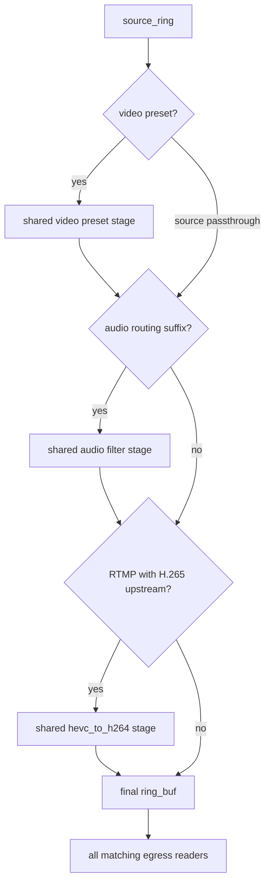
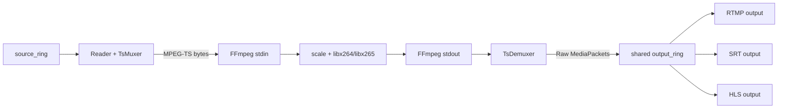
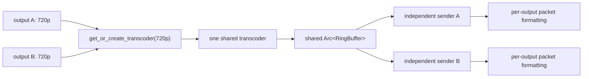

# Media Pipeline

This document covers the ingest-to-egress media pipeline: current shape,
protocol/codec boundaries, stage sharing, buffer sizing, and correctness
requirements.

For the performance optimization plan and benchmark results, see
[High-Performance Data Path](high-performance-data-path.md).

## Contents

- [Current shape](#current-shape)
- [Multi-input selection](#multi-input-selection)
- [Transcoder stages](#transcoder-stages)
- [Protocol and codec boundaries](#protocol-and-codec-boundaries)
- [Resolution presets](#resolution-presets)
- [H.265 egress policy](#h265-egress-policy)
- [Current protocol matrix](#current-protocol-matrix)
- [Minimum work per consumer](#minimum-work-per-consumer)
- [Harness coverage](#harness-coverage)
- [What is shared when outputs use the same encoding](#what-is-shared-when-outputs-use-the-same-encoding)
- [Audio stage cache](#audio-stage-cache)
- [Buffer sizing for 4K 60fps](#buffer-sizing-for-4k-60fps)
- [SRT bonding](#srt-bonding)
- [Protocol correctness requirements](#protocol-correctness-requirements)

## Current shape


## Multi-input selection

A pipeline supports one primary and up to three backup input records. Each
record has a separate stream key and independent RTMP/SRT session. Unselected
connected sessions stay warm through socket receive, parsing, demux/probe,
metadata, transport metrics, and on-demand input-scoped HLS preview generation.
RTMP and SRT standbys keep the latest complete compressed GOP in a
protocol-task-local `StandbyGopCache`. The default per-input limits are 16 MiB
of payload and 2,048 packets. Crossing either limit invalidates the whole GOP;
non-keyframe packets are then discarded until the next keyframe starts a new
cache. The cache has no shared lock, async channel, decoder, or transform.

Explicit promotion demotes and drains the old gate, then arms the target gate.
On the target's next packet, a complete cached GOP activates the gate and is
drained exactly once from its retained video keyframe. Without a complete cache,
the target waits for its next live video keyframe. `InputTimestampMapper`
applies one offset to the replay so its first DTS follows the prior writer's
last DTS, with PTS/DTS composition offsets preserved across the whole GOP and
on later re-promotions. The gate stores forwarding state and in-flight lease
count in one atomic word; loom covers no overlapping writers and one activation
for a replay-ready boundary.

This is connected standby, not bonded ingest. Each publisher remains an
independent source and the operator chooses one. Libsrt socket groups remain the
only bonded SRT path. File inputs retain the next-live-keyframe promotion path;
the compressed-GOP cache applies to continuously connected RTMP/SRT publishers.

## Transcoder stages

Every non-passthrough encoding creates a **shared stage**: one process per
`(pipeline_id, preset)` pair regardless of how many outputs use that preset.

### Stage graph



The `hevc_to_h264` stage is the **last** stage in the chain, applied only for
RTMP outputs when the ingest is H.265. SRT outputs receive native H.265 from the
preset ring without any additional conversion. RTMP and SRT outputs sharing the
same preset (e.g. both 720p) share the `video:720p` stage — only the final RTMP
edge gets a `hevc_to_h264` stage appended.

### Passthrough rule

`source` encodings **never** enter any transcoder stage. The egress reads
directly from `source_ring`. This is enforced in the reconciler (`src/lib.rs`)
before any `get_or_create_transcoder` call. `custom` output encodings are
rejected during output create/update because custom FFmpeg arguments are stored
for future implementation but not applied by the runtime.

### Stage-key naming

| Stage | Key format | Example |
|---|---|---|
| Video preset | `video:<preset>` | `video:720p` |
| H.265→H.264 | `hevc_to_h264:from:<upstream_key>` | `hevc_to_h264:from:source`, `hevc_to_h264:from:720p` |
| Audio filter | `audio:<op>:from:<video_key>` | `audio:atrack:0:from:720p` |

The `upstream_key` in the `hevc_to_h264` key encodes what ring feeds the
converter: `source` for passthrough RTMP, the preset name (e.g. `720p`) for
transcoded RTMP without audio routing, or the full audio key (e.g.
`audio:atrack:0:from:720p`) for transcoded RTMP with audio routing. This allows
RTMP-passthrough and RTMP-720p converters to be **independent stages** (each
runs its own libavcodec thread) while all RTMP egresses on the same encoding
**share** one converter.

The video-preset key is shared across all compound encodings with the same
video part (e.g. `720p`, `720p+atrack:0`, `720p+remap:0:1` all use key
`video:720p`). The audio key embeds the upstream video key to prevent
cross-contamination between presets.

### External transcoder (default)



One `ffmpeg` subprocess per `(pipeline, preset)`. FFmpeg reads MPEG-TS from
stdin and writes transcoded MPEG-TS to `pipe:1` (stdout). A Tokio task reads
stdout, runs it through `TsDemuxer`, and pushes the resulting `MediaPacket`s
into `output_ring`.

This is the **default** backend. It is robust because FFmpeg errors are
isolated to the subprocess and logged to stderr; a crash restarts cleanly on
the next reconciler cycle.

### Internal transcoder (opt-in)

Set `RESTREAM_INTERNAL_VIDEO_PRESETS=1` to use the in-process libavcodec path
(`src/media/transcoder.rs`) for video-preset stages. HEVC-to-H.264 bridge
stages, HLS preview transcode stages, and complex audio stages have separate
rollout flags: `RESTREAM_INTERNAL_HEVC_TO_H264`,
`RESTREAM_INTERNAL_HLS_PREVIEW`, and `RESTREAM_INTERNAL_AUDIO_COMPLEX`. The
data flow is identical — the same `source_ring → output_ring` contract holds —
but uses `MemoryQueue`/`avio` callbacks instead of a subprocess pipe.

Current behavior: for `video:*` presets, the internal path uses
`run_ffmpeg_transcode_with_scale` and performs decode→scale→encode in-process
(`libx264` for H.264 input, `libx265` for H.265 input), while audio streams are
passed through. Source passthrough still bypasses the video transcoder.

The external FFmpeg subprocess backend remains the default. Backend selection
is explicit per stage family; there is no global switch that silently changes
every transform path.

### Muxing stages summary

| Stage | Role |
|---|---|
| SRT Ingest | `TsDemuxer` — demux MPEG-TS into `MediaPacket`s (inline async) |
| External transcoder | subprocess FFmpeg stdin→stdout; `TsMuxer` writes stdin, `TsDemuxer` reads stdout |
| Internal transcoder | in-process FFmpeg via `MemoryQueue`+`avio`; `TsMuxer` feeds input, output packets pushed directly to ring |
| SRT Egress | Shared `TsMuxer` task per unique `(pipeline, preset)` feeding a shared `TsChunkRing` (SPMC lock-free package ring) |
| HLS | `TsMuxer` remux to MPEG-TS, then segment in memory (inline async) |
| Recording | Raw MPEG-TS write to `.ts` file via `MemoryQueue` (OS thread) |


## Protocol and codec boundaries

| Area | Current state |
|---|---|
| RTMP H.264/AAC | Native ingest/play/egress; video uses DTS and carries FLV composition offset. B-frame round-trip still an E2E gate |
| SRT H.264/AAC | Native ingest/read/egress with MPEG-TS demux/remux |
| SRT H.265 | Codec mapping implemented; full E2E matrix remains a gate |
| RTMP H.265 | Enhanced RTMP ingest (H.265 arriving over RTMP) is not implemented. RTMP *egress* with H.265 source works: `hevc_to_h264` stage does full libavcodec decode→encode |
| Multi-track audio | SRT ingest preserves audio track indices plus MPEG-TS PID/language metadata where present |
| Audio remap/downmix | Channel-level DSP routes use an external FFmpeg audio stage (`pan` for remap, stereo resample for downmix); `atrack` remains packet-only |
| HLS pull routes/store | Implemented and tested; live segment generation uses native TsMuxer |
| HLS upload | Implemented; HTTP/HTTPS output URLs PUT new segments plus playlist to the target |
| RTMPS output | `rtmps://` URLs accepted by API and routed through RTMP egress with Rustls wrapping before the RTMP handshake |
| Custom output encoding | Not applied; `custom` is rejected by output create/update instead of being exposed as a passthrough runtime option |

## Resolution presets

The external transcoder stage applies `scale=WxH` and re-encodes preserving the
input codec: `libx265 -preset veryfast` for H.265 input, `libx264 -preset
veryfast` for H.264 input. The internal video-preset backend (when enabled
with `RESTREAM_INTERNAL_VIDEO_PRESETS=1`) uses the same preset table via
`run_ffmpeg_transcode_with_scale`.

| Preset | Resolution | Scale filter |
|---|---|---|
| `source` | passthrough | none — never enters transcoder |
| `480p` | 854×480 | `scale=854:480` |
| `720p` | 1280×720 | `scale=1280:720` |
| `1080p` | 1920×1080 | `scale=1920:1080` |


## H.265 egress policy

Standard RTMP (non-Enhanced) does not carry H.265. The reconciler enforces:

| Egress protocol | H.265 input | Behavior |
|---|---|---|
| RTMP | H.265 source | `hevc_to_h264:from:source` stage inserted; full libavcodec H.265→H.264 — **working** |
| RTMP | H.265 + video preset | `video:preset` runs first (H.265 output, shared); `hevc_to_h264:from:<preset>` converts after — H.264 to RTMP — **working** |
| SRT | H.265 source | Passthrough (MPEG-TS carries HEVC natively) — **working** |
| SRT | H.265 + video preset | `video:preset` with libx265 → H.265 720p output; same ring shared with RTMP — **working** |
| HLS preview | H.265 source | Preview-only `hevc_preview_h264` stage converts to H.264 720p before served fMP4 HLS — **current path** |

Enhanced RTMP/HEVC packetization is not implemented.

## Current protocol matrix

| Ingest | RTMP egress | SRT egress | HLS preview | Recording |
|---|---|---|---|---|
| RTMP H.264 | Basic interop; B-frame timestamp gate | Implemented; full matrix gate | fMP4 HLS preview with alternate-audio renditions | Input-scoped mixed gate validates final MP4 |
| RTMP H.265 | Not supported without Enhanced RTMP | Not assumed | Not assumed | Not assumed |
| SRT H.264 | Packetization implemented; live matrix gate | Locally validated | fMP4 HLS preview with alternate-audio renditions | Input-scoped mixed gate validates final MP4 |
| SRT H.265 | RTMP: `hevc_to_h264` conversion working; SRT: passthrough working | Passthrough implemented; E2E gate | HEVC preview converts to H.264 720p before served fMP4 HLS | Input-scoped mixed gate validates final MP4 |
| File | RTMP-shaped via child FFmpeg | Implemented for compatible FLV codecs | Native fMP4 preview packager; HEVC uses preview transcode | Input-scoped mixed gate validates final MP4 |

HLS preview is now served as fragmented MP4 with `EXT-X-MAP`, `init.mp4`, and
`.m4s` media segments. The preview path uses one fMP4 muxer per HLS rendition:
one video-only rendition plus separate audio-only playlists for alternate
tracks. Remote HLS outputs intentionally remain MPEG-TS because HTTP PUT ingest
targets commonly require `.ts` media segments.

## Minimum work per consumer

All consumers that process packets from a ring buffer avoid per-packet heap
allocation by using the zero-allocation `_into` variants:

| Consumer | Video conversion | Audio conversion | Burst size |
|---|---|---|---|
| RTMP egress | `video_for_rtmp_into` | `audio_for_rtmp_into` | `pull_burst` 32 |
| SRT egress | None (Shared `TsMuxer`) | None (Shared `TsMuxer`) | `pull_burst` 32 (`TsChunkReader`) |
| SRT play subscriber | None (Shared `TsMuxer`) | None (Shared `TsMuxer`) | `pull_burst` 32 (`TsChunkReader`) |
| HLS segmenter | `video_for_ts_into` | `audio_for_ts_into` | `pull_burst` 32 |
| Recording | `video_for_ts_into` | `audio_for_ts_into` | `pull_burst` 32 |
| Transcoder feed | `video_for_ts` (Raw→Raw passthrough) | `audio_for_ts` | `pull_burst` 32 |

Scratch buffers (`video_conv_buf`, `audio_conv_buf`) are allocated once at
consumer startup and reused across packets. For `PayloadFormat::Raw` video, the
borrowed payload slice is returned directly (zero copy).

## Harness coverage

The live harness owns the changing scenario inventory. Use the catalog
inspection workflow in [Testing](testing.md#live-integration-tests) instead of
copying mode, scenario, or stage-count tables into this guide.

The canonical scenario definitions live in `test/harness/scenarios/` and the
generated mixed-matrix catalog under `src/bin/test_harness/`. Representative
rows cover RTMP, SRT, and file ingest; H.264 and H.265; single- and
multi-audio; passthrough and preset stages; B-frame timestamp behavior; and
cross-protocol egress.

Tests should assert the stable sharing contract rather than a copied process
count: identical `(pipeline_id, stage_key)` values reuse expensive work, while
each destination keeps its own sender. Current scenario composition and
resource measurements belong to the catalog and dated evidence.

## What is shared when outputs use the same encoding

Stage sharing is keyed by `(pipeline_id, stage_key)`:



The per-packet format conversion (AVCC wrap, ADTS strip) is NOT shared between
egress tasks. This is intentional: sharing would require synchronization and
outweigh the ~700 ns per frame conversion cost. What IS shared is the far more
expensive encode stage (CPU-bound, seconds of latency). This invariant is
covered by `same_encoding_outputs_share_one_transcoder_stage` in engine tests.

Current measurements belong in the
[quality baseline ledger](agent-guidance/quality/baselines.md). This guide owns
the sharing invariant, not a copied performance snapshot.

## Audio stage cache

Output reconciliation splits compound encodings into a video stage and an audio
stage. Audio stages are keyed by the upstream stage identity as well as the
audio operation (e.g. `audio:atrack:0:from:video:720p`), preventing outputs
using different presets from cross-contaminating.

`atrack` stages run in the lightweight packet router and only select/reindex
audio tracks. `remap` and `downmix` stages run through the external FFmpeg
stage, copy video, filter one selected audio track to stereo AAC, and then feed
the normal MPEG-TS demux back into the shared output ring.

## Buffer sizing for 4K 60fps

| Component | Size | Constraint | Source |
|---|---|---|---|
| Standby GOP cache | 16 MiB payload / 2,048 packets per connected RTMP/SRT standby | Keeps only the latest complete compressed GOP; invalidates on either limit | `standby_gop.rs` |
| RingBuffer capacity | 4096 slots | ~24s at 170 pkt/s (4K60). Overflow fast-forwards to most recent keyframe | `engine.rs` |
| AVIO buffer | 32 KB | FFmpeg internal read/write chunk | `avio.rs` |
| MemoryQueue | Bounded `VecDeque<u8>` (2 MB) | Backpressure is structural: writer yields on full, consumer blocks on empty `read()` | `avio.rs` |
| HLS segment accumulator | 8 MB initial | 4K60 H.264 segment at 6s can reach 12 MB; grows if needed | `hls.rs` |
| HLS MAX_SEGMENTS | 10 | ~60s sliding window. 10 × 8 MB = 80 MB worst case per pipeline at 4K | `hls.rs` |
| HLS TARGET_DURATION | 6s | MIN_SEGMENT (1s) prevents micro-segments from keyframe bursts | `hls.rs` |
| RTMP TCP SO_RCVBUF/SO_SNDBUF | 128 KB before auth, 8 MB after publish auth | Limits unauthenticated connection footprint while preserving burst headroom for accepted publishers | `rtmp.rs` |
| SRT SRTO_LATENCY | 250 ms | Dejitter + retransmit window. At 50 Mbps = 1.56 MB in flight | `srt.rs` |
| SRT SRTO_LOSSMAXTTL | 256 packets | Reorder tolerance. At 50 Mbps/1316 B ≈ 54 ms | `srt.rs` |
| SRT UDP buffers | 8 MB | Kernel SO_RCVBUF/SNDBUF. Requires `rmem_max`/`wmem_max` ≥ 8 MB | `srt.rs` |
| SRT internal buffers | 12 MB | libsrt retransmission/reordering. ≥ latency × bitrate × (1+loss) | `srt.rs` |
| SRT SRTO_FC | 32768 packets | Flow control window. 32768 × 1316 B ≈ 43 MB window | `srt.rs` |
| SRT SRTO_MAXBW | unlimited | Auto-detect bandwidth from input rate | `srt.rs` |
| SRT recv buffer | 1316 bytes (single) / 2048 bytes (group) | One SRT payload per receive | `srt.rs` |

Runtime verification: `srt_log_effective_opts` reads back values after
`srt_setsockopt` and warns if the kernel clamped UDP buffers.

## SRT bonding

### Ingest

The SRT listener requests `SRTO_GROUPCONNECT=1`. A publisher-created bonded
connection is accepted as one logical group: the first member returns a group
ID from `srt_accept`, later members attach in the background, and one
`srt_recv(group_id)` loop feeds one demuxer/ring producer. `srt_group_data()`
reports member state through health/diagnostics.

StreamID alone does not create a group. Two independent sockets with matching
StreamIDs are rejected as duplicate publishers.

Requires libsrt compiled with `ENABLE_BONDING=ON`; startup warns and retains
single-link ingest otherwise. All builds link against the repo-managed static
SRT build from `.local/build/static/prefix`, so bonded-ingest support no longer
depends on the distro `libsrt` package.

### Egress

Backup links via `bond=` URL parameter:

```text
srt://primary:10080?streamid=publish:key&bond=backup1:10080,backup2:10080
```

Creates an `SRT_GTYPE_BACKUP` group. Both single-connection and bonded egress groups now call `srt_set_highbitrate_opts(client_sock)` immediately after creation to prevent packet drops and buffer overflows under high bitrates.

## Protocol correctness requirements

### Probe with matching ingest protocol

Probing must use the same read protocol as the active ingest. Cross-protocol
probing can create false positives (e.g., probing SRT ingest through RTMP
requires additional packetization). The diagnostics endpoint rejects mismatched
probe protocols.

### SRT Stream ID normalization

The listener accepts these shapes:

```text
publish:<key>             publisher:<key>
read:<key>                play:<key>           subscriber:<key>
<key>
#!::r=<key>,m=publish
#!::r=<key>,m=request
```

Query parameters are stripped before database validation.
Slash-delimited application prefixes are RTMP-only; SRT treats the decoded
resource string as the stream key.

### Media streams only

Read endpoints must emit media payload only. The pipeline selects the first
video stream and preserves all audio tracks. Subtitles, private data, second
video PIDs, and unknown stream types are excluded. The MPEG-TS remuxer rejects
unknown codec metadata rather than guessing H.264/AAC.

The control plane surfaces MPEG-TS stream identity metadata separately from the
media payload: video and audio metadata may include PID, language, and title
fields when descriptors are present, and audio tracks can be assigned local
operator-friendly labels in the dashboard.

### Timestamp semantics

RTMP video timestamps are decode timestamps. AVC/HEVC packets carry a signed
24-bit composition-time offset:

```text
DTS = RTMP timestamp
PTS = DTS + signed composition-time offset
```

Ingest stores both values correctly. RTMP play and egress use `packet.dts` as
the RTMP message timestamp for video (audio uses PTS). B-frame round-trip tests
remain desirable.

### H.265

H.265 must be tested explicitly and cannot be inferred from H.264 results.
SRT/MPEG-TS should preserve HEVC codec identity. RTMP H.265 requires Enhanced
RTMP handling. Until RTMP H.265 is proven end-to-end, diagnostics should prefer
SRT read/probe for SRT H.265 publishers.
