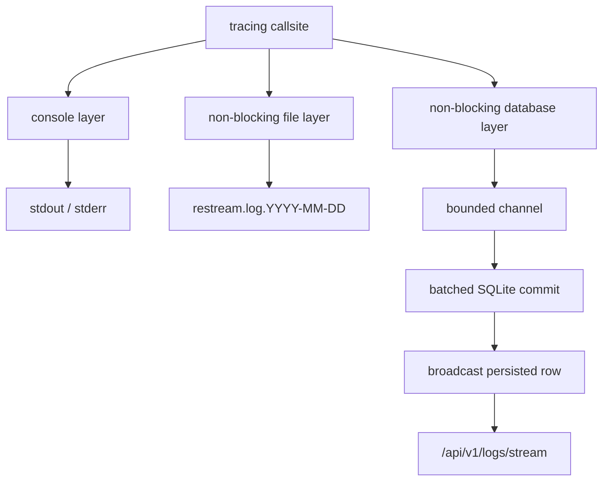

# Observability and Diagnostics

The Rust runtime exposes JSON diagnostics directly from process state and SSE
for live log/event feeds.
It does not expose a Prometheus text endpoint, proxy Grafana, or poll a sidecar.

## Contents

- [Endpoints](#endpoints)
- [/api/v1/engine/health field derivation](#apiv1enginehealth-field-derivation)
- [Diagnostic checks](#diagnostic-checks)
- [Known instrumentation gaps](#known-instrumentation-gaps)
- [Future instrumentation](#future-instrumentation)
- [Prometheus and Grafana](#prometheus-and-grafana)
- [Logging](#logging)

## Endpoints

| Surface | Authentication | Purpose |
|---|---|---|
| `GET /healthz` | None | Process liveness: `{ "status": "ok" }` |
| `GET /api/v1/engine/health` | Session | Pipeline input/output state, transport quality, recording state, SRT listener pressure |
| `GET /api/v1/engine/resource-map` | Session | Runtime or pipeline-scoped resource attribution: CPU/RSS/thread summary plus measured/derived resource nodes; defaults to grouped top-N for large fleets |
| `GET /metrics/system` | Session | Host CPU/memory/disk/network plus restream engine self metrics, child FFmpeg CPU/RSS, observe-only service-center capacity, and RTMPS/kTLS state (JSON, not Prometheus) |
| `GET /api/v1/engine` | Session | Restream build/toolchain, linked native-library versions, SBOM summary, and System information: OS, kernel, memory, CPU topology/features, and virtualization context |
| `GET /api/v1/engine/sbom` | Session | CycloneDX 1.5 runtime SBOM for resolved Rust crates and linked native libraries |
| `GET /api/v1/pipelines/:id/probe` | Session | Active input codec, dimensions, audio tracks, bitrate, and GOP summary |
| `GET /api/v1/pipelines/:id/graph` | Session | Processing stages, buffers, and output connections |
| `POST /api/v1/pipelines/:id/diagnostics/run` | Session | Protocol-aware batch diagnostic report |
| `GET /api/v1/overview` | Session | Engine-wide operator summary: pipeline counts, alert rollup, SRT listener |
| `GET /api/v1/alerts` | Session | Aggregate alerts across all pipelines with `firstSeen`/`lastSeen` tracking |
| `GET /api/v1/events` | Session | Lifecycle event log (ingest, stage, egress transitions) |
| `GET /api/v1/logs` | Session | Process log query: level, module, pipeline, time range, event class filters |
| `GET /api/v1/logs/stream` | Session | SSE live tail with Last-Event-ID resumption and 20 s heartbeat |
| `GET /api/v1/pipelines/:id/summary` | Session | Operator pipeline view: source, outputs, alerts |
| `GET /api/v1/pipelines/:id/alerts` | Session | Per-pipeline alert list |
| `GET /api/v1/engine/telemetry` | Session | Engineer: all ingests, stages, egresses, transcoder buffers |
| `GET /api/v1/pipelines/:id/telemetry` | Session | Engineer: pipeline-scoped ingest, ring, stages, egresses |
| `GET /api/v1/stages/:key/telemetry` | Session | Engineer: single-stage throughput and pipe metrics |

See [API Reference](api-reference.md) for request/response details.

## `/api/v1/engine/health` field derivation

`GET /api/v1/engine/health` is built on demand from native `MediaEngine` state and per-pipeline
recording settings in SQLite.

### Top-level shape

```json
{
  "generatedAt": "2026-06-20T12:00:00Z",
  "status": "ready",
  "pipelines": {},
  "srtListener": {
    "bondingAvailable": false,
    "ingressOwner": {
      "faulted": false,
      "managedRx": true,
      "serviceVisits": 0,
      "rxPackets": 0,
      "txPackets": 0,
      "peers": 0
    }
  }
}
```

`srtListener.ingressOwner` is published by the SRT ingress Owner threads and is
low-cardinality by construction (no peer or StreamID labels). With several
Owners (`RESTREAM_SRT_INGRESS_OWNERS`) every counter and gauge is the sum over
the Owners and every high-water mark is the largest one; a stopped Owner
withdraws its gauges. The sample shows a
subset; the full set is service visits/actions/maintenance actions and budget
exhaustion, TX capacity/in-flight/high-water/exhaustions/packets/completions/
failures, RX packets/bytes/ring depth/ring drops/buffer exhaustion/truncation, peers, admission
policy telemetry, command and event bridge depth high-water, event-bridge-full
visits, dropped telemetry samples, deferred read sends, stale commands,
overload disconnects and send failures.

`rxBufferExhaustions` counts transient managed provided-buffer pressure reports
(`ENOBUFS` / `ResourceBusy`). It does not establish packet loss, increment
`rxRingDropped`, or fault the Owner. `rxRingDropped` counts actual completion-ring
discards; `rxTruncated` counts oversized datagrams discarded without parsing.
These are local receive-path counters, not wire-loss or kernel socket-drop totals.
The same fields are exposed for each SRT egress Owner under `egressFabricShards`.

SRT ingest media runs to completion on the Owner thread, so the Owner also
reports it: `mediaPayloads` (payloads demuxed and published), `mediaWorkUs`
(cumulative time in the receive-and-publish pass), `mediaPassMaxUs` (longest
single pass), `mediaSlowPasses5ms` / `mediaSlowPasses20ms` (passes over 5 and
20 ms; each delays that Owner's protocol service), `mediaUnattachedDropped`
(payloads dropped past the bound held while Tokio admits a peer) and
`mediaProbeHoldOverflows` (a probe hold that reached its byte budget, per
publisher 4 MiB or Owner-wide 64 MiB, or its 2 s timeout: held packets were
published to the current ring and holding stopped) and `mediaProbeAckMaxUs`
(longest wait for Tokio to answer a stream probe). Pre-admission media is
bounded in bytes too: 2.5 MB per peer and 32 MiB Owner-wide, where a full
Owner-wide cap evicts from the largest queue so a new publisher keeps its
first payloads. The event bridge carries session
lifecycle only (connect, stream probe, disconnect), so `eventBridgeFullVisits`
should stay at zero.

`status` is currently always `ready` when the handler returns.

### Input status

| Condition | `input.status` |
|---|---|
| `MediaEngine` reports an active ingest for the pipeline | `on` |
| No active ingest is registered | `off` |

The Rust implementation does not emit `warning` or `error` for input state.

Active input fields:

| Field | Source |
|---|---|
| `publishStartedAt` | Current UTC time minus the ingest's monotonic uptime |
| `bytesReceived` | Ingest `AtomicU64` counter |
| `bitrateKbps` | Average bytes received over total ingest uptime |
| `video` | RTMP FLV parser or SRT native TsDemuxer metadata |
| `audio` | Primary audio metadata |
| `audioTracks` | Full active audio track list, including PID/language/title when available |
| `publisher.protocol` | `rtmp`, `srt`, or `file` |
| `publisher.remoteAddr` | Accepted peer address when available |
| `publisher.quality` | Protocol-specific live transport snapshot |

The pipeline-level health input is the currently selected forwarding session.
For all configured sessions, `GET /api/v1/pipelines/:id/inputs` exposes a
per-input runtime object with connection state, `forwardingState`, protocol,
uptime, bytes received, media metadata, remote address, and quality. The
forwarding states are `standby`, `awaitingKeyframe`, and `active`. A standby's
bytes and preview can progress while pipeline-level output counters remain
driven only by the selected input. `awaitingKeyframe` also covers the brief
period between arming a connected standby and its ingest task consuming the
next packet that triggers cached-GOP replay. Cache byte/packet occupancy is not
currently exposed as telemetry.

`bytesSent` is derived from active egress counters. `readers` is the count of
live source-ring readers, and `readerMetrics` exposes each reader's lag slots,
overflow count, unread packet age, read/write indexes, and burst-size stats.
`unexpectedReaders.count` remains a placeholder.

### RTMP publisher quality

On Linux, the accepted socket is queried with `TCP_INFO` and `SO_MEMINFO` about
every two seconds. Fields include RTT, receive RTT, bytes received,
last-receive age, receive space/window, out-of-order packets, receive-buffer
occupancy, and a rate derived from consecutive byte samples.

The first rate sample is unavailable (no prior counter exists). On unsupported
hosts or collection failure, `tcpStatsUnavailableReason` explains the absence.

### SRT publisher quality

The ingress Owner thread samples `srt-rs` receiver statistics about once per
second and stamps each sample with its own observation time. Samples reach Tokio
over a separate bounded, lossy telemetry bridge (a full bridge drops the sample
and counts it in `ingressOwner.telemetryDropped`; it never delays protocol
service). Per-second rates are computed between two consecutive Owner
observations; a duplicate observation is ignored and a counter that moved
backwards yields no rate rather than zero. Cumulative loss/drop/retransmit/
undecrypt counters are retained for context; alerting should use the per-second
delta fields so a recovered connection can return to healthy.

The snapshot includes receive-buffer occupancy in packets, but no in-flight
count (the ingest receiver does not report one). `mbpsReceiveRate` is the
Owner's smoothed wire receive rate for a direct publisher and the LOGICAL
payload rate (one copy of each delivered payload, from successive samples) for a
bond. For bonded publishers it additionally reports:

| Field | Meaning |
|---|---|
| `srtBonded` | Whether srt-rs admitted this publisher as a bonded group |
| `srtGroupMemberCount` | Total member tuples currently reported |
| `srtGroupConnectedMembers` | Members in a connected state (active, standby, or unstable) |
| `srtGroupActiveMembers` | Members carrying the active backup-group path |
| `srtGroupBrokenMembers` | Members reported broken |
| `srtGroupWireReceiverPacketsLost` | Receiver-side missing sequence numbers summed over all legs (wire) |
| `srtGroupWirePacketsUndecryptable` | Decryption rejections summed over all legs (wire) |

A bond's leg-level degradation is reported only through the explicit `wire`
fields: one degraded leg does not mean the deduplicated logical stream lost
data, so the ordinary `packetsReceivedLoss`/`Drop`/`Retrans`/`Undecrypt` fields
are not set for a bond. The member-count and wire fields are omitted for
ordinary single-link publishers.

`srt-rs` retains the last receiver statistics of every leg it has seen,
including legs that never completed a handshake and legs that failed, so a
bond's instantaneous RTT, jitter, latency span and receive-buffer occupancy
(`msRtt`, `msReceiveBuf`, `srtRecvBufPackets` and friends) are computed from
connected legs only — an unstable leg still counts, because upstream defines it
as a connected link the group excludes from delivery under backpressure, while a
broken leg's stale full buffer must never be the "fullest leg" the
`_recv_buffer_saturated` alert reads. The cumulative `wire` counters remain
summed over every leg. A bond with no connected leg reports no new quality
sample rather than describing the dead legs' last-known state.

### Output status

Active native egresses appear in `pipelines[id].outputs`:

- `register_egress()` stores active egress state in the engine's grouped egress
  registry with an explicit `pipeline_id`;
- `health_snapshot()` includes entries whose `ActiveEgress.pipeline_id`
  matches the pipeline being rendered.

| Field | Source |
|---|---|
| `status` | `ActiveEgress.status` (normally `running`) |
| `protocol` | URL-derived protocol (`rtmp`, `srt`, `hls`, or `unknown`) |
| `phase` | Current sender lifecycle phase such as `starting`, `connecting`, `handshaking`, `publishing`, `sending`, `uploading`, or `failed` |
| `targetAddr` | Resolved peer address when known, without credentials |
| `totalSize` | Atomic bytes-sent counter |
| `bytesOut` | Same atomic bytes-sent counter, named for v1 telemetry consistency |
| `bitrateKbps` | Byte delta divided by elapsed sample time; cached between samples |
| `startedAt` | Egress registration timestamp |
| `lastProgressAt` | Last successful protocol send or HLS PUT completion |
| `lastProgressAgeMs` | Age of the last successful send/upload sample |
| `lastError`, `lastErrorAt`, `failurePhase` | Last structured sender failure. These fields are preserved in recent output status after teardown so cleanup does not erase the cause. |
| `recentFailureCount` | Number of recent egress failures still inside the short downstream flap window. Carries forward onto the recovered active attempt so operators can see repeated sink churn even after the output is running again. |
| `flapping` | `true` when repeated downstream failures happened inside that flap window, even if the output has already recovered and resumed sending. |
| `retrying`, `retryAttempts`, `retryBackoffMs`, `nextRetryAt`, `retryRemainingMs` | Present while reconciler backoff is actively delaying the next automatic egress start. During this window the output `status` is promoted to `retrying` even though the preserved runtime phase remains `failed`. |
| `quality` | Egress transport quality. RTMP/RTMPS expose sender-side `TCP_INFO`/`SO_MEMINFO`; SRT exposes sender-side `srt-rs` logical-caller statistics (RTT, send rate from the local wire byte delta, sent loss/drop, send-buffer backlog). |
| `endedAt`, `endedAgeMs` | Present on recent output snapshots after unregister/cleanup so operators can tell when the last classified egress state ended |
| `fabric`, `shardId` | `true` and the owning shard index for every network egress output — the egress fabric runtime is now the only egress path |
| `resyncCount` | Total feed resynchronizations for this leaf a leaf that falls behind its retained feed window resyncs to the latest sync point in place rather than closing |
| `feedLagUnits` | Feed units this leaf's cursor is currently behind the feed head; updated once per second by the shard's stall sweep for every live leaf, not just ones about to be force-closed |
| `backpressureReason` | `null` when idle/healthy, `"backpressured"` when send-path bytes are queued but within the no-progress deadline, `"stalled"` when that deadline has passed (the same classification the stall sweep uses to decide force-close), `"shard_saturated"` (SRT) when the deadline has passed while at least four, and at least a quarter, of the shard's outputs are backpressured or stalled: the output is kept connected instead of force-closed, because reconnecting it into the same saturated Owner only adds load |

Stopped configured outputs are still defined by `/api/v1/settings`, but
`/api/v1/engine/health` now also preserves the most recent classified output
state after cleanup. That means the dashboard can keep showing `failed` or
`stopped` plus the last error instead of collapsing immediately to `off`.
When a desired-running output is still inside destination retry backoff, the
same preserved snapshot also shows when the next retry is due instead of
looking like a static terminal failure.

Recovered outputs now retain a short-lived instability signal too. After two
recent downstream failures, the active output returns to `status=running` once
bytes flow again, but `recentFailureCount` and `flapping=true` stay visible for
the flap window so dashboards can distinguish "healthy again" from "healthy but
still churning against the destination."

Input lifecycle snapshots also expose transient upstream grace explicitly:

| Field | Source |
|---|---|
| `disconnectGraceActive` | `true` only while the most recent ingest disconnect is still inside `RESTREAM_INGEST_DISCONNECT_GRACE_MS` |
| `disconnectGraceRemainingMs` | Remaining milliseconds before that grace window expires; `null` when no grace is active |
| `recentDisconnectCount` | Number of ingest disconnects still inside the short flap window. Resets to `0` once that window expires. |
| `flapping` | `true` when repeated ingest disconnects happened inside the flap window, even if the publisher is currently back online. |

These fields let the dashboard distinguish "publisher briefly dropped, keep
watching" from a genuinely idle pipeline, instead of inferring grace only from
the combination of `status=off` plus recent disconnect metadata. They also let
the UI surface "publisher is flapping" separately from a one-off transient
drop or a fully healthy live input.

The egress bitrate updates only after a sample window longer than 0.5 seconds
and only when the byte counter advances.

RTMP egress phases cover URL parsing, TCP/TLS connect, RTMP handshake,
application connect, publish acceptance, and packet send. SRT egress phases
cover resolve, connect, sender-capacity rejection, and Owner send failures.
RTMP ingest and RTMP/RTMPS egress quality include the kernel TCP congestion
control algorithm. RTMP/RTMPS egress quality also includes sender-side RTT,
bytes sent/acked/retrans, unacked/lost/retrans packet counts,
congestion/window state, not-sent bytes, pacing and delivery rate,
send-buffer limitation time, RTO counters, and send-side socket memory.

SRT egress quality comes from `srt-rs` logical-caller statistics: RTT, sent
loss/drop totals and the sender-buffer backlog. `mbpsSendRate` is the interval
delta of the caller's own wire sender bytes — a direct caller's
`total_srt_bytes_sent`, a bond's summed `wire_srt_bytes_sent` — sampled at the
shard's ~1 Hz stall sweep, never the peer's advertised receive rate from ACK
feedback. A first sample, a counter reset, or an absent sender direction
reports `null` rather than zero, and `msRtt`/`packetsSentDrop` stay `null` until
the transport reports them (a bond has no aggregate sender TLPKTDROP counter,
so its drop value is never a fabricated zero).
HLS PUT egress reports upload progress for segment and playlist PUTs. These
signals are local sender evidence; they do not prove that a third-party platform
accepted or played the stream unless a readback/verification probe is also run.
HLS PUT requests are also bounded by an internal timeout; when an upload target
hangs, the output surfaces a structured `upload_segment` or `upload_playlist`
failure and transitions through the normal retrying/backoff contract instead of
remaining wedged in an active-but-stuck sender loop.

### RTMPS kTLS telemetry

Both summary and full `GET /metrics/system` responses include an `rtmps`
object. Its process-lifetime counters are `connections`, negotiated `tls12`
and `tls13`, `ktlsRequested`, `ktlsAttempts`, `ktlsSuccess`,
`ktlsUnsupported`, `ktlsError`, and `userspaceTlsConnections`.
`ktlsCapabilities` reports cached current-host support probes for TLS 1.2/1.3
AES-128/256-GCM.

`ktlsRequested` records intent, not successful offload. `ktlsSuccess` records a
completed kernel handoff; `ktlsUnsupported` records an unsupported negotiated
suite/capability and `ktlsError` a handoff setup failure. There is no
userspace-TLS fallback. `userspaceTlsConnections` counts connections dropped
after the TLS handshake but before kTLS handoff; it is diagnostic evidence of
an interrupted setup, not an alternate operating mode.

### Egress telemetry parity status

This list describes the current, verified state. The `StageMetrics` output
counters and both quality rows were silently unreachable for every
fabric-owned output for a time after the egress fabric migration — the
fabric never called the code that populates them — before being found by
an explicit audit and fixed.

Implemented egress parity:

- protocol classification and resolved target address where available
- sender lifecycle phase and structured failure phase/error
- last successful send/upload timestamp and progress age
- per-output bytes, bitrate, and StageMetrics output counters
- RTMP/RTMPS sender-side TCP quality
- per-destination delivery ratio and per-feed Jain fairness
- SRT sender-side `srt-rs` quality and bonded egress member state
- graph, health, v1 telemetry, diagnostics, and alert surfacing for failed or
  stale active egresses
- process-lifetime egress failure events through `GET /api/v1/events`

Remaining egress parity gaps:
- post-egress media metadata, GOP cadence, and timestamp validation
- optional loopback/readback probe evidence for RTMP/SRT outputs

Post-egress validation should be modeled as readback evidence, not inferred from
sender counters. For RTMP/SRT, this means optionally routing an egress to a
readable loopback sink or destination-provided playback endpoint, running
`ffprobe`/native probes on that read side, and attaching an evidence object such
as:

```json
{
  "outputId": "out-rtmp",
  "source": "loopback",
  "protocol": "rtmp",
  "validatedAt": "...",
  "video": { "codec": "h264", "width": 1920, "height": 1080, "fps": 30.0 },
  "audio": [{ "codec": "aac", "sampleRate": 48000, "channels": 2 }],
  "gop": { "avgMs": 2000, "maxMs": 2200 },
  "timestamps": { "monotonicDts": true, "maxGapMs": 40 },
  "result": "pass"
}
```

### Per-destination delivery

Each fabric output's `quality` carries `deliveredBps`, `offeredBps`, and
`deliveryRatio`, computed by its shard thread over a 5 s window (sampled in
the 1 s stall sweep, off the media path):

- **offered**: bytes the output's feed published (the ring's
  `published_bytes` counter: a relaxed single-producer add).
- **delivered, RTMP/RTMPS**: TCP `tcpi_bytes_acked` delta — wire bytes the
  peer acknowledged, so a healthy output reads slightly above 1.0 (chunk
  headers).
- **delivered, SRT**: srt-rs `SenderStats::total_bytes_acked`, the payload
  the peer's cumulative ACK retired (sender-dropped packets excluded). This is an **upper bound** on what the receiver got: a receiver
  that drops late packets itself (its TLPKTDROP) still ACKs past the gap, so
  the sender counts those packets as delivered. Cross-check with a receiver
  when it matters. Bonded outputs report `null` (no aggregate buffer view).
- The window starts only once media flows (RTMP: after publish acceptance),
  so handshake bytes and the startup burst do not inflate the first window.

`GET /api/v1/pipelines/:pipelineId/telemetry` folds these per feed (outputs
reading the same terminal stage) into `delivery`: `rated`, `delivered` (outputs
at or above the 0.95 floor), `ratioMin`, and Jain's fairness index `jain` over
delivered rates. The resource-sweep harness measures the same ratio at the
receivers and records both, so a disagreement between them is itself a
finding.

### Recording state

```json
{
  "recording": {
    "enabled": true,
    "active": true
  }
}
```

- `enabled` comes from SQLite key `recording_enabled:<pipelineId>`.
- `active` reflects a live recording cancellation token.

### SRT listener state

The SRT listener is one `srt-rs` Compio `Owner` on its own owner thread (see
[media pipeline](media-pipeline.md#srt-ingress-owner)). `bondingAvailable` is
true while that listener is running with bonded-input support; the live listener
counters are `srtListener.ingressOwner`, published by the owner thread. These are
listener-wide values, not per-pipeline.

Per-publisher SRT receive quality (`publisher.quality`) is sampled by the Owner
thread from `srt-rs` receiver statistics about once per second and folded into
the ingest snapshot: RTT, receive rate, negotiated latency, latency-buffer span,
loss/drop/retransmission/undecryptable totals and per-second rates, and receive
buffer occupancy as `srtRecvBufPackets` / `srtRecvBufCapacityPackets` (plus exact
`srtRecvBufPayloadBytes`). Buffer capacity is a packet limit, so no byte-capacity
or "available bytes" field exists. The `srt_recv_buffer_saturated` alert and the
Publisher Transport diagnostic read these fields.

Use `ingressOwner.rxRingDropped`, `rxTruncated` and `rxRingDepth` for receive-path
loss and pressure, and `txFailed`, `txExhaustions` and `faulted` for the transmit
path and Owner health.

Per-shard SRT Owner counters are also published in `/metrics/system`
`egressShards[].srtOwners[]`. Alongside `txPackets` they carry `txClass`, the
`DatagramClass` breakdown of exactly those submissions (`dataFirst`,
`dataRetransmit`, `ack`, `ackack`, `nak`, `keepalive`, `handshake`,
`dropRequest`, `keyMaterial`, `shutdown`, `otherControl`). DATA pps,
retransmission rate and protocol-control pps are read from that breakdown; a
`txClass.total()` that does not equal `txPackets` would mean the breakdown is
incomplete.

`txBatchedSends`, `txCoalescedDatagrams` and `txGsoFallbacks` are the Owner's
UDP GSO counters: sends that carried more than one datagram, datagrams that
joined an already staged send (one submission saved each), and times the path
rejected GSO and coalescing was switched off. Only consecutive datagrams to
the same destination address coalesce, so many outputs to one server coalesce
far more than the same outputs to distinct servers.

## Diagnostic checks

`GET /metrics/system` also includes an observe-only `capacity` object. It
projects measured ingest bitrate/packet rate, active fanout, stage count, and
egress shard count onto calibrated service centers; it does not reject or
defer work. `hottestCenter` identifies the largest projected utilization, and
the per-center `*Util` fields are ratios (`1.0` means fully occupied). `flow`
is the Flow Doctor view of the hottest observed shard, including queue growth,
deadline slack, errors, and retransmit amplification.

```json
{
  "capacity": {
    "ingressPps": 1200,
    "mediaBps": 2400000,
    "egressPps": 3600,
    "hottestShardUtil": 0.0048,
    "nicUtil": 0.0007,
    "memoryUtil": 0.0008,
    "ffmpegUtil": 0,
    "diskUtil": 0,
    "activeLeaves": 3,
    "uniqueStages": 0,
    "hottestCenter": "egress",
    "projectedUtilization": 0.0048,
    "flow": {
      "center": "egress",
      "utilization": 0.0048,
      "queue": 0,
      "backlogSlope": 0,
      "deadlineSlackMs": 1000,
      "delayMs": 0,
      "errors": 0,
      "amplification": 1,
      "status": "healthy"
    },
    "observeOnly": true
  }
}
```

The same response includes `ioUring`, a cached host capability probe for Linux
io_uring features (`pollAdd`, fixed-file operations, multishot receive, `sendZc`,
and related kernel features). It reports kernel capability, not a separate RTMP
transport selection. `available: false` means the host denied or lacks
io_uring; it does not change control-plane behavior.

The JSON diagnostic run (`POST /api/v1/pipelines/:id/diagnostics/run`) is
protocol-aware and infers the protocol from the active ingest; the request has
no body. Checks are a short, ordered batch; SSE should return only if genuinely progressive multi-second
probes are added again. A client disconnect suppresses stale browser results,
but the owned server batch runs to completion while retaining its per-pipeline
permit so blocking file analysis cannot overlap a retry.

RTMP and SRT ingests run these checks:

| # | Check | Notes |
|---|---|---|
| 1 | Engine Status | Ingest/egress state, uptime, bytes, source ring, max reader lag, total overflows, and max unread packet age |
| 2 | Stream Info | Codec and track metadata |
| 3 | GOP Analysis | Keyframe interval; uses media PTS when available |
| 4 | Publisher Transport | RTMP `TCP_INFO`/`SO_MEMINFO` or SRT `srt-rs` receiver statistics. For a bonded SRT publisher the bond identity and explicit wire degradation counters are reported instead of the ordinary logical loss/drop/retransmit/undecrypt counters, which are unknown for a bond |
| 5 | Ring Buffer Health | Buffer state plus per-reader lag slots, overflow counters, and unread packet age |
| 6 | Active Outputs | Output state and bytes; egresses associated via `ActiveEgress.pipeline_id` |
| 7 | System Resources | CPU, RAM, disk |
| 8 | Network Bandwidth | Host-wide interface rates (not pipeline-specific latency) |
| 9 | SRT Listener Owner | SRT-only: bonding availability, Owner fault, receive mode, peers, RX/TX counters, ring drops/truncation, admission counters and dropped publisher-telemetry samples (listener-wide, from the Compio Owner) |

File ingests run a file-specific set instead:

| # | Check | Notes |
|---|---|---|
| 1 | Engine Status | Same core ingest / ring / output summary as other protocols |
| 2 | File Source | Source filename/path/existence, size, modified time, loop/start offset, live-optimized settings, codec/fps/duration, and sparse-GOP warnings |
| 3 | Stream Info | Runtime demux metadata from the active file ingest |
| 4 | GOP Analysis | Observed runtime keyframe cadence after ingest starts |
| 5 | File Ingest Runtime | Ingest uptime, bytes injected, ingest ID, registry state, and subprocess registration state |
| 6 | Ring Buffer Health | Same reader lag / overflow view as other protocols |
| 7 | Preview & Recording | HLS preview store / segmenter state plus active recording state |
| 8 | Active Outputs | Output state and bytes |
| 9 | System Resources | CPU, RAM, disk |

The SRT Listener Owner check reports actual ring discards, truncation and Owner
faults as issues. Buffer exhaustion is informational, not a packet-loss alarm.

The active ingest selects the RTMP, SRT, or file check set. Returns `404`
without an active ingest.

### Media executor (`mediaExecutor`)

Both summary and full `GET /metrics/system` responses include `mediaExecutor`,
the `restream-media` pool that runs shared SRT TS muxing, HLS packaging,
recording preparation, audio routing and file-ingest demux. All counters are
cumulative; compute rates from two snapshots.

- `classes[]`: per service class, `active` services, `polls` and `busyUs`
  (wall time spent inside the services' `poll` calls, not service lifetime) and
  `maxPollUs` (longest single poll). Window utilization is
  `Δ busyUs / (Δ wall µs × configuredWorkers)`; demand per wake is
  `Δ busyUs / Δ polls`.
- `workers[]`: per Tokio worker `busyUs` and `parks`, plus
  `globalQueueDepth`. These are empty/zero until the first media service starts
  the runtime.
- `queueLatency*`: spawn-to-first-poll delay of newly started services only.

`busyUs` is wall time. On a VM the hypervisor can deschedule a vCPU inside a
poll without the guest reporting steal (measured 20–128 ms gaps on the capacity
host), so busy time inflates on such hosts. A `maxPollUs` in the tens of
milliseconds against microsecond-scale polls indicates a stall rather than
work; compare with the capacity ramp's host jitter probe before sizing
`RESTREAM_MEDIA_WORKERS`.

## Known instrumentation gaps

These should be fixed before adding new timing work:

- `RingBuffer::fill_and_capacity()` reports source-ring occupancy from the
  slowest live reader and caps it at capacity. Per-reader snapshots expose live
  lag and unread packet age.
- `MemoryQueue::stats()` exposes current depth, capacity, high-water bytes,
  blocked write count, blocked write time, and closed state. These counters
  still need to be surfaced in higher-level graph/API snapshots where useful.
- HLS, recording, and in-process transcoder input share the TS packet feeder.
  Diagnostics must still avoid implying those mux paths are healthy merely
  because their task/token is active.

## Future instrumentation

Packet-residency and end-to-end lineage timing are not part of the current API
contract. If added, they must preserve these boundaries:

- no per-packet allocation, logging, serialization, or shared global lock;
- application residence time remains separate from media PTS/DTS;
- timing begins and ends only where the same packet identity survives;
- transcoders terminate source-packet lineage because they create new packets;
- task-local fixed-size aggregates publish compact snapshots at the existing
  health/diagnostic interval;
- every instrumentation change includes a before/after hot-path benchmark.

Useful future analyses include queue residence, direct-ingest-to-egress
latency, timestamp discontinuities, GOP stability, A/V interleaving, and
publisher stalls. Decode-only properties should continue to use explicit
readback evidence unless decoded frames already exist in the production path.

This section records constraints, not an implementation sequence. Concrete
work belongs in the [backlog](backlog.md) with a named proof and performance
gate.

## Prometheus and Grafana

Restream does not expose a Prometheus text endpoint or bundle Grafana. Current
metrics are authenticated JSON snapshots, principally `/metrics/system` and
the engine/pipeline telemetry routes above.

If a Prometheus adapter is added, it should derive bounded snapshots from those
current owners without labels, allocation, or collection work on packet loops.

## Logging

Restream uses `tracing` for process logs and lifecycle events. A callsite emits
one structured event; the logging subsystem writes it to the console, an
optional daily JSON file, and SQLite-backed history. Persisted rows are then
broadcast to authenticated SSE clients.

This guide owns the runtime design, level policy, and callsite rules. The
[API reference](api-reference.md#process-logs) owns request and response
details, while [configuration](configuration.md) owns environment variables
and defaults.

### Data flow



There are three subscriber layers. SSE is not a fourth tracing layer: the
background database task broadcasts rows only after their transaction commits,
so reconnect cursors always refer to durable positive IDs.

`Cargo.toml` enables `tracing`'s `max_level_debug` feature, so `trace!`
callsites are compiled out. `RUST_LOG`, defaulting to `info`, filters the
console and file layers. SQLite history independently retains all compiled
`error`, `warn`, and `info` events.

### Level policy

| Level | Use it for |
|---|---|
| `error` | A system fault stopped a task or delivery path and requires operator attention: database failure, panic, unrecoverable allocation/setup failure, or a crashed media worker. |
| `warn` | A recoverable or client-caused condition: rejected authentication, malformed input, destination refusal followed by retry, transient network failure, or enforced resource limit. |
| `info` | An operator-visible lifecycle transition: server readiness, ingest connect/disconnect, output start/stop/retry, recording transition, or codec discovery. |
| `debug` | Investigation detail about internal mechanisms, reconciliation, registry changes, or setup that would obscure normal lifecycle events. |

Two questions usually settle the level:

1. Did the system lose the ability to deliver this task or stream? Use
   `error`; otherwise prefer `warn` for a condition it can reject or recover.
2. Would an operator need the event to reconstruct the lifecycle? Use `info`;
   otherwise use `debug`.

Do not promote destination failures to `error` merely because they are
important to one output. If the reconciler will retry a remote refusal, it is a
recoverable `warn`; emit `error` when the local delivery task itself cannot
continue safely.

### Sinks and persistence

#### Console

`error` and `warn` go to stderr. `info` and `debug` go to stdout. Both use the
standard text formatter with module targets; ANSI color follows the configured
`no_color` setting.

#### Daily file

The file layer writes JSON through `tracing_appender::non_blocking`. It rolls
daily under `RESTREAM_LOG_DIR` using names such as
`restream.log.2026-07-14`. The default directory is `.restream/logs/`; an empty
value disables this sink. `LoggingHandles` retains the writer guard for the
process lifetime so buffered events flush during shutdown.

`RESTREAM_LOG_RETENTION_DAYS` applies to SQLite history cleanup, not deletion
of rolled files. File retention belongs to the host or container log policy.

#### SQLite history and SSE handoff

The database layer accepts `error`, `warn`, and `info` events. Its callsite path
uses `try_send` into a bounded channel with capacity 4096 and never waits for
SQLite. If the channel is full, the event is dropped rather than applying
backpressure to application work.

The background task collects at most 64 rows or waits 100 ms, then commits the
batch to `app_logs`. Only committed rows are broadcast. The broadcast channel
holds 256 rows; a lagged SSE receiver is closed so the client can reconnect and
backfill from its last durable event ID.

SQLite history retains `RESTREAM_LOG_RETENTION_DAYS` days, defaulting to seven.
The reconciler performs cleanup periodically.

### Pipeline and output context

Long-lived work should carry `pipeline_id` and, when applicable, `output_id`.
Callsites may provide those fields directly or inherit them from an enclosing
span. For spawned async work, instrument the future so the context crosses the
task boundary:

```rust
let span = tracing::info_span!(
    "egress",
    pipeline_id = %pipeline_id,
    output_id = %output_id,
);

tokio::spawn(run_output().instrument(span));
```

Lifecycle events also provide stable `event_class` and `event_type` fields.
The dashboard uses those fields to group history without parsing human-readable
messages.

### Query and live-tail API

Both endpoints require an authenticated session:

- `GET /api/v1/logs` returns persisted rows and supports level, time, target,
  scope, pipeline, output, event-class, message-prefix, cursor, ordering, and
  limit filters.
- `GET /api/v1/logs/stream` returns `event: log` SSE frames, supports the core
  scope filters, and sends a heartbeat every 20 seconds.

The stream resumes from the `Last-Event-ID` header or `last_event_id` query
parameter. Backfill reads SQLite in ascending ID order before switching to the
live broadcast. If the receiver falls behind, the server closes the stream;
browser reconnection resumes from the last delivered durable ID.

See the [process-log API reference](api-reference.md#process-logs) for the
complete filter and response contract.

### Callsite rules

- Use structured fields instead of embedding identifiers in message text.
- Keep messages stable and human-readable; use `event_type` for machine-facing
  lifecycle classification.
- Do not add `[module]` prefixes. The tracing target already identifies the
  source module.
- Never log inside packet-level push, pull, read, mux, demux, or send loops.
- Control operations such as stage creation, reader registration, resize, or
  teardown may log at `debug` or `info` according to operator value.
- Passing tests should not emit expected warnings, panic text, or media-tool
  chatter. Suppress expected noise at the test helper.
- Keep point-in-time callsite inventories in dated evidence, not this guide.

For a level audit, enumerate current callsites from `src/`, apply the policy
above, fix mismatches with scoped tests, and update this document only when the
policy or an invariant changes.

### Implementation map

| Concern | Source of truth |
|---|---|
| Subscriber layers, span inheritance, batching, post-commit broadcast | `src/logging.rs` |
| Shared log DTOs and filters | `src/logging/types.rs` |
| SQLite schema | `src/db/schema.rs` |
| Persistence and filtering queries | `src/db/log_repo.rs` |
| HTTP query and SSE behavior | `src/api/logs.rs` |
| Route registration | `src/api/router.rs` |
| Runtime defaults | `src/config.rs` and [configuration](configuration.md) |

### Invariants

- No `println!` or `eprintln!` in `src/`; crate lints enforce this.
- No logging in packet-level loops in `ring_buffer.rs` or `avio.rs`.
- Subscriber callsites never block on SQLite or SSE consumers.
- SSE publishes only rows that committed successfully and therefore have a
  stable database ID.
- The file writer guard outlives all application tasks that may emit logs.
- Async work that needs pipeline/output inheritance uses `.instrument(span)`;
  a temporary `span.enter()` guard must not be held across task boundaries.
