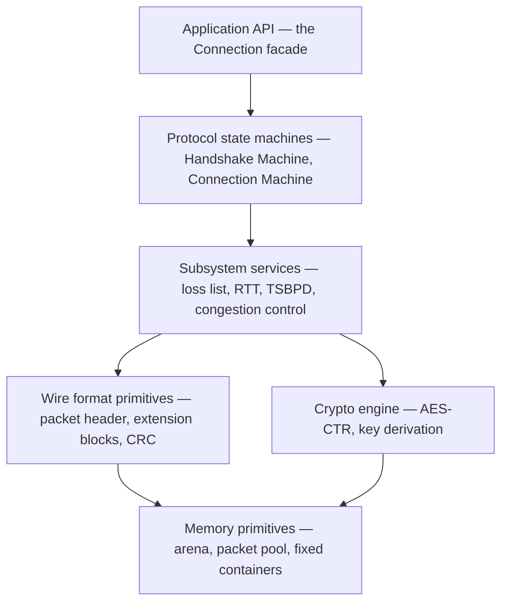
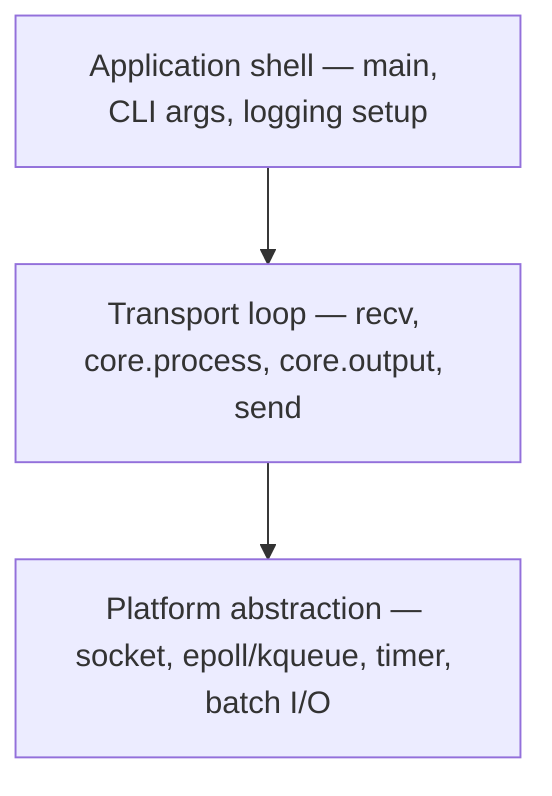
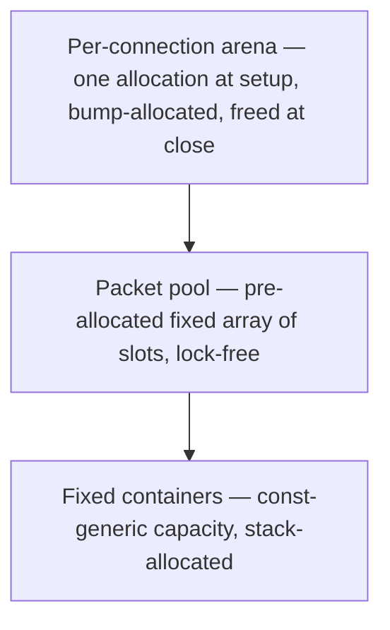
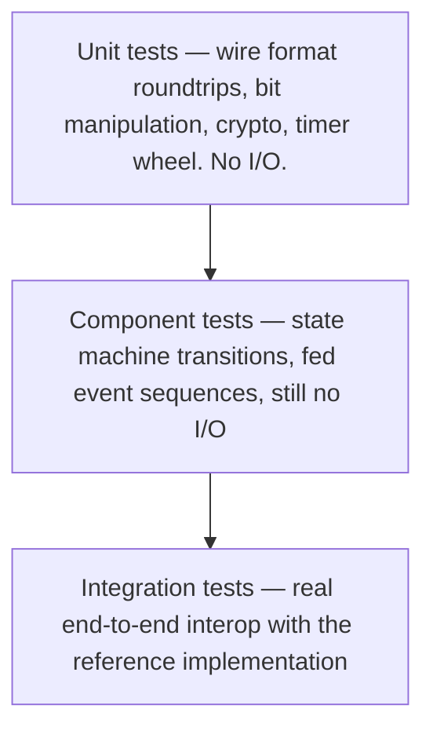

# Pure-Rust SRT: Architecture Design

**Status: proposal, not yet adopted.** This document describes the target
architecture for a from-scratch, sans-I/O, pure-Rust SRT implementation to
replace restream's current libsrt FFI dependency. It is architecture-level
guidance — layering, boundaries, dependency direction, ratios — not a wire
protocol reference or an implementation. For restream's concrete, phased,
gated migration plan (including how this architecture is adapted to
restream's actual production requirements), see
[`srt-pure-rust-plan.md`](srt-pure-rust-plan.md). For the measurements that
motivated this proposal, see
[`agent-guidance/quality/srt-scaling-investigation.md`](agent-guidance/quality/srt-scaling-investigation.md).

This document was reconstructed from a design sandbox that lived only at
`.local/experiments/srt-scaling/rust-srt-design.md` (git-ignored, never
part of this repository, no longer present in any worktree) per the
investigation doc's own explicit request to move it into `docs/` before it
was lost outside that one sandbox's local state.

## Contents

- [The fundamental architectural split](#the-fundamental-architectural-split)
- [Hierarchy within the Core](#hierarchy-within-the-core)
- [Hierarchy within the Driver](#hierarchy-within-the-driver)
- [The state machine architecture](#the-state-machine-architecture)
- [Memory architecture](#memory-architecture)
- [The wire format module](#the-wire-format-module)
- [Dependency management](#dependency-management)
- [Testing architecture](#testing-architecture)
- [Structural mistakes to avoid](#structural-mistakes-to-avoid)
- [Recommended build order](#recommended-build-order)
- [Summary of key ratios](#summary-of-key-ratios)
- [Architectural invariants](#architectural-invariants)
- [Performance: what's hypothesis vs. measured](#performance-whats-hypothesis-vs-measured)

## The fundamental architectural split

SRT has a natural structural fault line: **protocol logic** (what to do) vs.
**I/O mechanics** (how to move bytes). These have different lifecycles,
different testability requirements, and different portability constraints.

**Core (sans-I/O, embeddable).** All protocol logic: state machines, packet
parsing, flow control, loss detection, congestion control, encryption,
timers-as-data. Zero system calls, zero threads, zero allocation on the hot
path. No dependency on how its events arrive or its outputs are delivered.

**Driver (I/O shell).** All platform-specific concerns: socket I/O, thread
management, epoll, timer scheduling, batch recv/send. Thin — a small
fraction of the total code, wrapping the Core.

**Dependency direction is strict and one-way.** The Driver depends on the
Core. The Core never depends on the Driver, and cannot even name it.

Without this split: the protocol can't be unit-tested without a socket,
can't be fuzzed without threads, can't be embedded in a constrained runtime,
and can't have its I/O model changed without rewriting protocol logic. The
reference C++ implementation (libsrt) couples I/O and protocol logic; its
test harness is correspondingly elaborate, its fuzzing is limited, and its
threading bugs are well documented (see the investigation doc's own findings
on libsrt's thread-per-multiplexer model and lock contention).

restream already runs exactly this pattern in production today for RTMP,
via the `rml_rtmp` crate — see `srt-pure-rust-plan.md`'s comparison section
for what that validates and where the analogy runs out (SRT reimplements
transport-layer reliability RTMP gets from TCP for free, and SRT's
encryption is protocol-level rather than a Driver-side TLS wrap).

## Hierarchy within the Core

The Core is not flat. It has an internal hierarchy of subsystems, each with
a clear responsibility and a clear dependency direction.



Dependencies flow strictly downward; no layer may depend on a layer above
it:

| Layer | May depend on | Must NOT depend on |
|---|---|---|
| Application API | Everything below | Nothing (it is the top) |
| State machines | Subsystem services, wire format, crypto, memory | Application API |
| Subsystem services | Wire format, memory | State machines, Application API |
| Wire format | Memory | Anything above |
| Crypto | Memory | Anything above |
| Memory | Nothing (it is the bottom) | Anything |

**Violation example:** if the loss list (a subsystem service) directly calls
a connection's `send_ack()`, it has reached up two layers, becomes
circular, and can no longer be tested in isolation. Instead the loss list
returns data ("these sequence numbers are missing") and the connection
decides what to do with it.

**Approximate code-volume ratios**, as signals rather than hard targets:
memory primitives ~10%, wire format ~15%, crypto ~10%, subsystem services
~30%, state machines ~25% (further split ~35% handshake / ~65% connection),
application API ~10%. If a layer is wildly off these proportions — the
state machine is 60% of the code, or memory primitives are 30% — something
is structurally wrong. See `srt-pure-rust-plan.md`'s module-decomposition
section for how these layers map onto actual `crates/srt-protocol` modules
for restream specifically, including the two modules (`group`,
`subsystems::{loss,rtt,tsbpd,cc}`) that have no analog in restream's
existing sans-I/O RTMP crate.

**Cross-module communication happens through data, not calls.** Each module
is a black box exposing a minimal public API; internal state stays private.
The handshake module produces a `HandshakeResult` struct; the connection
module consumes it. They never call each other.

## Hierarchy within the Driver

The Driver is thin but has its own internal structure:



**The transport loop is the only place Core and the outside world meet.**
Recv bytes → hand to Core's `process_packet()` → collect Core's output
events → for each output, serialize+send, or deliver to the application, or
set/cancel a timer. Everything inside the Core is pure computation;
everything outside is platform-specific.

The Driver should stay a small fraction of total code (roughly 10-15% as a
signal, not a hard target). If the Driver is larger than the Core, logic
has leaked into the wrong layer.

## The state machine architecture

**Two machines, not one.** The SRT handshake has two distinct state
machines running on different objects:

- **Handshake Machine:** manages the 4-packet HSv5 exchange. Runs on a
  temporary object, produces a `HandshakeResult` when complete, then is
  discarded.
- **Connection Machine:** manages ongoing data transfer (ACK, NAK, loss
  detection, TSBPD, congestion). Runs on the long-lived connection object,
  initialized from the `HandshakeResult`.

These live in separate modules and must not share mutable state. The
Handshake Machine is a builder that constructs the Connection Machine's
initial state — it does not keep talking to the Connection Machine
afterward.

**Every state machine method follows the same input/output pattern:**

```rust
fn process_event(&mut self, event: Event, now: Timestamp) -> Outputs;
```

The machine takes an event (packet received, timer fired, application send
request) and returns outputs (send packet, deliver data, set timer, state
change) — never performing side effects directly, never allocating on the
hot path (a fixed-capacity output container, not an unbounded `Vec`). This
makes the machine **deterministic and replayable**: record inputs, replay
them, reproduce any bug.

restream's own `crates/srt-protocol` deviates from this signature inside
the *vendored* connection machine internals (kept close to upstream
`shiguredo/srt-rs` for rebaseability) and applies it strictly only at the
boundaries restream owns — see `srt-pure-rust-plan.md` decision D6.
restream also treats full determinism as a design goal, not an absolute
gate: production evidence from `rml_rtmp` (an internal `SystemTime::now()`
read, in production for years without incident) argues against blocking
on textbook purity where a vendored dependency doesn't quite meet it.

## Memory architecture

**Zero-allocation hot path is a correctness requirement, not a performance
preference.** If the protocol allocates under memory pressure, it fails at
the worst possible moment — during packet loss, exactly when the protocol
is needed most.



**Exactly three allocation points are allowed:**

1. **Connection setup** — arena allocated, packet pool slots assigned, all
   per-connection buffers carved from the arena. No allocation after this.
2. **Connection teardown** — arena freed, packet pool slots returned. The
   only deallocation.
3. **Driver-level buffering** — the Driver may allocate for its own I/O
   buffers (e.g. batch scatter-gather arrays). Outside the Core's budget.

Every data structure in the Core is classified into one of three
categories: **Fixed (stack)** — small, bounded, `const`-generic, never
grows (packet header decode buffers, extension block lists, output event
lists, congestion/RTT/TSBPD state); **Arena-allocated** — variable-but-
bounded capacity, carved from the connection arena at setup, fixed
thereafter (loss list intervals, send/receive buffer entries, timer wheel
slots, crypto state); **Driver-only** — requires `std` (socket tables,
inter-thread channels), lives outside the Core and outside its allocation
rules. If a structure in the Core needs dynamic capacity, it must be
arena-allocated with a fixed upper bound set at connection setup. If the
upper bound is unknown, the structure belongs in the Driver, not the Core.

## The wire format module

Sits at the bottom of the Core, just above memory primitives: a collection
of pure functions converting between byte arrays and typed structs. No
state, no dependency on any other Core module.

**Contains:** packet header encode/decode, handshake message encode/decode,
extension block encode/decode, control message payload encode/decode, loss
list interval encode/decode.

**Does not contain:** state machines (those live in the handshake and
connection modules), byte-order conversion as a general concern (write
directly in network byte order), validation beyond basic bounds checking
(that's a state machine concern).

**Every function should be roundtrip-testable**: encode a struct, decode
the bytes, verify the struct matches. This is the highest test-density
module in the Core by design — more tests per line than anywhere else.

## Dependency management

**Fewer than 10 external dependencies in the Core, all safe to use without
Driver-side I/O crates leaking in.** Each dependency is a liability: it may
pull in transitive dependencies that bloat the graph, or it may not stay
compatible with the Core's no-I/O contract.

**Never depend on a crate that depends on I/O/threading crates from within
the Core.** One such dependency poisons the entire tree. Audit every
dependency's own `Cargo.toml`.

**The Driver may use `std`-ecosystem crates freely** — an async runtime,
`socket2`, structured logging, etc. But these must never leak into the
Core's dependency tree. The boundary is the Cargo workspace: Core and
Driver are separate crates, sharing only the Core's public API. See
`srt-pure-rust-plan.md`'s workspace-layout section for restream's specific
crate boundary decision (`crates/srt-protocol` as Core; Driver code stays
inline in `src/media/srt/`, not a separate crate, because restream already
owns the thread/shard/poller machinery a generic Driver crate would
duplicate).

## Testing architecture



**Target proportions**, as signals: unit tests ~50-60% (fast, deterministic,
no I/O), component tests ~30-35% (still no I/O — feed a sequence of events
to the Handshake or Connection Machine, verify outputs), integration tests
~5-10% (slow, requires network and the reference binary — the canary that
catches wire format regressions).

**Interop testing protocol:** start the reference implementation as a
listener, connect with the Rust implementation as a caller, verify the
handshake, exchange a known payload, verify it arrives correctly, check the
reference's own error/debug output. Automate this and run it on every
commit that touches wire-format or handshake code. See
`srt-pure-rust-plan.md`'s interop section for restream's concrete oracle
(`test/native/srt-scaling/`'s C helpers, built against the same static
`libsrt.a` restream already links, extended for this purpose rather than
inventing a new harness).

**Fuzzing targets:** the wire format module (feed random bytes to decode
functions, verify no panic) and the state machines (feed random event
sequences).

## Structural mistakes to avoid

- **I/O in the Core.** If the Core opens a socket, spawns a thread, or
  calls `poll`, it is no longer sans-I/O, testable, or embeddable. The most
  common mistake and the hardest to recover from.
- **Protocol logic in the Driver.** If the Driver decides which ACK fields
  to include, when to retransmit, or how to size the congestion window,
  that logic is in the wrong layer. The Driver moves bytes; it does not
  make protocol decisions.
- **State machines calling each other.** The Handshake Machine and
  Connection Machine communicate only through data (a `HandshakeResult`),
  never through direct calls — otherwise neither can be tested in
  isolation.
- **Global state.** No `static mut`, no global protocol state. Each
  connection is a self-contained owned value — needed both for running many
  connections in one process and for keeping the door open to constrained
  execution environments later.
- **A monolith.** One enormous file instead of `handshake`, `connection`,
  wire format, subsystem modules, `crypto`, `memory`/types — each readable
  in isolation.
- **Skipping architectural tests.** Before writing protocol code: an
  automated check that the Core has no I/O-crate dependency, that the
  dependency count stays under budget, and that the crate graph enforces
  the one-way Driver→Core dependency. Cheap, and they prevent architectural
  drift long before it's expensive to unwind.
- **Ignoring the ratio signals.** If the Driver grows larger than the Core,
  the architecture has inverted. If the wire format module has more state
  than the state machines, the boundaries are wrong. These ratios don't
  need to be exact, but persistent, large deviations are a real signal.

## Recommended build order

The order matters — building in the wrong order hides structural problems
until they're expensive to fix. In original-proposal order (restream's
actual phased plan in `srt-pure-rust-plan.md` adapts this to what restream
specifically needs, dropping File mode/rendezvous/FEC entirely and inserting
a dedicated bonding-spike phase this generic ordering doesn't have):

1. Memory primitives — everything else depends on these.
2. Wire format — testable in isolation, foundation for interop.
3. Handshake Machine (caller + listener) — first interop point, validates
   wire format.
4. Connection Machine skeleton (keepalive, shutdown) — establishes the
   pattern before adding complexity.
5. ACK/NAK flow control — required for any data transfer.
6. Loss detection and retransmission — builds on ACK/NAK.
7. TSBPD clocking — timing-sensitive, build after the protocol is stable.
8. Congestion control — complex, build after TSBPD works.
9. Encryption — independent subsystem, adds complexity without new
   functionality, build last among Core subsystems.
10. Driver shell — thin wrapper, build last because it's the simplest part.

Each phase should be independently testable against the reference before
the next begins.

## Summary of key ratios

| Metric | Target range | Warning sign |
|---|---|---|
| Core : Driver code ratio | 85-90% : 10-15% | Driver > 20% means protocol logic leaked out |
| State machine : subsystem code ratio | 25% : 30% | State machine > 40% means too much logic in transitions |
| Handshake : Connection machine ratio | 35% : 65% | Handshake > 50% means extension parsing is tangled with state |
| Wire format tests : wire format code | 2:1 | Below 1:1 means under-tested |
| External dependencies (Core) | 6-10 | Above 15 means over-coupled |
| Allocation points in Core | 2 (setup + teardown) | Any more means hot-path allocation |

## Architectural invariants

These are non-negotiable structural properties, verified by architectural
tests, not benchmarks. Violating any of them means the design has drifted
and must be corrected before proceeding — they are not performance targets.

1. **Core has no I/O.** Zero system calls, threads, or socket operations.
   Enforced by an architectural test that the Core crate names no I/O or
   threading crate. Consequence: the Core can be embedded in any execution
   context without modification.
2. **Driver depends on Core, never vice versa.** The Core's own manifest
   has no dependency on any I/O crate. Enforced by the crate boundary.
   Consequence: the Core can be tested, fuzzed, and benchmarked without any
   Driver infrastructure.
3. **State machines communicate through data.** No subsystem calls upward
   through the layers. Consequence: every subsystem is testable in
   isolation with synthetic inputs and observed outputs.
4. **Deterministic input → output behavior**, as a design goal (see the
   `rml_rtmp` precedent note above for why this is treated as strongly
   preferred rather than absolute for vendored code). No randomness, no
   unmanaged wall-clock dependency, no thread-scheduling influence in the
   Core's own logic — the Driver controls the clock; the Core reads it as
   a parameter. Consequence: reproducible tests, replayable bugs, fuzzing
   that finds real issues rather than scheduling-dependent flakes.
5. **No hot-path allocation.** Enforced by an architectural test scanning
   for unbounded-allocation calls in the Core's hot path, and by the data
   structure classification above.
6. **Wire format is pure and independently testable.** Every function is
   bytes-in/struct-out or the reverse, no side effects, no global state, no
   I/O, every function roundtrip-tested.
7. **Allocation points are explicit and bounded** — exactly the three
   listed under [Memory architecture](#memory-architecture).
8. **Dependency count stays below the Core's budget**, audited for
   transitive I/O-crate leakage.

## Performance: what's hypothesis vs. measured

The original version of this document (the reconstructed sandbox proposal)
included a detailed set of *hypothesized* performance numbers — projected
per-socket memory, thread counts, and syscall-batching gains, derived from
structural analysis of libsrt, gosrt, and an earlier prototype, explicitly
marked as targets to validate rather than established conclusions.

**Those hypotheses have since been substantially superseded by real
measurement**, and this document intentionally does not restate them as if
they were still open — restating stale hypothetical numbers next to real
ones invites confusing the two. Use the measured sources instead:

- **libsrt's actual scaling ceiling** (a hard, measured, zero-loss ceiling
  of 700 concurrent connections per best-tuned multiplexer pool on a 6-core
  host, and the 2.5-4x raw-UDP-vs-SRT gap under identical thread/socket
  architecture, attributed by `perf` profiling to libsrt's own protocol
  layer): [`agent-guidance/quality/srt-scaling-investigation.md`](agent-guidance/quality/srt-scaling-investigation.md).
- **Whether Rust syscall-batching (`sendmmsg`/`recvmmsg`) actually moves
  the raw-UDP floor, and by how much, isolated from the "it's Rust" effect
  separately from the "it's batched" effect**, measured directly on this
  host at two thread-pair scales:
  [`../test/native/srt-scaling/rs-udp-bench/README.md`](../test/native/srt-scaling/rs-udp-bench/README.md).
- **The still-open performance questions the actual Rust protocol
  implementation must answer** (is the Core cheaper per packet than
  libsrt's equivalent, does the ingest ceiling clear meaningfully past
  700): [`srt-pure-rust-plan.md`](srt-pure-rust-plan.md)'s Phase 4 and
  Phase 7 go/no-go criteria — these are the actual kill switches for this
  whole effort, not a generic projection.

The distinction that still matters from the original proposal:
**architectural invariants** (the section above) are structural properties
validated by code review and architectural tests. **Performance claims**
are quantitative and must be validated by measurement, against the sources
above, on the actual host and workload in question — never assumed from
this document alone.
